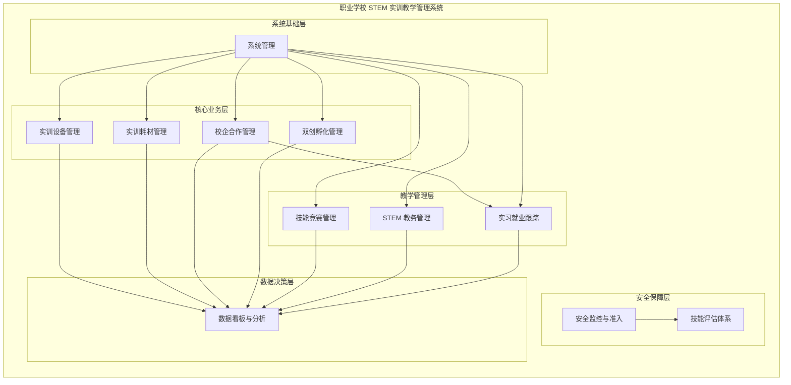

# 职业学校 STEM 实训教学管理 — 产品总览

**模块代码**：VOCATIONAL
**文档版本**：v1.0
**最后更新**：2026-06-24
**状态**：✅ 需求定义完成

---

## 目录

1. [产品愿景](#产品愿景)
2. [核心价值](#核心价值)
3. [与云托管版的关系](#与云托管版的关系)
4. [功能模块总览](#功能模块总览)
5. [模块间依赖关系](#模块间依赖关系)
6. [原型参考](#原型参考)
7. [相关文档](#相关文档)
8. [版本历史](#版本历史)

---

## 产品愿景

OpenMT 职业学校 STEM 实训教学管理模块是专为 **中等职业学校、技工院校、高职院校的 STEM 实训中心** 打造的 SaaS 管理解决方案。它区别于传统教务管理系统，聚焦 **实训设备管理、校企合作、双创孵化、技能竞赛** 等 STEM 实训核心场景，帮助职业学校实现从"经验管理"到"数据驱动"的数字化转型。

**一句话定位**：职业学校的 STEM 实训教学"操作系统"——不做文化课/学籍管理，只做实训教学和产教融合的数字化支撑。

---

## 核心价值

1. **工业级设备管理** — PLC、CNC、工业机器人、嵌入式平台等实训设备全生命周期管理，扫码即用，告别 Excel 台账
2. **产教融合数字化** — 校企合作项目全流程线上管理，从需求对接、联合攻关到成果交付，让合作看得见
3. **双创孵化引擎** — 从创意提交到推向市场全链条支撑，激发学生创新潜能，对接真实产业需求
4. **技能竞赛体系化** — 省/市/县/行业赛全流程管理，竞赛档案伴随学生成长
5. **安全第一** — 工业级安全准入管理，安全培训、设备分级、事故报告闭环管理

---

## 与云托管版的关系

职业学校 STEM 实训教学管理模块是 [云托管版](../01-cloud-hosted/index.md) 的一个**垂直行业解决方案**，在云托管版共有的基础框架（多租户隔离、JWT 认证、RBAC 权限、WebSocket 推送、AI 助教等）之上，叠加**职业学校特有**的功能模块。

| 层面 | 共享云托管版能力 | 职业学校特有 |
|------|-----------------|------------|
| 技术底座 | 多租户隔离、JWT 认证、速率限制、审计日志 | — |
| AI 能力 | AI 助教（智能排课、学情分析） | 实训报告智能批阅、设备故障智能诊断 |
| 数据同步 | WebSocket 实时推送、响应式多端适配 | — |
| 安全能力 | SSL/TLS、数据加密、RBAC 权限 | 实训安全准入、设备安全分级 |
| 业务功能 | — | 实训设备管理、校企合作、双创孵化、技能竞赛、实习就业 |

---

## 功能模块总览

### 模块全景图

### 功能模块说明

| 模块 | 编码 | 说明 | P0 需求数 |
|------|------|------|:--------:|
| **实训设备管理** | FR-VEQ | 工业级设备全生命周期管理（PLC/CNC/机器人/开发板） | 6 |
| **实训耗材管理** | FR-VCON | 电子元器件/五金工具/3D 耗材等精益管理 | 4 |
| **校企合作管理** | FR-VCOOP | 企业信息、联合项目、人才输送通道 | 3 |
| **双创孵化管理** | FR-VINC | 从创意提交到推向市场的全链条孵化 | 4 |
| **技能竞赛管理** | FR-VCOMP | 省/市/县/行业赛全流程管理 | 3 |
| **STEM 教务管理** | FR-VACA | 实训课程排课、实训室调度、教师工作量 | 3 |
| **实习就业跟踪** | FR-VEMP | 实习岗位、过程跟踪、就业统计 | 3 |
| **安全监控与准入** | FR-VSAF | 安全准入认证、设备安全分级、事故报告 | 2 |
| **技能评估体系** | FR-VASS | 技能标准库、实操考核、能力雷达图 | 2 |
| **数据看板与分析** | FR-VDSH | 多维数据分析看板、区域数据汇总 | 2 |
| **系统管理** | FR-VSYS | 租户管理、用户管理、权限管理 | 4 |
| **合计** | | | **36** |

---

## 模块间依赖关系

| 依赖方向 | 说明 |
|---------|------|
| 所有模块 → 系统管理 | 用户认证、权限控制是基础 |
| 双创孵化 → 校企合作 | 孵化项目可升级为校企联合项目 |
| 实习就业 → 校企合作 | 实习岗位和就业机会来源于合作企业 |
| 安全准入 → 设备管理 | 使用危险设备需通过安全认证 |
| 技能评估 → 实训教务 | 评估数据来源于实训课程表现 |
| 所有模块 → 数据看板 | 各模块业务数据聚合展示 |

---

## 原型参考

本需求文档基于原型站（marketing-site）中「梅山县职业技术学校」演示数据整理，原型地址：

- [职业学校演示页](../marketing-site-deploy/app/demo/vocational-static/page.tsx)
- [职业学校演示数据](../marketing-site-deploy/app/demo/vocational-static/_data.ts)
- [职业学校仪表盘组件](../frontend/src/app/organization-management/organization-portal/components/dashboard-overview/vocational-dashboard.component.ts)
- [职业学校路由（后端）](../backend/routes/vocational_routes.py)

**原型关键数据**：
- 机构：梅山县职业技术学校 · STEM 实训中心
- 用户：刘建国，实训中心主任
- 核心指标：在训 826 人、设备 203 台、认证通过率 88%、就业率 94.5%
- 合作企业：23 家
- 双创项目：6 个在孵

---

## 相关文档

| 文档 | 路径 |
|------|------|
| 功能需求 | [functional-requirements.md](functional-requirements.md) |
| 用户故事 | [user-stories.md](user-stories.md) |
| 验收标准 | [acceptance-criteria.md](acceptance-criteria.md) |
| 主 PRD | [../../VOCATIONAL_STEM_CLOUD_HOSTING_PRD.md](../../VOCATIONAL_STEM_CLOUD_HOSTING_PRD.md) |
| 云托管版总览 | [../01-cloud-hosted/index.md](../01-cloud-hosted/index.md) |
| 系统架构 | [../../03-architecture/system-architecture.md](../../03-architecture/system-architecture.md) |
| K12 STEM 云托管 PRD | [../../K12_STEM_CLOUD_HOSTING_PRD.md](../../K12_STEM_CLOUD_HOSTING_PRD.md) |
| STEM 定位调整说明 | [../../STEM_POSITIONING_ADJUSTMENT.md](../../STEM_POSITIONING_ADJUSTMENT.md) |

---

## 版本历史

| 版本 | 日期 | 变更内容 |
|------|------|---------|
| v1.0 | 2026-06-24 | 初始版本，基于原型站（梅山县职业技术学校）演示数据整理 |

---

**上一级**：[../README.md](../README.md)
**下一部分**：[functional-requirements.md](functional-requirements.md)