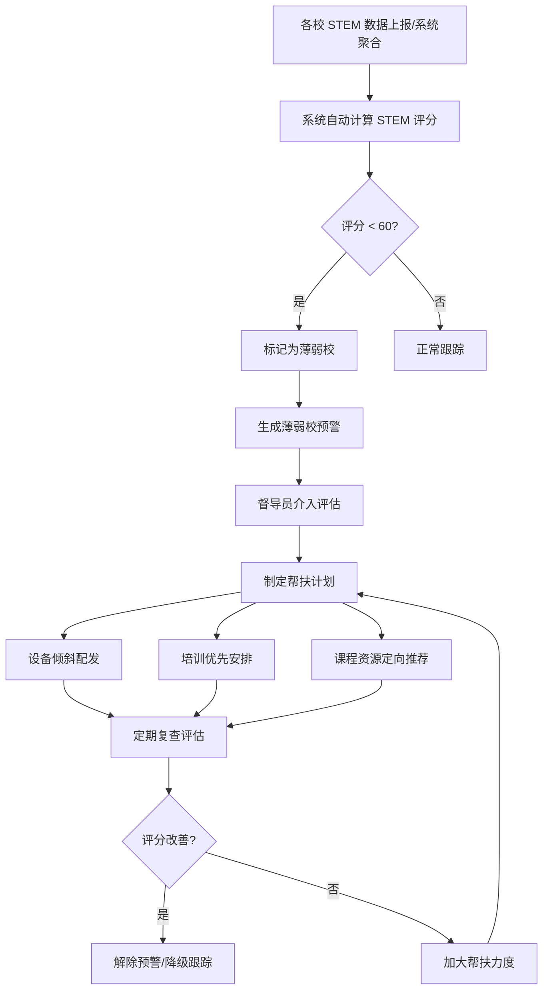
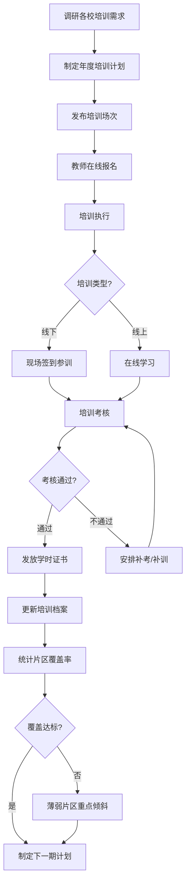
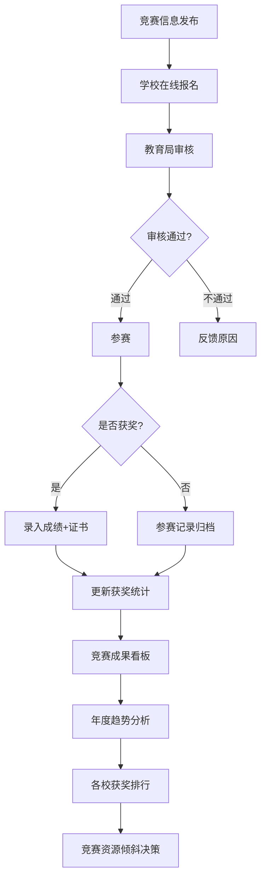
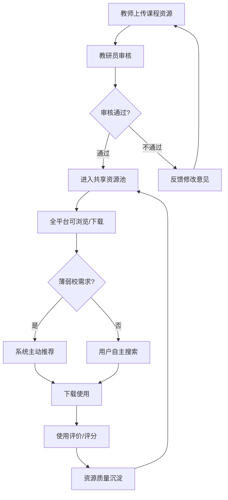
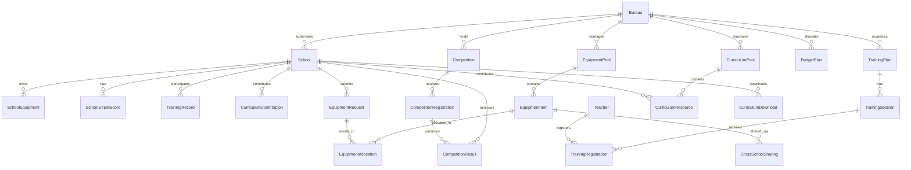
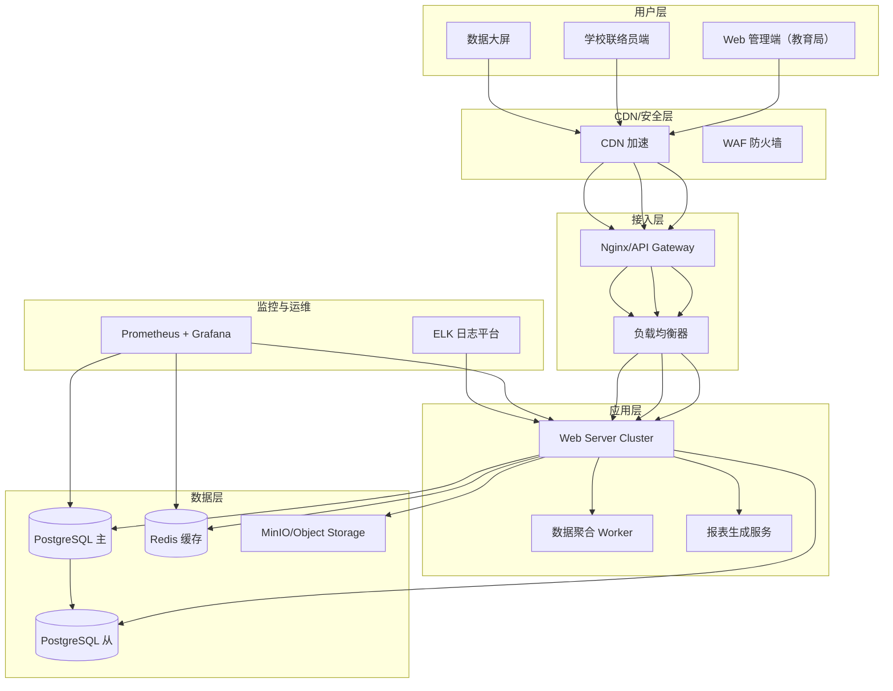

# 面向教育局的 STEM 教育监管平台 · 云托管版 —— 产品需求规格说明书（PRD）

**版本**: v1.0  
**日期**: 2026-06-24  
**状态**: 🟢 需求定义完成  
**文档定位**: 面向区县教育局/教委的 **STEM 教育监管与资源统筹平台**，采用 SaaS 云托管部署模式。

> **核心差异声明（本 PRD 的灵魂）**：传统教育局信息系统的核心对象是「学校 / 教师编制 / 学籍 / 考试排名 / 经费审计」，其业务模型为 **行政管理 + 数据上报 + 审批流**。而 STEM 教育监管平台的核心定位是 **区域 STEM 教育质量监测 + 资源均衡配置 + 师资协同培训 + 教学成果统筹**，其业务模型是 **全区 STEM 覆盖雷达 + 跨校设备池化 + 区域师资研训 + 竞赛成果看板 + 经费预算追踪**。本 PRD 所有需求均建立在这一差异之上，与通用教育管理信息系统和学校级 STEM 管理系统形成清晰区分。

---

## 目录

1. [项目背景与目标](#1-项目背景与目标)
2. [产品定位与核心差异](#2-产品定位与核心差异)
3. [用户角色与权限](#3-用户角色与权限)
4. [功能需求](#4-功能需求)
5. [业务流程](#5-业务流程)
6. [数据模型](#6-数据模型)
7. [接口规范](#7-接口规范)
8. [非功能需求](#8-非功能需求)
9. [部署架构](#9-部署架构)
10. [安全标准](#10-安全标准)
11. [优先级矩阵](#11-优先级矩阵)
12. [术语表](#12-术语表)

---

## 1. 项目背景与目标

### 1.1 背景

《义务教育课程方案和课程标准（2022 年版）》将信息科技、劳动（含工程技术）纳入独立课程，《关于加强新时代中小学科学教育工作的意见》明确要求区县教育部门统筹推进 STEM 教育。然而，当前市场上 **缺乏面向区县教育局的 STEM 教育监管 SaaS 系统**：

- 传统教育局管理信息系统（学籍、人事、财务系统）无法覆盖 **STEM 课程覆盖率监测、设备跨校调配、师资培训统筹、竞赛成果统筹** 等 STEM 特有监管场景；
- 现有 STEM 教育平台多为学校级管理工具，缺少 **区域视角的多校统筹、资源均衡配置、质量监测雷达** 等局级管理功能；
- 区县教育局 IT 能力有限，需要开箱即用、免运维的云托管方案；
- 县域教育面临 **STEM 资源分布不均、薄弱校缺乏设备师资、区级数据统计靠手工填表** 等痛点。

### 1.2 目标

构建一套 **面向区县教育局的 STEM 教育监管云托管平台**，实现：

- **区域 STEM 覆盖率监测**：辖区内学校 STEM 课程开设率、参与学生数、师资配置等核心指标的可视化
- **多校 STEM 质量评估**：学校 STEM 教育质量评分、排名、薄弱校预警
- **设备资源统筹调配**：统一采购、按需配发、跨校共享流转管理
- **师资培训统筹管理**：区级培训计划、各片区培训覆盖率、培训档案
- **竞赛成果统筹**：区级/市级/省级/国家级竞赛获奖统计与趋势分析
- **经费预算追踪**：STEM 教育年度预算编制、执行、支出明细
- **课程资源共享**：优质课程教案全区共享、薄弱校定向推荐
- **区域数据报表**：定时/按需生成区级 STEM 教育发展数据报表

### 1.3 适用范围

- **目标用户**：全国区县教育局 STEM 教育管理部门（基教科/装备中心/教研室）
- **部署方式**：SaaS 云托管（多租户）
- **终端覆盖**：Web 管理端 + 移动端数据看板
- **使用规模**：单区县 10-100 所学校，管理 50-50000 名 STEM 学生
- **与学校级 STEM 系统的关系**：教育局平台从各校 STEM 系统（或手动填报）聚合数据，提供区域监管视角

---

## 2. 产品定位与核心差异

### 2.1 与通用教育局管理信息系统的核心差异

| 维度 | 通用教育局管理系统 | STEM 教育监管平台 |
|------|------------------|------------------|
| 核心对象 | 学校/教师编制/学籍/财务 | STEM 课程覆盖率/设备资源/师资培训/竞赛成果 |
| 管理方式 | 行政管理+数据上报 | 质量监测+资源统筹+均衡配置 |
| 数据来源 | 学校定期上报 | 学校 STEM 系统数据聚合/手动填报 |
| 决策支持 | 学籍统计/经费审计 | STEM 覆盖雷达/薄弱校预警/资源缺口分析 |
| 资源配置 | 人事调动/经费拨付 | 设备跨校调配/师资研训统筹/课程资源共享 |
| 时间维度 | 学期制/学年制 | 学期制+竞赛周期+培训计划+采购周期 |
| 特色场景 | 无 | STEM 质量评估排名/跨校设备流转/区域竞赛看板 |

### 2.2 与学校级 STEM 教育管理系统的核心差异

| 维度 | 学校级 STEM 系统（K12/职校） | 教育局 STEM 监管平台 |
|------|-----------------------------|-------------------|
| 管理粒度 | 单校内部管理 | 全区多校统筹监管 |
| 核心目标 | 提升教学质量与运营效率 | 区域均衡发展与质量监测 |
| 数据范围 | 本校设备/学生/教师/项目 | 全区学校汇总数据与对比分析 |
| 设备管理 | 设备入库/借用/维护 | 统一采购/配发/跨校流转 |
| 教师管理 | 教师档案/工作负载 | 全区师资分布/培训覆盖率 |
| 资源配置功能 | 无 | 跨校设备共享/课程资源池/师资统筹培训 |
| 决策支持 | 校内看板 | 区域 STEM 质量评估/薄弱校预警/资源缺口分析 |
| 评估体系 | 学生/教师个体评估 | 学校 STEM 教育质量评分与排名 |

### 2.3 核心竞争力

1. **区域 STEM 覆盖雷达**：全区 STEM 课程开设率、覆盖率、参与度一目了然
2. **多校质量评估体系**：学校 STEM 教育质量多维评分、排名、动态跟踪
3. **跨校设备池化管理**：统一采购→按需配发→跨校共享流转，全域设备资源一盘棋
4. **师资研训统筹**：区级培训计划、片区覆盖率、送教下乡管理
5. **课程资源全县共享**：优质教案、课件全县共享，薄弱校按需推荐
6. **竞赛成果看板**：全区竞赛获奖统计分析、各校横向对比
7. **云托管 SaaS**：开箱即用，零运维，自动升级

---

## 3. 用户角色与权限

### 3.1 角色定义

| 角色编码 | 角色名称 | 说明 | 典型用户 |
|---------|---------|------|---------|
| B-R01 | 系统管理员 | 系统全局配置、租户管理、运维监控 | 云平台运营人员 |
| B-R02 | 教育局管理员 | 区域信息配置、账号管理、全区数据查看、预算审批 | 教育局基教科/装备中心主任 |
| B-R03 | 学科教研员 | STEM 课程指导、学校评估、教师培训组织、课程资源审核 | 教研室 STEM 教研员 |
| B-R04 | 学校联络员 | 本校 STEM 数据填报、设备申请、培训报名 | 各校 STEM 负责人 |
| B-R05 | 督导评估员 | 学校 STEM 教育督导评估、薄弱校认定、整改跟踪 | 教育督导室成员 |
| B-R06 | 局领导/决策者 | 全局数据总览、趋势分析、决策支持 | 教育局分管副局长/局长 |

### 3.2 权限矩阵

| 功能模块 | 系统管理员 | 教育局管理员 | 学科教研员 | 学校联络员 | 督导评估员 | 局领导 |
|---------|:---------:|:-----------:|:---------:|:---------:|:---------:|:-----:|
| 租户管理 | ✅ | — | — | — | — | — |
| 区域配置 | ✅ | ✅ | — | — | — | — |
| 账号管理 | ✅ | ✅ | — | — | — | — |
| 学校信息管理 | ✅ | ✅ | 查看 | 本校 | 查看 | 查看 |
| 数据总览看板 | ✅ | ✅ | ✅ | 本校 | ✅ | ✅ |
| STEM 覆盖率监测 | ✅ | ✅ | ✅ | — | ✅ | ✅ |
| 学校质量评估 | ✅ | ✅ | ✅ | — | ✅ | ✅ |
| 薄弱校预警 | ✅ | ✅ | ✅ | — | ✅ | ✅ |
| 设备配发池管理 | ✅ | ✅ | 查看 | 申请 | 查看 | 查看 |
| 跨校设备共享 | ✅ | ✅ | ✅ | 参与 | 查看 | 查看 |
| 设备配发审批 | ✅ | ✅ | — | — | — | — |
| 师资培训计划 | ✅ | ✅ | ✅ | 报名 | — | — |
| 培训覆盖统计 | ✅ | ✅ | ✅ | 查看 | ✅ | ✅ |
| 竞赛信息发布 | ✅ | ✅ | ✅ | — | — | 查看 |
| 竞赛成绩录入 | ✅ | ✅ | ✅ | 本校 | — | 查看 |
| 竞赛成果看板 | ✅ | ✅ | ✅ | 查看 | ✅ | ✅ |
| 经费预算管理 | ✅ | ✅ | 查看 | — | — | ✅ |
| 经费支出审批 | ✅ | ✅ | — | — | — | — |
| 课程资源共享 | ✅ | ✅ | ✅ | 上传/下载 | 查看 | 查看 |
| 课程资源审核 | ✅ | ✅ | ✅ | — | — | — |
| 数据报表 | ✅ | ✅ | ✅ | 本校 | ✅ | ✅ |
| 数据导出 | ✅ | ✅ | ✅ | — | ✅ | ✅ |
| 操作日志 | ✅ | ✅ | — | — | — | — |
| 系统设置 | ✅ | ✅ | — | — | — | — |

---

## 4. 功能需求

### 4.1 数据总览仪表盘模块（FR-BDSH）

#### 功能概述
教育局管理员的首页工作台，聚合全区 STEM 教育关键指标、覆盖趋势、学校分布等核心数据，形成"全区 STEM 教育一览"的决策驾驶舱。

| 编号 | 功能名称 | 描述 | 优先级 |
|-----|---------|------|:-----:|
| FR-BDSH-01 | 关键指标卡 | 展示管辖学校总数、STEM 学生数、STEM 教师数、STEM 覆盖率、跨校设备共享次数、年度竞赛获奖数等 6 大核心指标，含环比变化趋势 | P0 |
| FR-BDSH-02 | STEM 覆盖率趋势图 | 近 N 个月（默认 6 个月）全区 STEM 课程开设率趋势图，标注目标达标线 | P0 |
| FR-BDSH-03 | 学校类型分布图 | 按小学/初中/高中/职校等类型展示全区学校分布，饼图/环形图 | P0 |
| FR-BDSH-04 | 薄弱校预警面板 | 自动识别 STEM 教育薄弱学校（评分低于阈值），展示学校名称、类型、评分、重点帮扶提示 | P0 |
| FR-BDSH-05 | 四大功能快捷入口 | 设备调配、师资培训、竞赛组织、课程共享四大核心功能的快捷卡片，含关键摘要数据 | P0 |
| FR-BDSH-06 | 近期动态 | 最新设备到货、竞赛报名、培训结业、成果获奖等动态信息流 | P1 |
| FR-BDSH-07 | 用户角色个人信息 | 顶部栏展示当前用户姓名、角色、所属教育局 | P0 |

### 4.2 学校监管模块（FR-BSCHOOL）

#### 功能概述
对辖区内各学校的 STEM 教育质量进行多维度评估、排名与监管，支持薄弱校识别与重点帮扶。

| 编号 | 功能名称 | 描述 | 优先级 |
|-----|---------|------|:-----:|
| FR-BSCH-01 | 学校 STEM 教育质量评估列表 | 展示各学校排名、名称、学段、学生数、STEM 评分（百分制）、设备状态、评级（优秀/良好/待提升/薄弱）、重点描述及预警标签 | P0 |
| FR-BSCH-02 | 多维度评分排序 | 支持按 STEM 评分、学生数、学校名称等多维度排序 | P0 |
| FR-BSCH-03 | 评级筛选 | 支持按评级（全部/优秀/良好/待提升/薄弱）快速筛选过滤 | P0 |
| FR-BSCH-04 | 设备状态标签 | 学校设备状态可视化标注：充足/基本满足/紧缺/严重不足，颜色区分 | P0 |
| FR-BSCH-05 | 薄弱校预警机制 | 自动标记薄弱校（评分 < 60 分），展示重点帮扶提示，支持整改跟踪 | P0 |
| FR-BSCH-06 | 学校详情下钻 | 点击学校名称进入该校 STEM 教育详情页，展示该校设备清单、师资配置、课程开设、竞赛成果等详细数据 | P1 |
| FR-BSCH-07 | 学校类型分布统计 | 按学段统计各类学校数量和占比 | P1 |
| FR-BSCH-08 | 学校 STEM 档案 | 每所学校的 STEM 教育发展历程、关键事件、帮扶记录 | P2 |
| FR-BSCH-09 | 学校对比分析 | 支持选择 2-5 所学校进行关键指标横向对比 | P2 |

### 4.3 设备调配管理模块（FR-BEQ）

#### 功能概述
区县级 STEM 设备统一采购、按需配发、跨校流转的全流程管理，实现全区 STEM 设备资源的"一盘棋"统筹。

| 编号 | 功能名称 | 描述 | 优先级 |
|-----|---------|------|:-----:|
| FR-BEQ-01 | 设备配发池总览 | 展示设备总值、已配发金额、调拨中金额、待审批金额等关键统计 | P0 |
| FR-BEQ-02 | 设备品类清单 | 按品类展示设备名称、总量、已配发数、库存数、单价、覆盖学校等信息 | P0 |
| FR-BEQ-03 | 设备配发审批 | 学校提交设备配发申请 → 教育局审批 → 配发出库 → 到校确认 | P0 |
| FR-BEQ-04 | 跨校设备共享流转 | 记录设备从 A 校流转至 B 校的借用记录（来源校/目标校、设备名称、日期、原因、状态） | P0 |
| FR-BEQ-05 | 设备配发待处理 | 展示待审批的配发申请列表，含申请学校、设备名称、数量、原因、优先级（紧急/一般） | P0 |
| FR-BEQ-06 | 库存预警 | 库存量低于安全阈值的设备自动标记，提醒补货采购 | P1 |
| FR-BEQ-07 | 统一采购计划 | 编制年度/学期设备采购计划，汇总各校需求，生成采购清单 | P1 |
| FR-BEQ-08 | 设备使用统计 | 各品类设备使用率、各校设备保有量对比、设备闲置分析 | P1 |
| FR-BEQ-09 | 设备配发历史记录 | 按时间线展示所有配发操作历史，支持按学校/品类筛选 | P1 |
| FR-BEQ-10 | 设备报修管理 | 学校提交设备故障报修，教育局协调维修资源 | P2 |

### 4.4 师资培训管理模块（FR-BTRAIN）

#### 功能概述
区县级 STEM 教师资格培训的统筹管理，包括培训计划发布、参训统计、片区覆盖率分析，推动师资均衡配置。

| 编号 | 功能名称 | 描述 | 优先级 |
|-----|---------|------|:-----:|
| FR-BTRAIN-01 | 培训总体进度 | 年度已培训人数/总目标人数、完成率百分比展示 | P0 |
| FR-BTRAIN-02 | 各片区培训覆盖率 | 按地理片区（如县城片区、各乡镇片区）展示培训覆盖人数、覆盖率百分比，覆盖率达标的标记绿色，未达标标记红色 | P0 |
| FR-BTRAIN-03 | 培训场次管理 | 发布培训计划（标题、讲师、日期、类型（线下/线上）、限额、已报名人数、状态（报名中/即将开课/已结束）） | P0 |
| FR-BTRAIN-04 | 培训报名管理 | 学校教师在线报名培训，支持名额限制、审核确认 | P0 |
| FR-BTRAIN-05 | 培训考勤记录 | 线下培训扫码签到，线上培训在线时长统计 | P1 |
| FR-BTRAIN-06 | 培训档案 | 每位参训教师的培训记录、考核成绩、学时证书 | P1 |
| FR-BTRAIN-07 | 送教下乡管理 | 组织城区优秀教师赴薄弱校送教，记录送教计划、课程、效果 | P1 |
| FR-BTRAIN-08 | 培训效果评估 | 培训后问卷调查、参训教师反馈、教学实践改进跟踪 | P2 |
| FR-BTRAIN-09 | 培训预算管理 | 年度培训经费预算编制与执行追踪 | P2 |

### 4.5 竞赛管理模块（FR-BCOMP）

#### 功能概述
统筹管理全区 STEM 竞赛活动，涵盖赛事信息发布、报名组织、成绩管理与获奖统计。

| 编号 | 功能名称 | 描述 | 优先级 |
|-----|---------|------|:-----:|
| FR-BCOMP-01 | 竞赛级别概览 | 按国家级/省级/市级/县级展示全区获奖数量统计卡片 | P0 |
| FR-BCOMP-02 | 竞赛信息发布 | 录入竞赛信息（名称、级别、主办方、时间、地点、赛项设置、参赛费用） | P0 |
| FR-BCOMP-03 | 竞赛报名组织 | 学校在线报名参赛，教育局审核确认，缴费跟踪 | P0 |
| FR-BCOMP-04 | 近期获奖成果 | 展示最近获奖记录（赛事名称、获奖学校、获奖等级、级别、日期） | P0 |
| FR-BCOMP-05 | 竞赛成绩录入 | 录入竞赛成绩和获奖证书扫描件 | P0 |
| FR-BCOMP-06 | 级别筛选 | 支持按赛事级别（县级/市级/省级/国家级）快速筛选过滤 | P0 |
| FR-BCOMP-07 | 赛前集训管理 | 区级集训安排、参赛学校集训计划、模拟训练 | P1 |
| FR-BCOMP-08 | 获奖统计分析 | 按年份/级别/学校统计获奖情况，生成趋势图、各校获奖排行 | P1 |
| FR-BCOMP-09 | 竞赛档案 | 每所学校的参赛记录、获奖等级历史、指导老师记录 | P1 |
| FR-BCOMP-10 | 竞赛预算管理 | 参赛经费预算编制、报销记录、预算执行分析 | P2 |

### 4.6 经费管理模块（FR-BBUDGET）

#### 功能概述
STEM 教育专项经费的预算编制、执行追踪和支出明细管理，支撑教育局对 STEM 教育投入的精细化管理。

| 编号 | 功能名称 | 描述 | 优先级 |
|-----|---------|------|:-----:|
| FR-BBGT-01 | 年度总预算概览 | 展示年度 STEM 教育总预算金额，已支出/剩余金额及比例 | P0 |
| FR-BBGT-02 | 预算分类占比 | 按支出类别（设备采购、创客实验室建设、师资培训、竞赛组织、课程资源开发、其他）展示预算分配及占比，含进度条可视化 | P0 |
| FR-BBGT-03 | 经费支出明细 | 最近经费支出记录列表（支出项目、学校/用途、金额、日期、状态（已拨付/审批中）） | P0 |
| FR-BBGT-04 | 预算执行率跟踪 | 各预算类别执行率实时计算，超支预警 | P1 |
| FR-BBGT-05 | 经费审批流程 | 学校/科室提交经费申请 → 教育局管理员审批 → 财务拨付 | P1 |
| FR-BBGT-06 | 年度对比分析 | 与上一年度预算使用情况对比分析 | P2 |
| FR-BBGT-07 | 经费报表导出 | 支持按年度/类别导出经费使用报表（Excel/PDF） | P2 |

### 4.7 课程资源共享模块（FR-BCURRI）

#### 功能概述
搭建全区 STEM 课程资源池，促进优质教案、课件的全县共享，特别关注薄弱校的资源获取。

| 编号 | 功能名称 | 描述 | 优先级 |
|-----|---------|------|:-----:|
| FR-BCUR-01 | 资源池总览 | 展示全区共享课程总数、参与共享学校数量 | P0 |
| FR-BCUR-02 | 课程分类统计 | 按编程与计算思维/电子与电路/3D 设计与制造/机器人与自动化/科学探究与实验等分类展示课程数量 | P0 |
| FR-BCUR-03 | 优秀课程教案展示 | 展示优质课程教案卡片（标题、来源学校、适用年级、下载次数、评分） | P0 |
| FR-BCUR-04 | 课程资源上传 | 学校教师上传课程教案、课件、视频等资源，支持多类型文件 | P0 |
| FR-BCUR-05 | 课程资源审核 | 教研员审核上传的资源质量，审核通过的纳入共享池 | P1 |
| FR-BCUR-06 | 薄弱校课程推荐 | 针对薄弱校自动推荐适合的课程资源，展示推荐理由 | P0 |
| FR-BCUR-07 | 资源搜索与筛选 | 支持按分类、年级、关键词搜索课程资源 | P1 |
| FR-BCUR-08 | 资源下载统计 | 统计各资源的下载次数、使用学校数、用户评分 | P1 |
| FR-BCUR-09 | 资源版本管理 | 课程资源的版本更新、历史版本追溯 | P2 |

### 4.8 数据报表模块（FR-BREPORT）

#### 功能概述
为教育局管理层提供可配置、可导出的区域 STEM 教育数据报表，支撑数据驱动决策和教育规划。

| 编号 | 功能名称 | 描述 | 优先级 |
|-----|---------|------|:-----:|
| FR-BREP-01 | STEM 覆盖率趋势报表 | 各区县/各学校 STEM 课程开设率的时间趋势图 | P0 |
| FR-BREP-02 | 学校质量评估报表 | 含 STEM 评分、排名、评级、设备状态的综合报表 | P0 |
| FR-BREP-03 | 设备资源报表 | 各品类设备保有量、配发率、使用率统计 | P1 |
| FR-BREP-04 | 师资培训报表 | 各片区培训覆盖率、培训完成率、参训人次统计 | P1 |
| FR-BREP-05 | 竞赛成果报表 | 按级别/学校/年份统计的获奖报表 | P1 |
| FR-BREP-06 | 经费执行报表 | 预算执行率、各类支出明细对比 | P1 |
| FR-BREP-07 | 薄弱校帮扶进度报表 | 薄弱校整改措施、帮扶进展、改善趋势 | P1 |
| FR-BREP-08 | 自定义报表 | 用户选择指标维度和时间范围生成自定义报表 | P2 |
| FR-BREP-09 | 报表导出 | 支持 Excel/PDF 格式导出，支持定时自动推送 | P1 |
| FR-BREP-10 | 报表数据下钻 | 从全区汇总数据逐级下钻至学校级明细数据 | P1 |

### 4.9 系统管理模块（FR-BSYS）

| 编号 | 功能名称 | 描述 | 优先级 |
|-----|---------|------|:-----:|
| FR-BSYS-01 | 租户管理 | 区县教育局租户创建、配置、停用、删除 | P0 |
| FR-BSYS-02 | 用户管理 | 教育局/学校用户账号管理，支持批量导入、角色分配 | P0 |
| FR-BSYS-03 | 区域与学校配置 | 管理辖区内学校信息（名称、类型、片区、规模、负责人） | P0 |
| FR-BSYS-04 | 权限管理 | 基于 RBAC 的细粒度权限配置，支持自定义角色 | P0 |
| FR-BSYS-05 | 操作日志 | 关键操作审计日志，可追溯查询，保留 ≥ 180 天 | P1 |
| FR-BSYS-06 | 消息通知 | 系统公告、审批提醒、预警通知（站内信+邮件/短信） | P1 |
| FR-BSYS-07 | 数据导入 | 支持 Excel/CSV 批量导入学校、设备、培训、竞赛数据 | P1 |
| FR-BSYS-08 | 数据归档 | 年度数据归档，支持历史数据查询 | P2 |
| FR-BSYS-09 | 演示模式/生产模式切换 | 演示模式只读，生产模式开启完整读写 | P1 |

---

## 5. 业务流程

### 5.1 区域 STEM 教育质量监控流程



### 5.2 设备统一采购与配发流程

```mermaid
flowchart TD
    A[汇总各校设备需求] --> B[编制采购计划]
    B --> C[经费预算审批]
    C --> D{审批通过?}
    D -->|通过| E[统一招标采购]
    D -->|不通过| F[调整计划]
    F --> C
    E --> G[设备到货入库]
    G --> H[按配发方案分发]
    H --> I[各校确认收货]
    I --> J[设备状态更新为"已配发"]
    J --> K[设备投入使用]
    K --> L{设备闲置?}
    L -->|是| M[发起跨校共享]
    L -->|否| K
    M --> N[借用校使用]
    N --> O[归还/确认]
    O --> K
```

### 5.3 师资培训统筹流程



### 5.4 竞赛成果管理流程



### 5.5 课程资源共享流程



---

## 6. 数据模型

### 6.1 核心实体关系图（ER 图）



### 6.2 主要实体属性

#### 教育局/租户（Bureau/Tenant）
| 属性 | 类型 | 说明 |
|------|------|------|
| id | UUID | 主键 |
| name | VARCHAR(200) | 教育局名称 |
| district | VARCHAR(100) | 所属行政区 |
| level | ENUM | 县级/地市级/省级 |
| contact_name | VARCHAR(50) | 联系人 |
| contact_phone | VARCHAR(20) | 联系电话 |
| school_count | INT | 管辖学校数 |
| annual_stem_budget | DECIMAL(12,2) | 年度 STEM 教育预算 |
| status | ENUM | 启用/停用 |
| expire_date | DATE | 服务到期日 |

#### 学校（School）
| 属性 | 类型 | 说明 |
|------|------|------|
| id | UUID | 主键 |
| bureau_id | UUID | 所属教育局 |
| name | VARCHAR(200) | 学校名称 |
| code | VARCHAR(50) | 学校代码 |
| type | ENUM | 小学/初中/高中/九年一贯制/职校 |
| district_area | VARCHAR(100) | 所属片区（如县城片区/xx镇片区） |
| student_count | INT | 在校生人数 |
| stem_student_count | INT | 参与 STEM 学生数 |
| stem_teacher_count | INT | STEM 教师数 |
| stem_score | INT | STEM 教育质量评分（百分制） |
| rating | ENUM | 优秀/良好/待提升/薄弱 |
| equipment_status | ENUM | 充足/基本满足/紧缺/严重不足 |
| contact_name | VARCHAR(50) | 学校联系人 |
| contact_phone | VARCHAR(20) | 联系电话 |
| status | ENUM | 启用/停用 |

#### STEM 教育质量评分（SchoolSTEMScore）
| 属性 | 类型 | 说明 |
|------|------|------|
| id | UUID | 主键 |
| school_id | UUID | 所属学校 |
| score_date | DATE | 评分日期 |
| overall_score | INT | 综合评分 |
| curriculum_score | INT | 课程开设分 |
| equipment_score | INT | 设备配置分 |
| teacher_score | INT | 师资配置分 |
| competition_score | INT | 竞赛成果分 |
| coverage_score | INT | 覆盖普及分 |
| evaluation | TEXT | 综合评语 |
| evaluator_id | UUID | 评估人 |

#### 设备品类（EquipmentItem）
| 属性 | 类型 | 说明 |
|------|------|------|
| id | UUID | 主键 |
| bureau_id | UUID | 所属教育局 |
| name | VARCHAR(200) | 设备名称 |
| category | VARCHAR(100) | 设备分类（Arduino套件/3D打印机/Micro:bit/焊接工作台/传感器箱/无人机/机器人竞赛套装等） |
| unit | VARCHAR(20) | 单位（套/台/个） |
| unit_price | DECIMAL(10,2) | 单价 |
| total_quantity | INT | 总量 |
| allocated_quantity | INT | 已配发数量 |
| in_stock_quantity | INT | 库存数量 |
| in_transit_quantity | INT | 调拨中数量 |
| min_stock | INT | 库存预警下限 |
| supplier | VARCHAR(200) | 供应商 |

#### 设备配发记录（EquipmentAllocation）
| 属性 | 类型 | 说明 |
|------|------|------|
| id | UUID | 主键 |
| equipment_item_id | UUID | 设备品类 |
| school_id | UUID | 目标学校 |
| quantity | INT | 配发数量 |
| allocation_type | ENUM | 新配发/补充配发/调拨 |
| status | ENUM | 待审批/已批准/配送中/已签收 |
| request_date | DATE | 申请日期 |
| approval_date | DATE | 审批日期 |
| delivery_date | DATE | 配送日期 |
| approval_comment | TEXT | 审批意见 |
| created_by | UUID | 操作人 |

#### 跨校设备共享记录（CrossSchoolSharing）
| 属性 | 类型 | 说明 |
|------|------|------|
| id | UUID | 主键 |
| from_school_id | UUID | 来源学校 |
| to_school_id | UUID | 借用学校 |
| equipment_item_id | UUID | 设备品类 |
| quantity | INT | 数量 |
| borrow_date | DATE | 借用日期 |
| expected_return_date | DATE | 预计归还日 |
| actual_return_date | DATE | 实际归还日 |
| reason | TEXT | 借用原因 |
| status | ENUM | 使用中/已归还/逾期 |
| created_by | UUID | 操作人 |

#### 培训计划（TrainingSession）
| 属性 | 类型 | 说明 |
|------|------|------|
| id | UUID | 主键 |
| bureau_id | UUID | 所属教育局 |
| title | VARCHAR(200) | 培训标题 |
| trainer | VARCHAR(100) | 讲师 |
| trainer_org | VARCHAR(200) | 讲师单位 |
| date | DATE | 培训日期 |
| type | ENUM | 线下/线上 |
| location | VARCHAR(200) | 培训地点 |
| max_attendees | INT | 限额人数 |
| current_attendees | INT | 已报名人数 |
| status | ENUM | 报名中/即将开课/已结束/已取消 |
| coverage_area | VARCHAR(100) | 覆盖片区 |
| description | TEXT | 培训内容描述 |

#### 竞赛信息（Competition）
| 属性 | 类型 | 说明 |
|------|------|------|
| id | UUID | 主键 |
| bureau_id | UUID | 所属教育局 |
| name | VARCHAR(200) | 竞赛名称 |
| level | ENUM | 国家级/省级/市级/县级 |
| organizer | VARCHAR(200) | 主办方 |
| competition_date | DATE | 竞赛日期 |
| registration_deadline | DATE | 报名截止日期 |
| location | VARCHAR(200) | 竞赛地点 |
| status | ENUM | 报名中/备赛中/已结束 |

#### 竞赛获奖结果（CompetitionResult）
| 属性 | 类型 | 说明 |
|------|------|------|
| id | UUID | 主键 |
| competition_id | UUID | 所属竞赛 |
| school_id | UUID | 获奖学校 |
| award_name | VARCHAR(200) | 获奖名称 |
| award_level | ENUM | 特等奖/一等奖/二等奖/三等奖/优秀奖 |
| award_type | ENUM | 团体/个人 |
| student_name | VARCHAR(100) | 获奖学生（个人奖） |
| teacher_name | VARCHAR(100) | 指导老师 |
| certificate_url | VARCHAR(500) | 证书扫描件 |
| award_date | DATE | 获奖日期 |

#### 课程资源（CurriculumResource）
| 属性 | 类型 | 说明 |
|------|------|------|
| id | UUID | 主键 |
| bureau_id | UUID | 所属教育局 |
| title | VARCHAR(200) | 资源标题 |
| category | ENUM | 编程与计算思维/电子与电路/3D设计与制造/机器人与自动化/科学探究与实验 |
| grade_range | VARCHAR(50) | 适用年级 |
| school_id | UUID | 来源学校 |
| author | VARCHAR(100) | 作者 |
| file_type | ENUM | 教案/课件/视频/习题/其他 |
| file_url | VARCHAR(500) | 文件 URL |
| description | TEXT | 资源描述 |
| download_count | INT | 下载次数 |
| rating | DECIMAL(2,1) | 评分（1.0-5.0） |
| status | ENUM | 待审核/已发布/已下架 |
| created_at | TIMESTAMP | 创建时间 |

#### 经费预算（BudgetPlan）
| 属性 | 类型 | 说明 |
|------|------|------|
| id | UUID | 主键 |
| bureau_id | UUID | 所属教育局 |
| fiscal_year | INT | 财年 |
| total_amount | DECIMAL(12,2) | 总预算金额 |
| spent_amount | DECIMAL(12,2) | 已支出金额 |
| status | ENUM | 编制中/执行中/已结束 |

#### 经费支出（BudgetExpense）
| 属性 | 类型 | 说明 |
|------|------|------|
| id | UUID | 主键 |
| budget_plan_id | UUID | 所属预算 |
| category | ENUM | 设备采购/实验室建设/师资培训/竞赛组织/课程开发/其他 |
| item_name | VARCHAR(200) | 支出项目 |
| amount | DECIMAL(10,2) | 金额 |
| school_id | UUID | 受益学校（可为空） |
| expense_date | DATE | 支出日期 |
| status | ENUM | 审批中/已拨付/已退回 |
| description | TEXT | 支出说明 |

---

## 7. 接口规范

### 7.1 通用规范

- **协议**: HTTPS
- **基础路径**: `/api/v1/bureau`
- **请求格式**: `application/json`
- **响应格式**: JSON，统一结构：

```json
{
  "code": 0,
  "message": "success",
  "data": {},
  "request_id": "uuid",
  "timestamp": 1719123456789
}
```

- **鉴权方式**: JWT（Access Token + Refresh Token）
- **分页参数**: `?page=1&page_size=20`
- **排序参数**: `?sort_by=created_at&order=desc`

### 7.2 核心接口列表

#### 仪表盘与总览
| 方法 | 路径 | 说明 | 权限 |
|------|------|------|------|
| GET | /dashboard/stats | 获取关键指标卡数据 | B-R02~B-R06 |
| GET | /dashboard/coverage-trend | 获取覆盖率趋势图数据 | B-R02~B-R06 |
| GET | /dashboard/school-type-distribution | 获取学校类型分布 | B-R02~B-R06 |
| GET | /dashboard/weak-school-alerts | 获取薄弱校预警列表 | B-R02,B-R03,B-R05 |
| GET | /dashboard/recent-activities | 获取近期动态 | B-R02~B-R06 |

#### 学校监管
| 方法 | 路径 | 说明 | 权限 |
|------|------|------|------|
| GET | /schools | 获取学校列表/评估排名 | B-R02~B-R06 |
| GET | /schools/{id} | 获取学校 STEM 详情 | B-R02~B-R06 |
| PUT | /schools/{id} | 更新学校信息 | B-R02,B-R03 |
| PUT | /schools/{id}/score | 更新学校 STEM 评分 | B-R03,B-R05 |
| GET | /schools/stats | 学校类型统计 | B-R02~B-R06 |
| GET | /schools/compare | 学校对比分析 | B-R02,B-R05 |

#### 设备调配
| 方法 | 路径 | 说明 | 权限 |
|------|------|------|------|
| GET | /equipment-pool | 获取设备配发池总览 | B-R02~B-R06 |
| GET | /equipment-pool/items | 获取设备品类清单 | B-R02~B-R06 |
| POST | /equipment-pool/items | 添加设备品类 | B-R02 |
| PUT | /equipment-pool/items/{id} | 更新设备品类 | B-R02 |
| GET | /equipment-requests | 获取配发申请列表 | B-R02~B-R04 |
| POST | /equipment-requests | 提交配发申请 | B-R04 |
| PUT | /equipment-requests/{id}/approve | 审批配发申请 | B-R02 |
| GET | /equipment-requests/pending | 获取待审批列表 | B-R02 |
| GET | /cross-school-shares | 获取跨校共享记录 | B-R02~B-R06 |
| POST | /cross-school-shares | 创建跨校共享 | B-R03,B-R04 |
| PUT | /cross-school-shares/{id}/return | 归还设备 | B-R04 |

#### 师资培训
| 方法 | 路径 | 说明 | 权限 |
|------|------|------|------|
| GET | /training/overview | 培训总体进度 | B-R02~B-R06 |
| GET | /training/district-coverage | 各片区培训覆盖率 | B-R02~B-R06 |
| GET | /training/sessions | 培训场次列表 | B-R02~B-R06 |
| POST | /training/sessions | 创建培训场次 | B-R02,B-R03 |
| PUT | /training/sessions/{id} | 更新培训场次 | B-R02,B-R03 |
| POST | /training/sessions/{id}/register | 报名培训 | B-R04 |
| GET | /training/sessions/{id}/registrations | 查看报名列表 | B-R02,B-R03 |
| PUT | /training/sessions/{id}/attendance | 记录考勤 | B-R03 |
| GET | /training/records | 培训档案 | B-R02,B-R03 |

#### 竞赛管理
| 方法 | 路径 | 说明 | 权限 |
|------|------|------|------|
| GET | /competitions | 获取竞赛列表 | B-R02~B-R06 |
| POST | /competitions | 发布竞赛信息 | B-R02,B-R03 |
| PUT | /competitions/{id} | 更新竞赛信息 | B-R02,B-R03 |
| POST | /competitions/{id}/register | 报名参赛 | B-R04 |
| PUT | /competitions/{id}/results | 录入竞赛成绩 | B-R02,B-R03 |
| GET | /competitions/stats | 竞赛统计看板 | B-R02~B-R06 |
| GET | /competitions/awards | 获奖列表 | B-R02~B-R06 |

#### 经费管理
| 方法 | 路径 | 说明 | 权限 |
|------|------|------|------|
| GET | /budget/overview | 经费总览 | B-R02~B-R06 |
| GET | /budget/allocation | 预算分配明细 | B-R02~B-R06 |
| GET | /budget/expenses | 经费支出列表 | B-R02~B-R06 |
| POST | /budget/expenses | 创建支出记录 | B-R02 |
| PUT | /budget/expenses/{id}/approve | 审批支出 | B-R02 |
| GET | /budget/stats | 预算执行统计 | B-R02,B-R06 |

#### 课程资源
| 方法 | 路径 | 说明 | 权限 |
|------|------|------|------|
| GET | /curriculum/overview | 资源池总览 | B-R02~B-R06 |
| GET | /curriculum/resources | 课程资源列表 | B-R02~B-R06 |
| POST | /curriculum/resources | 上传课程资源 | B-R04 |
| PUT | /curriculum/resources/{id}/approve | 审核资源 | B-R03 |
| PUT | /curriculum/resources/{id} | 更新资源信息 | B-R03,B-R04 |
| POST | /curriculum/resources/{id}/download | 下载资源 | B-R04 |
| GET | /curriculum/recommendations | 薄弱校课程推荐 | B-R02~B-R06 |
| GET | /curriculum/stats | 资源使用统计 | B-R02~B-R06 |

#### 数据报表
| 方法 | 路径 | 说明 | 权限 |
|------|------|------|------|
| GET | /reports/coverage | STEM 覆盖率报表 | B-R02~B-R06 |
| GET | /reports/school-ranking | 学校评估排名报表 | B-R02~B-R06 |
| GET | /reports/equipment | 设备资源报表 | B-R02~B-R06 |
| GET | /reports/training | 师资培训报表 | B-R02~B-R06 |
| GET | /reports/competition | 竞赛成果报表 | B-R02~B-R06 |
| GET | /reports/budget | 经费执行报表 | B-R02,B-R06 |
| POST | /reports/export | 导出报表（Excel/PDF） | B-R02,B-R05 |

### 7.3 WebSocket 接口

| 事件 | 方向 | 说明 |
|------|------|------|
| bureau.weak-school-alert | Server→Client | 薄弱校预警推送 |
| bureau.equipment-request | Server→Client | 设备配发申请通知 |
| bureau.training-reminder | Server→Client | 培训报名/开课提醒 |
| bureau.competition-result | Server→Client | 竞赛成绩更新通知 |
| bureau.budget-warning | Server→Client | 预算超支预警 |

---

## 8. 非功能需求

### 8.1 性能需求

| 编号 | 需求项 | 指标 | 优先级 |
|------|-------|------|:-----:|
| B-NFR-01 | 页面响应时间 | 核心页面（仪表盘、学校列表）首屏加载 ≤ 2 秒 | P0 |
| B-NFR-02 | API 响应时间 | 95% 的 API 请求响应 ≤ 500ms | P0 |
| B-NFR-03 | 并发用户数 | 单局支持 100 并发用户，全平台 ≥ 2000 并发 | P0 |
| B-NFR-04 | 数据导出 | 10 万条数据导出 ≤ 30 秒 | P1 |
| B-NFR-05 | 图表渲染 | 趋势图/饼图等图表渲染 ≤ 1 秒 | P0 |
| B-NFR-06 | 数据聚合 | 全区学校数据聚合计算 ≤ 5 秒 | P1 |

### 8.2 可用性需求

| 编号 | 需求项 | 指标 | 优先级 |
|------|-------|------|:-----:|
| B-NFR-07 | 系统可用性 | 99.9%（月度） | P0 |
| B-NFR-08 | 计划内维护 | 每月 ≤ 4 小时，提前 7 日公告 | P0 |
| B-NFR-09 | 故障恢复 | 常规故障 ≤ 30 分钟恢复；灾难故障 ≤ 4 小时 | P0 |
| B-NFR-10 | 数据备份 | 每日全量备份 + 每小时增量备份 | P0 |
| B-NFR-11 | 数据恢复 | 支持按时间点恢复至 24 小时内任意时刻 | P1 |

### 8.3 可扩展性需求

| 编号 | 需求项 | 描述 | 优先级 |
|------|-------|------|:-----:|
| B-NFR-12 | 水平扩展 | 应用层无状态，支持水平扩展 | P0 |
| B-NFR-13 | 数据库扩展 | 支持读写分离，分库分表策略 | P1 |
| B-NFR-14 | 租户扩展 | 支持 500+ 租户（区县教育局） | P0 |
| B-NFR-15 | 学校扩展 | 单租户支持 500+ 所学校 | P0 |
| B-NFR-16 | 接口限流 | API 网关层限流，单租户 1000 次/分钟 | P1 |

### 8.4 安全需求

| 编号 | 需求项 | 描述 | 优先级 |
|------|-------|------|:-----:|
| B-NFR-17 | 数据传输加密 | 全站 HTTPS，TLS 1.2+ | P0 |
| B-NFR-18 | 数据存储加密 | 敏感数据（手机号、联系人等）加密存储 | P0 |
| B-NFR-19 | 身份认证 | 支持密码登录 + 验证码 + OAuth 2.0 | P0 |
| B-NFR-20 | 权限控制 | RBAC 细粒度权限，按角色/功能/数据范围控制 | P0 |
| B-NFR-21 | 审计日志 | 关键操作完整记录，保留 ≥ 180 天 | P1 |
| B-NFR-22 | 防注入 | SQL 注入、XSS、CSRF 防护 | P0 |
| B-NFR-23 | 数据脱敏 | 学校联系人信息自动脱敏 | P0 |

### 8.5 兼容性需求

| 编号 | 需求项 | 描述 | 优先级 |
|------|-------|------|:-----:|
| B-NFR-24 | 浏览器兼容 | Chrome 90+、Firefox 90+、Edge 90+、Safari 14+ | P0 |
| B-NFR-25 | 移动端适配 | 关键看板兼容移动端浏览 | P1 |
| B-NFR-26 | 报表导出兼容 | Excel/PDF 导出兼容主流办公软件 | P1 |

---

## 9. 部署架构

### 9.1 总体架构



### 9.2 多租户隔离方案

| 隔离层面 | 方案 | 说明 |
|---------|------|------|
| 数据库 | PostgreSQL Schema 隔离 | 每区县教育局一个 Schema，表结构相同，数据物理隔离 |
| 缓存 | Redis Key 前缀 | `{bureau_id}:{key}` 格式 |
| 对象存储 | 路径前缀 | `/{bureau_id}/{bucket}/{path}` |
| 域名 | 独立子域名 | `{bureau}.stemcloud.cn` |

### 9.3 数据备份策略

| 备份类型 | 频率 | 保留期限 | 存储位置 |
|---------|------|---------|---------|
| 全量备份 | 每日 02:00 | 30 天 | 异地对象存储 |
| 增量备份 | 每小时 | 7 天 | 同区域对象存储 |
| WAL 归档 | 连续 | 24 小时 | 本地存储 |
| 逻辑备份 | 每周 | 90 天 | 异地对象存储 |

---

## 10. 安全标准

### 10.1 合规要求

- **《个人信息保护法》**：学校联系人等个人信息收集最小化
- **《数据安全法》**：教育统计数据分类分级，重要数据保护
- **《网络安全法》**：落实网络安全等级保护制度
- **等保 2.0**：需达到第二级安全等级保护要求
- **教育行业数据安全规范**：区域教育数据不出境，符合教育部信息化安全规范

### 10.2 数据安全措施

| 措施 | 说明 |
|------|------|
| 传输加密 | 全站 HTTPS（TLS 1.3），API 网关强制跳转 |
| 存储加密 | AES-256 加密敏感字段（学校联系人手机号等） |
| 数据脱敏 | 学校联系人信息在非授权界面自动脱敏 |
| 访问控制 | 基于 RBAC + 数据范围权限（学校联络员只能查看本校数据） |
| 操作审计 | 所有写操作记录审计日志，支持按时间/用户/操作类型检索 |
| 会话管理 | JWT 有效期 2 小时，Refresh Token 7 天，支持主动下线 |
| 防暴力破解 | 登录失败 5 次后锁定 15 分钟，支持 CAPTCHA |

---

## 11. 优先级矩阵

### 11.1 优先级定义

| 等级 | 定义 |
|:----:|------|
| P0 | 核心功能，必须上线，缺失则系统不可用 |
| P1 | 重要功能，建议上线，可接受短期缺失 |
| P2 | 增强功能，可延后至第二期或更晚 |

### 11.2 功能模块优先级矩阵

| 模块 | P0 | P1 | P2 |
|-----|:--:|:--:|:--:|
| 数据总览仪表盘 | 6 | 1 | 0 |
| 学校监管 | 5 | 2 | 2 |
| 设备调配管理 | 5 | 4 | 1 |
| 师资培训管理 | 4 | 3 | 2 |
| 竞赛管理 | 6 | 3 | 1 |
| 经费管理 | 3 | 2 | 2 |
| 课程资源共享 | 4 | 3 | 2 |
| 数据报表 | 2 | 5 | 2 |
| 系统管理 | 4 | 4 | 1 |
| **合计（覆盖率）** | **39(43%)** | **27(30%)** | **13(14%)** |

### 11.3 实施阶段建议

| 阶段 | 时间 | 交付模块 | 里程碑 |
|------|------|---------|--------|
| Phase 1 | 第 1-2 月 | 数据总览仪表盘 + 学校监管 + 系统管理 | MVP 可用：教育局可查看全区 STEM 数据和学校排名 |
| Phase 2 | 第 3-4 月 | 设备调配管理 + 师资培训管理 + 竞赛管理 | 核心功能完整：可支撑教育局日常 STEM 管理业务 |
| Phase 3 | 第 5-6 月 | 经费管理 + 课程资源共享 + 数据报表 | 全功能覆盖：资源统筹 + 数据决策支持 |
| Phase 4 | 第 7-8 月 | 薄弱校帮扶跟踪 + 学校对比分析 + 自动报表推送 | 增值功能：智能化数据驱动决策 |

---

## 12. 术语表

| 术语 | 英文 | 说明 |
|------|------|------|
| STEM | Science, Technology, Engineering, Mathematics | 科学、技术、工程、数学跨学科教育 |
| STEM 覆盖率 | STEM Coverage Rate | 辖区内开设 STEM 课程学校数/学校总数 × 100% |
| 薄弱校 | Weak School | STEM 教育质量评分低于 60 分的学校 |
| 设备配发池 | Equipment Pool | 教育局统一采购设备，按需配发至各校的资源池 |
| 跨校共享 | Cross-School Sharing | 设备/资源在辖区内学校之间流转共享 |
| 送教下乡 | Teaching Outreach | 组织城区优秀教师赴农村/薄弱学校授课指导 |
| 片区 | District Area | 按地理区域划分的学校管理单元 |
| STEM 评分 | STEM Score | 学校 STEM 教育质量的多维综合评分 |
| 教研员 | Teaching Researcher | 负责 STEM 课程指导和教师培训的专业人员 |
| 督导评估 | Supervision Evaluation | 对学校 STEM 教育开展情况的督导检查与评估 |
| RBAC | Role-Based Access Control | 基于角色的权限控制 |
| 多租户 | Multi-Tenancy | 一套系统服务多个区县教育局租户 |
| 等保 | 信息安全等级保护 | 中国信息安全等级保护标准 |

---

> **文档信息**  
> 创建日期：2026-06-24  
> 文档版本：v1.0  
> 文档状态：✅ 已定稿  
> 维护团队：OpenMTEdu 产品部  
> 更新记录：初创版本，基于原型站（梅山县教育局）演示数据整理

---

**相关文档**：
- [云托管版 PRD](./CLOUD_HOSTING_PRD.md)
- [K12 STEM 云托管版 PRD](./K12_STEM_CLOUD_HOSTING_PRD.md)
- [职业院校 STEM 云托管版 PRD](./VOCATIONAL_STEM_CLOUD_HOSTING_PRD.md)
- [机构管理仪表板 PRD](./INSTITUTION_DASHBOARD_PRD.md)
- [产品需求目录](./02-product-requirements/README.md)
- [系统架构](../03-architecture/system-architecture.md)
- [API 接口规范](./API_SPECIFICATION.md)
- [数据库设计](./DATABASE_SCHEMA.md)