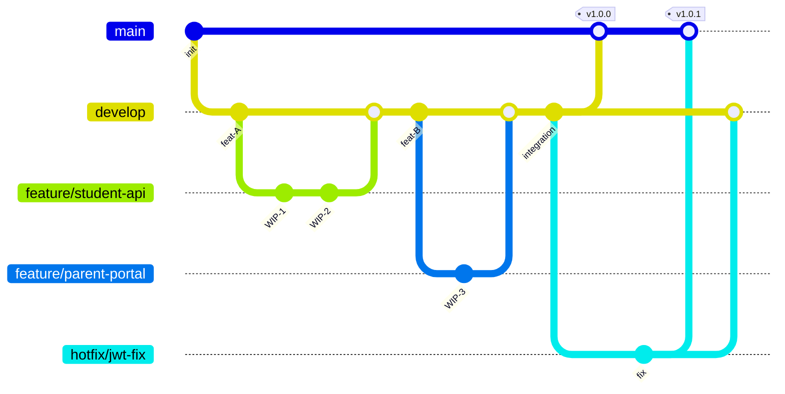

# OpenMT EduInst — Git 分支策略

## 1. 概述

本文档定义 OpenMT EduInst 项目的 Git 分支管理规范，适用于所有参与开发的团队成员。

**选择的策略**：Git Flow 简化版（GitHub Flow + develop 长期分支）

**核心原则**：
- 一套代码服务所有租户，不按租户分离分支
- 所有功能通过 feature 分支开发，经 PR 合并到 develop
- main 分支始终代表生产就绪状态

---

## 2. 为什么选择此策略

| 策略 | 适用场景 | 本项目适配度 |
|------|---------|-------------|
| Git Flow（完整版） | 大团队、多版本并行发布 | ⚠️ 过重 |
| **Git Flow 简化版** | 中小团队、持续交付 | ✅ 最佳 |
| GitHub Flow | 极简团队、纯 SaaS | ⚠️ 缺少集成分支 |
| Trunk-Based | 高成熟度 CI/CD + 特性开关 | ⚠️ 对团队要求高 |

**选择理由**：
1. 团队规模适中，不需要完整版 Git Flow 的复杂度
2. CI 已配置 `main` + `develop` 双分支触发（见 `.github/workflows/backend-ci.yml`）
3. develop 作为集成分支，可在合并到生产前进行充分测试
4. 保留 release 分支的能力，支持版本冻结测试

---

## 3. 多租户架构与分支策略的关系

### 3.1 当前多租户实现方式

OpenMT EduInst 采用**运行时数据隔离**的多租户架构：

```
┌─────────────┐     ┌──────────────────────┐     ┌─────────────────┐
│  HTTP 请求   │ ──→ │ TenantIsolation      │ ──→ │ 路由层           │
│ (JWT Token)  │     │ Middleware            │     │ filter(org_id)  │
│              │     │ 解析 org_id 注入 state│     │ 数据隔离查询     │
└─────────────┘     └──────────────────────┘     └─────────────────┘
```

- **TenantIsolationMiddleware**：从 JWT Token 解析 `org_id`，注入到 `request.state`
- **TenantFeatureFlag**：数据库存储的功能开关表，控制不同租户可见的功能模块
- **TenantConfig**：JSON 格式的业务配置表，存储租户特定的业务参数

### 3.2 为什么"按租户分分支"不可取

#### ❌ 错误做法
```
main
├── tenant/training-institution-A   # 培训机构 A
├── tenant/training-institution-B   # 培训机构 B
├── tenant/k12-school-C            # K12 学校 C
└── tenant/bureau-D                # 教育局 D
```

#### ❌ 不可取的五大原因

**1. 代码重复与同步困难**
- 共享逻辑（认证、审计、基础 CRUD）的 Bug 修复需要在 N 个分支重复 cherry-pick
- 遗漏同步会导致某些租户分支存在已知安全漏洞

**2. 合并地狱**
- 随着租户数量增加，分支间交叉合并冲突呈指数增长
- 每个租户分支的定制化修改会与其他租户分支产生大量冲突

**3. CI/CD 爆炸**
- 每个租户分支需要独立的 CI pipeline 配置和维护
- 测试矩阵复杂度随租户数量线性增长
- 构建资源消耗倍增

**4. 违反架构设计初衷**
- 多租户架构的设计本意就是"一套代码，运行时隔离"
- 按租户分分支等于退化回"多套代码"，完全丧失了多租户架构的优势

**5. 发布同步困难**
- 安全补丁无法同时生效于所有租户
- 紧急修复需要逐个租户分支发布，窗口期存在安全风险

#### ✅ 正确做法

通过数据库配置驱动租户差异，而非代码分支：

| 租户差异类型 | 实现方式 | 存储位置 |
|-------------|---------|---------|
| 功能可见性 | `TenantFeatureFlag` | `tenant_feature_flags` 表 |
| 业务参数 | `TenantConfig.config_data` | `tenant_configs` 表（JSON） |
| UI 差异 | Feature Flag 条件渲染 | 前端代码 + API 返回的 flag |
| 专属路由 | 独立 route 文件 | `routes/vocational_routes.py` 等 |

**新增租户时的操作**：
1. 在数据库创建组织记录
2. `TenantInitService.initialize_tenant()` 自动初始化功能开关和配置
3. 无需任何代码改动，无需创建分支

---

## 4. 分支模型图



### 长期分支

| 分支 | 用途 | 保护级别 |
|------|------|---------|
| `main` | 生产就绪，每次合入打 tag | 🔒 严格（PR + Review + CI） |
| `develop` | 开发集成分支，日常 PR 目标 | 🔓 中等（PR + CI） |

### 临时分支

| 类型 | 来源 | 合并目标 | 生命周期 |
|------|------|---------|---------|
| `feature/*` | develop | develop | 合并后删除 |
| `fix/*` | develop | develop | 合并后删除 |
| `hotfix/*` | main | main + develop | 合并后删除 |
| `release/*` | develop | main + develop | 发布后删除 |
| `docs/*` | develop | develop | 合并后删除 |

---

## 5. 分支命名规范

| 类型 | 格式 | 示例 |
|------|------|------|
| 功能 | `feature/<描述>` | `feature/student-import` |
| 修复 | `fix/<issue号或描述>` | `fix/issue-42-login-crash` |
| 热修复 | `hotfix/<描述>` | `hotfix/tenant-token-expiry` |
| 发布 | `release/<版本号>` | `release/v1.2.0` |
| 文档 | `docs/<描述>` | `docs/branching-strategy` |

**命名规则**：
- ✅ 全小写英文
- ✅ 短横线 `-` 分隔单词
- ✅ 简洁描述性（不超过 50 字符）
- ❌ 不使用中文
- ❌ 不使用下划线 `_`
- ❌ 不使用大写字母
- ❌ 不使用特殊字符

---

## 6. 工作流步骤

### 6.1 功能开发流程

```bash
# 1. 更新 develop 到最新
git checkout develop
git pull origin develop

# 2. 切出功能分支
git checkout -b feature/student-import

# 3. 本地开发 + 提交（遵循 Conventional Commits）
git add .
git commit -m "feat(backend): add student CSV import endpoint"

# 4. 推送到远程
git push -u origin feature/student-import

# 5. 在 GitHub 创建 PR → develop
# 6. CI 自动运行 + Code Review
# 7. 合并后删除远程 feature 分支
```

### 6.2 发布流程

```bash
# 1. 从 develop 切出 release 分支
git checkout develop
git pull origin develop
git checkout -b release/v1.2.0

# 2. 仅允许 bugfix 提交到 release 分支
git commit -m "fix(backend): correct pagination in release"

# 3. 测试通过后 PR → main
# 4. 合并到 main 后打 tag
git tag -a v1.2.0 -m "Release v1.2.0"
git push origin v1.2.0

# 5. 同步 release 期间的修复回 develop
git checkout develop
git merge release/v1.2.0
git push origin develop

# 6. 删除 release 分支
git branch -d release/v1.2.0
```

### 6.3 热修复流程

```bash
# 1. 从 main 切出 hotfix 分支
git checkout main
git pull origin main
git checkout -b hotfix/tenant-token-expiry

# 2. 修复 + 提交
git commit -m "fix(middleware): extend JWT token expiry for tenant isolation"

# 3. PR → main（紧急合并）
# 4. main 打 tag
git tag -a v1.2.1 -m "Hotfix: tenant token expiry"
git push origin v1.2.1

# 5. 同步修复到 develop（关键！）
git checkout develop
git merge hotfix/tenant-token-expiry
git push origin develop

# 6. 删除 hotfix 分支
git branch -d hotfix/tenant-token-expiry
```

---

## 7. PR 规范

### 7.1 基本要求
- ✅ 必须使用项目 PR 模板（`.github/PULL_REQUEST_TEMPLATE.md`）
- ✅ PR 标题遵循 Conventional Commits 格式
- ✅ 至少 1 人 Review 后方可合并到 main
- ✅ CI（Backend CI）必须通过
- ✅ 无合并冲突

### 7.2 PR 标题格式
```
<type>(<scope>): <description>

# 示例
feat(backend): add parent portal notification API
fix(frontend): correct STEM lab device status display
docs: update API specification for v1.2
refactor(middleware): simplify tenant isolation logic
```

### 7.3 PR 大小建议
- 单个 PR 改动不超过 **400 行**（不含自动生成代码）
- 大功能拆分为多个小 PR
- 数据库迁移脚本单独提交

---

## 8. Commit 信息规范

采用 [Conventional Commits](https://www.conventionalcommits.org/) 规范：

```
<type>(<scope>): <description>

[可选的 body]

[可选的 footer]
```

### Type 类型

| Type | 说明 | 示例 |
|------|------|------|
| `feat` | 新功能 | `feat(backend): add student enrollment API` |
| `fix` | Bug 修复 | `fix(frontend): correct date format in schedule view` |
| `docs` | 文档更新 | `docs: update deployment guide` |
| `refactor` | 重构 | `refactor(services): extract license validation logic` |
| `test` | 测试 | `test(backend): add unit tests for tenant init service` |
| `chore` | 构建/工具 | `chore(ci): add frontend build step` |
| `perf` | 性能优化 | `perf(backend): optimize tenant config query with index` |
| `style` | 格式调整 | `style(frontend): align STEM lab icons` |

### Scope 范围

| Scope | 说明 |
|-------|------|
| `backend` | FastAPI 后端代码 |
| `frontend` | Angular 前端代码 |
| `marketing` | Next.js 营销站 |
| `ci` | CI/CD 配置 |
| `config` | 项目配置 |
| `middleware` | 中间件层 |
| `services` | 服务层 |

---

## 9. 分支保护规则（GitHub 设置）

### main 分支保护

| 规则 | 设置 |
|------|------|
| Require pull request before merging | ✅ 启用 |
| Required approving reviews | 1 |
| Require status checks to pass | ✅ 启用 |
| Required checks | Backend CI |
| Disallow force push | ✅ 启用 |
| Disallow deletion | ✅ 启用 |
| Require linear history | ⚠️ 可选 |

### develop 分支保护

| 规则 | 设置 |
|------|------|
| Require pull request before merging | ✅ 启用 |
| Required approving reviews | 0（自审可合并） |
| Require status checks to pass | ✅ 启用 |
| Required checks | Backend CI |
| Disallow force push | ✅ 启用 |
| Disallow deletion | ✅ 启用 |

> ⚠️ **注意**：当前 CI 测试步骤末尾有 `|| true`（`backend-ci.yml` 第 60 行），导致测试失败也被忽略。建议在启用分支保护前移除此后缀，否则 "Require status checks" 将形同虚设。

---

## 10. 常见问题 FAQ

### Q1：新增一个租户类型（如国际学校）需要创建分支吗？
**A**：不需要。只需要：
1. 在 `OrganizationType` 枚举中新增类型
2. 在 `TenantInitService.DEFAULT_FEATURES` 和 `DEFAULT_CONFIGS` 中添加默认配置
3. 如有专属路由，新建 `routes/international_routes.py`

### Q2：某个租户需要定制功能怎么办？
**A**：通过以下方式实现，不创建分支：
1. 在 `tenant_feature_flags` 表添加定制功能开关
2. 在 `TenantConfig.config_data` JSON 中存储定制参数
3. 代码中用 `if feature_flag.is_enabled` 做条件判断

### Q3：开发中需要同时修改前后端怎么建分支？
**A**：使用同一个 feature 分支，前后端改动在同一分支内提交。由于本项目是 monorepo，前后端代码在同一仓库。

### Q4：hotfix 忘记同步到 develop 怎么办？
**A**：立即补做：
```bash
git checkout develop
git cherry-pick <hotfix-commit-hash>
git push origin develop
```

### Q5：多人协作同一个功能分支如何操作？
**A**：
1. 创建 feature 分支后推送到远程
2. 其他成员 `git checkout feature/xxx` 拉取该分支
3. 各自提交后 push，通过 `git pull --rebase` 同步
4. 最终由负责人统一创建 PR

---

## 附录：相关文件

| 文件 | 说明 |
|------|------|
| `.github/workflows/backend-ci.yml` | CI 配置（触发 main + develop） |
| `.github/PULL_REQUEST_TEMPLATE.md` | PR 模板 |
| `.github/ISSUE_TEMPLATE/bug_report.md` | Bug 报告模板 |
| `.github/ISSUE_TEMPLATE/feature_request.md` | 功能需求模板 |
| `backend/middleware/tenant_isolation.py` | 租户隔离中间件 |
| `backend/models/tenant.py` | 租户配置模型 |
| `backend/services/tenant_init_service.py` | 租户初始化服务 |
