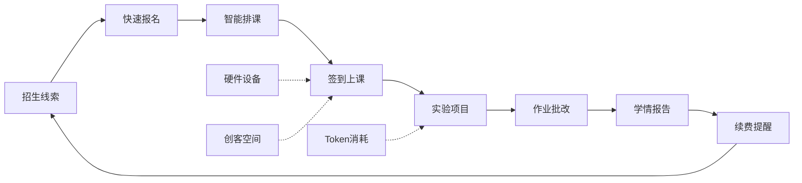
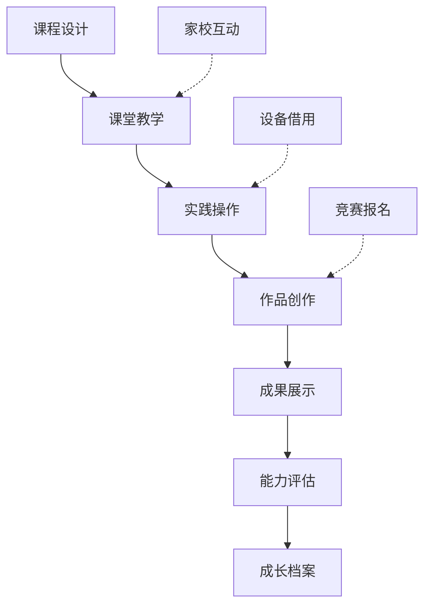
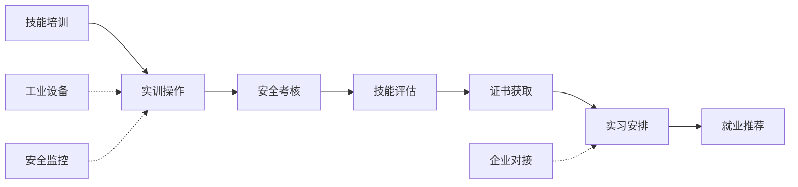
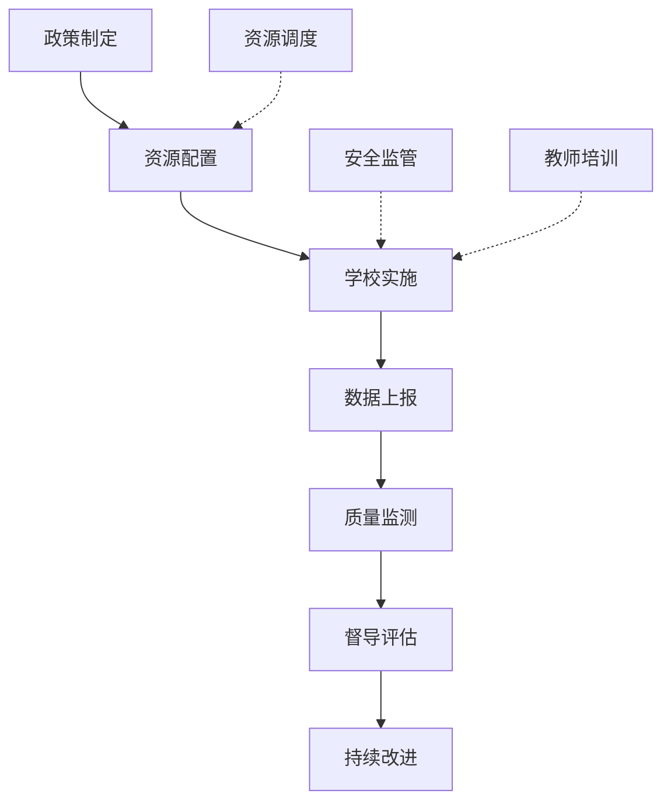

# OpenMT 机构驾驶舱产品需求文档

**版本**: v1.0  
**日期**: 2026-05-20  
**状态**: 📋 需求定义完成  
**参考标准**: [MatuX 机构驾驶舱](https://www.matux.tech/institution-dashboard)

---

## 📋 目录

1. [项目概述](#项目概述)
2. [设计原则](#设计原则)
3. [组织类型分析](#组织类型分析)
4. [培训机构驾驶舱需求](#1-培训机构-training-institution)
5. [K12学校驾驶舱需求](#2-k12学校-k12-school)
6. [职业学校驾驶舱需求](#3-职业学校-vocational-school)
7. [教育局驾驶舱需求](#4-教育局-education-bureau)
8. [通用功能规范](#通用功能规范)
9. [技术实现要点](#技术实现要点)
10. [原型开发优先级](#原型开发优先级)

---

## 项目概述

### 背景

OpenMT 是专为 STEM 教育设计的开源机构管理系统，支持四种不同类型的组织：
- **STEM 培训机构**: 商业化运营的机器人/编程培训机构
- **K12 学校**: 基础教育阶段的科创教育中心
- **职业学校**: 职业技能实训基地
- **教育局**: 区域 STEM 教育监管平台

### 目标

参考 MatuX 机构驾驶舱的设计理念，为每种组织类型打造定制化的管理驾驶舱，突出各自业务特点，同时保持产品整体一致性。

### 核心价值

| 维度 | 价值体现 |
|------|---------|
| **差异化** | 突出硬件管理、实验项目、Token计费、创客空间等STEM特色 |
| **定制化** | 四种组织类型各有专属的功能模块和指标体系 |
| **效率提升** | 关键数据一目了然，常用操作一键可达 |
| **业务闭环** | 从招生/教学到评估/反馈的完整业务流程支持 |

---

## 设计原则

### 1. 视觉设计规范

#### 色彩系统
```
主色调:
- 科技蓝 (Primary Blue): #0066FF
- 电路板绿 (Circuit Green): #00CC66

辅助色:
- 警告橙 (Warning Orange): #FF6600
- 错误红 (Error Red): #FF3333
- 中性灰 (Neutral Gray): #0F172A / #1E293B / #334155
```

#### 布局结构
每个驾驶舱采用统一的四段式布局：
```
┌─────────────────────────────────────┐
│  顶部导航栏 (Logo + 组织名称 + 用户) │
├─────────────────────────────────────┤
│  核心指标卡片 (4个关键数据)          │
├─────────────────────────────────────┤
│  左侧: 常用功能模块 (4-6个)          │
│  右侧: 快捷操作栏 + 资源中心         │
├─────────────────────────────────────┤
│  底部: STEM特色功能区                │
└─────────────────────────────────────┘
```

### 2. 交互设计规范

- **响应式设计**: 支持 Desktop (1280px+)、Tablet (768-1024px)、Mobile (<768px)
- **动画效果**: 页面过渡 300ms，按钮悬停 200ms，卡片上浮 4px
- **数据刷新**: 核心指标实时刷新，图表数据定时更新（30s间隔）
- **加载状态**: 骨架屏 + 进度条，避免白屏等待

### 3. 信息架构原则

- **重要性优先**: 最关键的业务指标放在最显眼位置
- **操作便捷**: 高频操作不超过 2 次点击
- **上下文相关**: 根据组织类型动态显示相关功能
- **数据可视化**: 用图表代替纯数字，提升可读性

---

## 组织类型分析

### 对比矩阵

| 维度 | 培训机构 | K12学校 | 职业学校 | 教育局 |
|------|---------|---------|---------|--------|
| **核心目标** | 营收增长、学员续费 | 教学质量、学生发展 | 技能认证、就业对接 | 区域均衡、安全监管 |
| **主要用户** | 管理员、招生顾问、教师 | 校长、教务主任、教师 | 实训主任、企业导师 | 教育局官员、督导员 |
| **关键痛点** | 设备损耗、排课冲突 | 家校沟通、成果展示 | 安全管理、设备维护 | 数据统计、资源调配 |
| **STEM特色** | 硬件租赁、Token计费 | 班级设备、作品展示 | 工业设备、安全准入 | 资源调度、质量监测 |
| **商业模式** | B2C 收费培训 | 政府拨款/学费 | 政府拨款+企业合作 | 财政拨款 |

---

## 1. 培训机构 (Training Institution)

### 1.1 定位与场景

**典型用户**: 星海机器人培训中心、创客教育工作室  
**业务模式**: 面向 K12 学生的付费 STEM 培训课程  
**核心诉求**: 提高招生转化率、优化课时消耗、降低设备损耗

### 1.2 核心指标卡片

| 指标名称 | 示例数据 | 说明 | 更新频率 |
|---------|---------|------|---------|
| **在训学员数** | 328人 | 当前活跃学员总数，含环比变化 | 实时 |
| **本月营收** | ¥12.5W | 当月总收入（课程费+设备租赁+其他） | 实时 |
| **本月消课率** | 92% | 已消耗课时 / 总购买课时 | 每日 |
| **设备使用率** | 85% | STEM设备日均使用时长占比 | 每日 |

**设计要求**:
- 每个卡片显示当前值、环比变化（↑↓箭头+百分比）
- 点击卡片可跳转到详细数据页面
- 异常值高亮显示（如消课率<70%显示橙色警告）

### 1.3 常用功能模块

#### 模块 1: 招生线索
- **标题**: 招生线索
- **副标题**: 15位待跟进
- **图标**: `user-plus`
- **功能**: 
  - 显示新增线索数量（今日/本周/本月）
  - 线索来源分布（线上广告、转介绍、地推等）
  - 转化率漏斗图
- **快捷入口**: [查看全部线索] [添加新线索]

#### 模块 2: 智能排课
- **标题**: 智能排课
- **副标题**: 本周42节课
- **图标**: `calendar-check`
- **功能**:
  - 本周课程日历视图
  - 冲突检测提醒（教师/教室/时间冲突）
  - 负载均衡建议
- **快捷入口**: [查看课表] [智能排课] [处理冲突]

#### 模块 3: 课时结算
- **标题**: 课时结算
- **副标题**: 待确认8单
- **图标**: `file-text`
- **功能**:
  - 教师课时费结算清单
  - 自动计算（课时数 × 单价）
  - 批量确认/导出
- **快捷入口**: [待确认列表] [历史结算] [导出报表]

#### 模块 4: 直播授课
- **标题**: 直播授课
- **副标题**: 在线教室3间
- **图标**: `video`
- **功能**:
  - 当前在线教室列表
  - 实时观看人数统计
  - 录制回放管理
- **快捷入口**: [进入教室] [查看回放] [创建新课]

### 1.4 快捷操作栏

| 操作名称 | 图标 | 功能描述 | 权限要求 |
|---------|------|---------|---------|
| **快速报名** | `user-plus` | 一键录入新学员信息，自动生成合同 | 管理员/招生顾问 |
| **请假处理** | `calendar-x` | 批量审批学员请假申请，自动调整课时 | 教师/管理员 |
| **作业批改** | `check-square` | 查看待批改的实验项目作业，在线评分 | 教师 |
| **签到打卡** | `clock` | 学员上课扫码签到，自动记录出勤 | 教师/前台 |
| **续费提醒** | `bell` | 即将到期学员列表，一键发送提醒 | 招生顾问 |

**设计要求**:
- 采用按钮组形式，横向排列
- 每个按钮带图标 + 文字标签
- 悬停显示 Tooltip 详细说明
- 未读消息/待处理数量以 Badge 形式显示

### 1.5 教学资源中心

#### 子模块 1: 课件发布
- **功能**: STEM课程课件上传、版本管理、共享给其他教师
- **支持格式**: PPT、PDF、视频、代码文件
- **特色**: 与实验项目关联，自动归档到对应课程

#### 子模块 2: 活动推广
- **功能**: 生成朋友圈海报、微信公众号推文模板
- **模板库**: 招生宣传、节日活动、竞赛报名、成果展示
- **特色**: 自定义机构 Logo、联系方式、二维码

#### 子模块 3: 学情报告
- **功能**: 自动生成学员学习进度报告，一键发送给家长
- **内容**: 出勤率、课时消耗、项目完成情况、能力评估
- **特色**: 可视化图表（雷达图展示各项能力）

#### 子模块 4: 素材库
- **分类**: 教案、实验指导书、代码模板、3D打印模型
- **搜索**: 按关键词、标签、适用年龄段筛选
- **特色**: 社区共享，可下载其他机构的优质资源

### 1.6 STEM 特色功能区

#### 功能 1: 硬件设备管理
- **设备清单**: Arduino、Raspberry Pi、传感器套件、电机等
- **库存状态**: 在库、借出、维修中、报废
- **租赁记录**: 学员借用历史、押金管理、逾期提醒
- **维护日志**: 维修记录、耗材更换、损耗统计
- **可视化**: 设备使用热力图、故障率趋势

#### 功能 2: 实验项目跟踪
- **项目列表**: 机器人竞赛、创客作品、编程挑战
- **进度管理**: 需求分析 → 方案设计 → 编码实现 → 测试调试 → 成果展示
- **团队协作**: 小组成员分工、代码仓库集成、版本控制
- **评审系统**: 教师评分、同伴互评、自评反思
- **作品集**: 自动生成学生个人作品集，支持导出 PDF

#### 功能 3: Token 余额监控
- **当前余额**: 显示剩余 Token 数量
- **消耗明细**: AI 助教、智能评测、课程生成等功能的使用记录
- **充值入口**: 在线购买 Token 套餐
- **预警机制**: 余额低于阈值时自动提醒
- **成本分析**: 各功能模块的 Token 消耗占比

#### 功能 4: 创客空间预约
- **空间列表**: Arduino 实验室、3D 打印工坊、机器人竞赛室
- **预约日历**: 可视化时间段选择，冲突自动检测
- **设备配套**: 预约时同步选择所需设备
- **安全准入**: 检查学员是否具备操作资质
- **使用记录**: 历史预约、实际使用时长、满意度评价

### 1.7 业务流程图



---

## 2. K12学校 (K12 School)

### 2.1 定位与场景

**典型用户**: 中小学科创中心、STEM 特色学校  
**业务模式**: 校内 STEM 课程教学 + 课外兴趣班  
**核心诉求**: 提升教学质量、展示学生成果、加强家校沟通

### 2.2 核心指标卡片

| 指标名称 | 示例数据 | 说明 | 更新频率 |
|---------|---------|------|---------|
| **在训学生数** | 1,250人 | 参与 STEM 课程的学生总数（占全校 XX%） | 实时 |
| **课程完成率** | 78% | 本学期 STEM 课程整体完成进度 | 每周 |
| **设备完好率** | 96% | Micro:bit、传感器等教学设备正常运行比例 | 每日 |
| **竞赛获奖数** | 23项 | 学生在科创竞赛中的获奖数量（本年累计） | 每月 |

**设计要求**:
- 强调覆盖率（如"占全校 65% 学生"）
- 设备完好率用颜色标识（绿色>95%，黄色 85-95%，红色<85%）
- 竞赛获奖数可按级别分类（国家级/省级/市级）

### 2.3 常用功能模块

#### 模块 1: 课表查询
- **标题**: 课表查询
- **副标题**: 本周 56 节 STEM 课
- **图标**: `calendar`
- **功能**:
  - 按班级/教师/教室多维度查看课表
  - 课程类型分布（编程、机器人、3D 打印等）
  - 调课/代课申请流程
- **快捷入口**: [查看课表] [申请调课] [导出课表]

#### 模块 2: 家校互动
- **标题**: 家校互动
- **副标题**: 12条未读消息
- **图标**: `message-circle`
- **功能**:
  - 家长留言回复
  - 学生表现反馈推送
  - 活动通知发送
- **快捷入口**: [消息中心] [发送通知] [查看反馈]

#### 模块 3: 成绩分析
- **标题**: 成绩分析
- **副标题**: 平均分 85.3
- **图标**: `bar-chart-2`
- **功能**:
  - 班级/年级 STEM 成绩趋势
  - 各项能力维度雷达图（逻辑思维、动手能力等）
  - 优秀学生/进步学生榜单
- **快捷入口**: [详细分析] [生成报告] [导出数据]

#### 模块 4: 考勤管理
- **标题**: 考勤管理
- **副标题**: 今日出勤率 94%
- **图标**: `clipboard-check`
- **功能**:
  - 学生上课出勤记录
  - 缺勤原因统计（病假/事假/旷课）
  - 异常出勤预警
- **快捷入口**: [考勤记录] [请假审批] [异常名单]

### 2.4 快捷操作栏

| 操作名称 | 图标 | 功能描述 | 权限要求 |
|---------|------|---------|---------|
| **快速分班** | `users` | 为新学年学生分配 STEM 兴趣班 | 教务主任 |
| **请假审批** | `check-circle` | 审批学生 STEM 课程请假申请 | 班主任/教师 |
| **作品上传** | `upload` | 学生提交创客作品，教师审核 | 学生/教师 |
| **家长通知** | `send` | 向家长群发学习报告和活动通知 | 教师/管理员 |
| **设备借用** | `package` | 学生借用 Micro:bit 等设备的登记 | 实验员/教师 |

### 2.5 教学资源中心

#### 子模块 1: 课程资源
- **课程标准**: 符合国家 STEM 教育标准的教案模板
- **分级课程**: 按年级/难度分类的课程包
- **跨学科整合**: STEM 与语文、数学、艺术的融合案例
- **特色**: 支持校本课程开发，可自定义课程内容

#### 子模块 2: 活动推广
- **校园科技节**: 活动策划方案、宣传海报模板
- **创客大赛**: 校内选拔赛组织指南
- **科普讲座**: 专家资源库、讲座录像
- **特色**: 活动报名系统，自动生成参与者名单

#### 子模块 3: 学情报告
- **个体报告**: 每位学生的 STEM 能力发展档案
- **班级报告**: 班级整体学习情况分析
- **成长轨迹**: 从小学到高中的长期追踪
- **特色**: 与家长端 APP 联动，实时推送学习动态

#### 子模块 4: 素材库
- **实验视频**: 科学实验操作演示视频
- **编程教程**: Scratch、Python、C++ 入门教程
- **3D 模型**: 可打印的教学模型库
- **特色**: 与教材出版社合作，提供正版教学资源

### 2.6 STEM 特色功能区

#### 功能 1: 班级设备管理
- **设备清单**: 各班級专属的 Micro:bit、传感器、乐高套件
- **借用记录**: 课堂借用、课后借用、假期借用
- **损耗统计**: 损坏率、遗失率、维修成本
- **盘点功能**: 学期末设备清点，自动生成盘点报告
- **特色**: 二维码扫描快速登记，减少人工录入

#### 功能 2: 学生作品展示
- **在线展厅**: 学生机器人、编程作品的 3D 展示
- **分类浏览**: 按年级、主题、技术类型筛选
- **投票互动**: 师生可为喜欢的作品点赞
- **作品集导出**: 自动生成学生个人作品集（PDF/网页）
- **特色**: 支持嵌入视频演示、代码片段、设计思路说明

#### 功能 3: 成长档案
- **能力图谱**: 逻辑思维、创新能力、协作能力等多维度评估
- **学习历程**: 记录学生参与的每个项目、竞赛、活动
- **证书管理**: 获得的各类 STEM 相关证书
- **教师评语**: 每学期教师对学生的主观评价
- **特色**:  longitudinal tracking，形成完整的 STEM 学习履历

#### 功能 4: 竞赛报名
- **竞赛日历**: 全年科创竞赛时间表（FLL、VEX、NOI 等）
- **校内选拔**: 组织校内预选赛，筛选参赛队伍
- **报名管理**: 统一报名、缴费、资料提交
- **备战跟踪**: 训练计划、模拟比赛、心理辅导
- **特色**: 历史获奖数据分析，指导备赛策略

### 2.7 业务流程图



---

## 3. 职业学校 (Vocational School)

### 3.1 定位与场景

**典型用户**: 技工学校、职业高中、高职学院实训中心  
**业务模式**: 职业技能培训 + 企业实习 + 资格认证  
**核心诉求**: 保障实训安全、提高技能达标率、促进就业对接

### 3.2 核心指标卡片

| 指标名称 | 示例数据 | 说明 | 更新频率 |
|---------|---------|------|---------|
| **在训学员数** | 856人 | 参与职业技能培训的学生总数 | 实时 |
| **实训设备利用率** | 72% | PLC、CNC、工业机器人等设备使用效率 | 每日 |
| **技能认证通过率** | 88% | 学生获得职业资格证书的通过比例 | 每月 |
| **就业对接率** | 65% | 已落实实习/就业岗位的学生比例 | 每季度 |

**设计要求**:
- 强调安全性指标（如"连续 120 天无事故"）
- 设备利用率区分不同设备类型（昂贵设备优先显示）
- 就业对接率可按专业/企业合作方细分

### 3.3 常用功能模块

#### 模块 1: 实训管理
- **标题**: 实训管理
- **副标题**: 今日 12 个实训班组
- **图标**: `tool`
- **功能**:
  - 实训课程安排与设备分配
  - 操作流程标准化检查
  - 实训成绩记录
- **快捷入口**: [实训课表] [操作规范] [成绩录入]

#### 模块 2: 实习跟踪
- **标题**: 实习跟踪
- **副标题**: 235人在岗实习
- **图标**: `briefcase`
- **功能**:
  - 实习企业信息与岗位分布
  - 学生实习周报/月报提交
  - 企业导师评价反馈
- **快捷入口**: [实习名单] [周报汇总] [企业反馈]

#### 模块 3: 技能认证
- **标题**: 技能认证
- **副标题**: 本月 45 人参加考试
- **图标**: `award`
- **功能**:
  - 职业资格证书种类与要求
  - 考试报名与准考证打印
  - 通过率分析与补考安排
- **快捷入口**: [证书列表] [报名入口] [成绩查询]

#### 模块 4: 企业对接
- **标题**: 企业对接
- **副标题**: 合作企业 38 家
- **图标**: `building`
- **功能**:
  - 合作企业名录与联系人
  - 实习岗位/招聘信息发布
  - 校企合作项目进展
- **快捷入口**: [企业列表] [招聘岗位] [合作项目]

### 3.4 快捷操作栏

| 操作名称 | 图标 | 功能描述 | 权限要求 |
|---------|------|---------|---------|
| **设备预约** | `calendar-plus` | 学生预约使用昂贵的工业设备 | 学生/教师 |
| **安全准入** | `shield-check` | 检查学生是否具备操作特定设备的安全资质 | 实训教师 |
| **实习报告** | `file-text` | 提交和审核学生的实习总结报告 | 学生/企业导师 |
| **证书申请** | `award` | 为学生申请相关的职业技能证书 | 教务员 |
| **企业联络** | `phone` | 与合作企业沟通学生实习事宜 | 就业办主任 |

### 3.5 教学资源中心

#### 子模块 1: 实训指导
- **操作规程**: 工业设备的标准操作流程（SOP）
- **安全手册**: 各类设备的安全注意事项和应急处理
- **故障排查**: 常见故障诊断与维修指南
- **特色**: VR/AR 沉浸式操作培训，降低实操风险

#### 子模块 2: 案例库
- **真实项目**: 来自合作企业的实际工程案例
- **问题分析**: 工程问题的解决思路与方法
- **最佳实践**: 行业内的优秀做法与标准
- **特色**: 企业工程师参与案例编写，确保与时俱进

#### 子模块 3: 认证资料
- **考试大纲**: 各类职业资格证书的考试范围
- **模拟试题**: 历年真题与模拟练习
- **培训视频**: 考前强化培训课程
- **特色**: 与认证机构合作，提供官方备考资源

#### 子模块 4: 企业资源
- **技术文档**: 合作企业提供的设备说明书、技术资料
- **行业标准**: 相关行业的技术标准与规范
- **职业发展规划**: 各职业路径的成长路线与建议
- **特色**: 企业内训资源开放给学生，提前适应职场

### 3.6 STEM 特色功能区

#### 功能 1: 工业设备管理
- **设备清单**: PLC 控制系统、CNC 机床、工业机器人、3D 打印机
- **全生命周期**: 采购 → 安装 → 使用 → 维护 → 报废
- **预防性维护**: 基于使用时长的保养计划提醒
- **备件管理**: 易损件库存、采购建议、更换记录
- **特色**: IoT 传感器实时监控设备运行状态（温度、振动等）

#### 功能 2: 安全监控系统
- **准入控制**: 只有经过安全培训并考核合格的学生才能操作设备
- **实时监控**: 摄像头 + AI 识别违规操作（如未戴安全帽）
- **紧急停机**: 一键紧急停止所有设备，保障人员安全
- **事故记录**: 安全事故的详细记录与分析，持续改进
- **特色**: 与设备联锁，未经认证无法启动高危设备

#### 功能 3: 技能评估体系
- **能力矩阵**: 各专业所需的技能清单与等级标准
- **实操考核**: 基于真实任务的技能水平测试
- **自动化评分**: AI 辅助评估操作规范性与完成质量
- **成长曲线**: 学生技能水平的长期追踪与可视化
- **特色**: 与企业联合制定评估标准，确保与岗位需求匹配

#### 功能 4: 产教融合平台
- **项目合作**: 企业提供真实项目，学生团队承接实施
- **双师制**: 学校教师 + 企业工程师共同指导
- **人才输送**: 优秀毕业生直接推荐到合作企业就业
- **反馈循环**: 企业对毕业生的评价反馈用于改进教学
- **特色**: 建立校企共同体，实现教育与产业的深度融合

### 3.7 业务流程图



---

## 4. 教育局 (Education Bureau)

### 4.1 定位与场景

**典型用户**: 市/区教育局 STEM 教育管理部门  
**业务模式**: 区域 STEM 教育规划、资源配置、质量监管  
**核心诉求**: 促进教育公平、保障安全合规、提升整体质量

### 4.2 核心指标卡片

| 指标名称 | 示例数据 | 说明 | 更新频率 |
|---------|---------|------|---------|
| **辖区学校数** | 127所 | 开展 STEM 教育的学校总数（覆盖率 XX%） | 每月 |
| **设备资源总量** | ¥2,350W | 区域内所有学校的 STEM 设备总价值 | 每季度 |
| **师资培训覆盖率** | 73% | 接受过 STEM 教育培训的教师比例 | 每半年 |
| **学生参与率** | 58% | 参与 STEM 课程的学生占全区学生的比例 | 每学期 |

**设计要求**:
- 强调区域均衡性（如"城乡学校设备配置差异 <15%"）
- 用地图可视化展示各学校分布与资源情况
- 设置年度目标值，显示完成进度

### 4.3 常用功能模块

#### 模块 1: 辖区统计
- **标题**: 辖区统计
- **副标题**: 127所学校数据汇总
- **图标**: `pie-chart`
- **功能**:
  - 各学校 STEM 教育开展情况排名
  - 区域整体发展趋势分析
  - 横向对比（与其他区县/城市）
- **快捷入口**: [详细报表] [数据导出] [趋势分析]

#### 模块 2: 安全预警
- **标题**: 安全预警
- **副标题**: 2所学校需关注
- **图标**: `alert-triangle`
- **功能**:
  - 实验室安全检查结果汇总
  - 隐患整改跟踪
  - 安全事故统计分析
- **快捷入口**: [预警列表] [检查计划] [整改督办]

#### 模块 3: 资源调配
- **标题**: 资源调配
- **副标题**: 5项待审批申请
- **图标**: `shuffle`
- **功能**:
  - 学校设备/资金申请审批
  - 跨区域设备共享调度
  - 师资流动与支援安排
- **快捷入口**: [申请列表] [审批处理] [调度记录]

#### 模块 4: 政策发布
- **标题**: 政策发布
- **副标题**: 本月 3份新文件
- **图标**: `file-text`
- **功能**:
  - STEM 教育相关政策文件发布
  - 执行情况跟踪与反馈
  - 政策解读与培训通知
- **快捷入口**: [政策库] [执行报告] [培训计划]

### 4.4 快捷操作栏

| 操作名称 | 图标 | 功能描述 | 权限要求 |
|---------|------|---------|---------|
| **数据上报** | `upload-cloud` | 收集各学校的 STEM 教育统计数据 | 学校管理员 |
| **资源申请** | `plus-circle` | 学校申请新增 STEM 设备或资金 | 学校管理员 |
| **安全检查** | `shield` | 安排对辖区内学校实验室的安全检查 | 督导员 |
| **培训计划** | `users` | 组织区域性的 STEM 教师培训活动 | 教研员 |
| **质量评估** | `star` | 对各学校 STEM 教育质量进行评估排名 | 评估专家 |

### 4.5 教学资源中心

#### 子模块 1: 政策文件
- **国家政策**: 教育部关于 STEM 教育的指导意见
- **地方政策**: 本市/区的实施细则与支持措施
- **标准规范**: 实验室建设、设备配置、课程标准
- **特色**: 政策演变时间轴，帮助理解发展方向

#### 子模块 2: 最佳实践
- **示范学校**: 区域内 STEM 教育标杆学校的经验分享
- **创新案例**: 特色课程、教学模式、管理机制创新
- **研究成果**: 高校与研究机构的教育研究成果
- **特色**: 可复制推广的经验总结，附带实施工具包

#### 子模块 3: 培训资料
- **教师培训**: STEM 教学法、课程设计、评价方法
- **管理者培训**: 学校 STEM 教育规划与实施
- **在线课程**: 微课程、工作坊录像、专家讲座
- **特色**: 分层分类培训，满足不同角色需求

#### 子模块 4: 标准规范
- **实验室标准**: 场地要求、设备清单、安全规范
- **课程标准**: 各年级 STEM 学习目标与内容
- **评价标准**: 学生能力评估、学校教育质量评价
- **特色**: 与国家/国际标准对标，确保科学性

### 4.6 STEM 特色功能区

#### 功能 1: 区域数据看板
- **地理信息系统**: 地图上标注各学校位置与基本信息
- **资源分布**: 设备价值、师资力量、课程数量的空间分布
- **质量热力图**: 用颜色深浅表示各校 STEM 教育质量
- **动态监测**: 关键指标的实时变化与异常预警
- **特色**: 多维度钻取分析，从区域到学校到班级的层层深入

#### 功能 2: 资源调度中心
- **共享平台**: 昂贵设备（如 CNC 机床、3D 打印机）的跨校共享
- **预约系统**: 学校在线预约使用其他学校的设备
- **物流配送**: 设备运输、安装调试、技术支持协调
- **成本分摊**: 使用费用计算与结算机制
- **特色**: 最大化资源利用率，缩小校际差距

#### 功能 3: 安全监管网络
- **远程监控**: 联网学校的实验室视频监控接入
- **IoT 传感**: 温湿度、气体浓度、用电安全等实时监测
- **智能预警**: AI 识别安全隐患（如化学品存储不当）
- **应急响应**: 事故发生时的快速处置与资源调度
- **特色**: 构建全域安全防护网，防患于未然

#### 功能 4: 质量监测体系
- **评估指标**: 学生参与度、教师专业性、资源丰富度、成果产出
- **数据采集**: 自动从各学校系统抽取数据，减少人工填报
- **横向对比**: 同类型学校之间的对标分析
- **纵向追踪**: 学校质量的年度变化趋势
- **特色**: 基于数据的精准督导，避免"一刀切"

### 4.7 业务流程图



---

## 通用功能规范

### 1. 顶部导航栏

**组成元素**:
- Logo + 产品名称（OpenMT）
- 组织名称与类型标识
- 用户头像 + 角色标签
- 通知中心（Badge 显示未读数）
- 设置菜单

**交互行为**:
- 点击 Logo 返回首页
- 点击组织名称切换组织（多组织用户）
- 点击通知中心展开通知列表
- 点击头像下拉菜单（个人信息、退出登录）

### 2. 侧边导航菜单

**动态加载**: 根据组织类型和功能开关动态生成菜单项

**菜单结构**（以培训机构为例）:
```
- 机构驾驶舱 (Dashboard)
- 学员管理
  - 学员列表
  - 招生线索
  - 续费管理
- 课程管理
  - 课程列表
  - 智能排课
  - 课时结算
- 硬件设备
  - 设备清单
  - 租赁管理
  - 维护记录
- 实验项目
  - 项目列表
  - 作品展示
  - 竞赛管理
- 创客空间
  - 空间预约
  - 设备配套
  - 使用记录
- Token 管理
  - 余额查询
  - 充值记录
  - 消耗明细
- 数据统计
  - 营收分析
  - 消课统计
  - 设备使用
- 系统设置
  - 机构信息
  - 功能开关
  - 权限管理
```

**交互行为**:
- 支持折叠/展开
- 当前选中项高亮显示
- 鼠标悬停显示 Tooltip
- 支持快捷键快速跳转

### 3. 数据刷新机制

**实时数据**:
- 在训人数、在线教室、未读消息等
- 使用 WebSocket 推送更新

**准实时数据**（30s 刷新）:
- 营收统计、消课率、设备使用率等
- 前端定时轮询 API

**静态数据**（手动刷新）:
- 历史报表、 archived 数据等
- 提供"刷新"按钮

### 4. 权限控制

**角色定义**:
- **超级管理员**: 所有功能权限
- **机构管理员**: 除系统设置外的所有功能
- **教师**: 教学相关功能（排课、批改、项目管理）
- **招生顾问**: 招生、续费相关功能
- **实验员**: 设备管理、空间预约
- **学生/家长**: 只读权限 + 部分操作（请假、作品提交）

**权限粒度**:
- 菜单级：是否显示某菜单项
- 页面级：是否可访问某页面
- 按钮级：是否可执行某操作
- 数据级：只能查看自己相关的数据

### 5. 错误处理

**网络错误**:
- 显示友好提示："网络连接失败，请检查网络后重试"
- 提供"重试"按钮
- 自动重试机制（最多 3 次）

**业务错误**:
- 表单验证错误：字段旁显示具体错误信息
- 操作失败：Toast 提示失败原因
- 权限不足： redirect 到无权限页面

**系统错误**:
- 500 错误：显示"系统繁忙，请稍后重试"
- 记录错误日志，便于排查
- 提供客服联系方式

### 6. 无障碍设计

**键盘导航**:
- Tab 键顺序合理
- Enter/Space 触发按钮
- Esc 关闭弹窗

**屏幕阅读器**:
- 所有图标有 aria-label
- 表单字段有关联 label
- 动态内容有 live region

**视觉辅助**:
- 颜色对比度符合 WCAG AA 标准
- 不只依赖颜色传达信息（加图标/文字）
- 支持浏览器缩放（最高 200%）

---

## 技术实现要点

### 1. 前端架构

**技术栈**:
- Angular 17 + Angular Material
- RxJS 响应式编程
- NgRx 状态管理（可选）

**组件设计**:
- 通用组件：指标卡片、功能模块、操作按钮
- 组织特定组件：根据 org_type 动态加载
- 懒加载：非首屏组件按需加载

**状态管理**:
- OrganizationContextService：当前组织上下文
- TenantMenuService：动态菜单数据
- Repository Cache：API 数据缓存

### 2. 后端 API

**接口设计**:
```
GET  /api/v1/tenant/menu/{org_id}       # 获取动态菜单
GET  /api/v1/tenant/config/{org_id}     # 获取组织配置
GET  /api/v1/dashboard/metrics/{org_id} # 获取核心指标
GET  /api/v1/dashboard/modules/{org_id} # 获取功能模块数据
POST /api/v1/dashboard/actions          # 执行快捷操作
```

**数据格式**:
```typescript
interface DashboardMetrics {
  metrics: MetricCard[];
  modules: FunctionModule[];
  quickActions: QuickAction[];
  resources: ResourceCenter[];
  stemFeatures: StemFeature[];
}

interface MetricCard {
  id: string;
  title: string;
  value: string | number;
  unit?: string;
  trend?: {
    direction: 'up' | 'down' | 'stable';
    percentage: number;
  };
  alertLevel?: 'normal' | 'warning' | 'danger';
}
```

### 3. 多租户隔离

**数据隔离**:
- 所有查询自动附加 `org_id` 过滤条件
- 数据库行级权限控制（RLS）
- 缓存 key 包含 org_id 前缀

**功能隔离**:
- TenantFeatureFlag 表控制功能开关
- 前端根据 features 动态渲染
- 后端 API 校验功能权限

### 4. 性能优化

**前端优化**:
- 虚拟滚动：长列表使用 CDK Virtual Scroll
- 图片懒加载：Intersection Observer API
- 代码分割：路由级代码拆分

**后端优化**:
- Redis 缓存：热点数据缓存（5-30 分钟）
- 数据库索引：常用查询字段建立索引
- 异步任务：耗时操作放入 Celery 队列

### 5. 安全性

**认证授权**:
- JWT Token 认证
- Refresh Token 自动续期
- RBAC 权限模型

**数据安全**:
- HTTPS 加密传输
- 敏感数据脱敏显示
- SQL 注入防护（ORM 参数化查询）

**审计日志**:
- 记录所有关键操作
- 操作人、时间、IP、结果
- 支持追溯与回溯

---

## 原型开发优先级

### Phase 1: 基础框架（1-2 周）

**目标**: 搭建通用的驾驶舱框架，实现动态菜单加载

**任务**:
1. 创建 Dashboard 布局组件（顶部导航 + 侧边菜单 + 主内容区）
2. 实现 OrganizationContextService，支持组织切换
3. 对接后端 `/tenant/menu` 和 `/tenant/config` API
4. 开发通用指标卡片组件（MetricCardComponent）
5. 开发通用功能模块组件（FunctionModuleComponent）

**验收标准**:
- 可选择任意组织类型进入驾驶舱
- 菜单根据组织类型动态变化
- 核心指标卡片正确显示数据

### Phase 2: 培训机构驾驶舱（2-3 周）

**目标**: 完整实现培训机构的驾驶舱功能

**任务**:
1. 实现 4 个核心指标卡片（在训学员、营收、消课率、设备使用率）
2. 实现 4 个常用功能模块（招生线索、智能排课、课时结算、直播授课）
3. 实现 5 个快捷操作按钮
4. 实现教学资源中心 4 个子模块
5. 实现 STEM 特色功能区（硬件管理、实验项目、Token、创客空间）

**验收标准**:
- 所有数据正确显示且可交互
- 快捷操作可正常执行
- STEM 特色功能突出显示

### Phase 3: K12 学校驾驶舱（2 周）

**目标**: 实现 K12 学校的驾驶舱功能

**任务**:
1. 调整核心指标（在训学生、课程完成率、设备完好率、竞赛获奖）
2. 实现 K12 特有的功能模块（课表查询、家校互动、成绩分析、考勤管理）
3. 实现 K12 特色功能（班级设备、作品展示、成长档案、竞赛报名）

**验收标准**:
- 突出教育属性，弱化商业属性
- 家校互动功能可用
- 学生作品展示美观

### Phase 4: 职业学校驾驶舱（2 周）

**目标**: 实现职业学校的驾驶舱功能

**任务**:
1. 调整核心指标（在训学员、设备利用率、认证通过率、就业对接率）
2. 实现职校特有功能（实训管理、实习跟踪、技能认证、企业对接）
3. 实现安全监控与工业设备管理

**验收标准**:
- 安全警示醒目
- 工业设备管理专业
- 就业数据清晰

### Phase 5: 教育局驾驶舱（2 周）

**目标**: 实现教育局的驾驶舱功能

**任务**:
1. 调整核心指标（辖区学校数、设备资源总量、师资覆盖率、学生参与率）
2. 实现监管功能（辖区统计、安全预警、资源调配、政策发布）
3. 实现区域数据看板（地图可视化）

**验收标准**:
- 宏观数据可视化效果好
- 地图交互流畅
- 监管功能实用

### Phase 6: 优化与测试（1-2 周）

**目标**: 全面测试与优化

**任务**:
1. 响应式适配（Desktop/Tablet/Mobile）
2. 性能优化（加载速度、内存占用）
3. 无障碍测试（键盘导航、屏幕阅读器）
4. 浏览器兼容性测试（Chrome/Firefox/Safari/Edge）
5. 用户测试与反馈收集

**验收标准**:
- Lighthouse 评分 >90
- 所有主流浏览器正常显示
- 无明显 bug

---

## 附录

### A. 术语表

| 术语 | 英文 | 说明 |
|------|------|------|
| 在训学员 | Active Students | 当前正在参与课程的学生 |
| 消课率 | Course Consumption Rate | 已消耗课时占总购买课时的比例 |
| Token | Token | AI 服务等增值功能的计费单位 |
| 创客空间 | Makerspace | 提供工具设备的创新实践空间 |
| 家校互动 | Home-School Communication | 学校与家长之间的沟通渠道 |
| 产教融合 | Industry-Education Integration | 学校与企业的深度合作模式 |

### B. 参考资源

- [MatuX 机构驾驶舱](https://www.matux.tech/institution-dashboard)
- [Angular Material 组件库](https://material.angular.io/)
- [Lucide Icons](https://lucide.dev/)
- [WCAG 2.1 无障碍标准](https://www.w3.org/WAI/WCAG21/quickref/)

### C. 版本历史

| 版本 | 日期 | 修改内容 | 作者 |
|------|------|---------|------|
| v1.0 | 2026-05-20 | 初始版本，完成四种组织类型的需求定义 | Product Team |

---

**文档状态**: ✅ 需求定义完成  
**下一步**: UI/UX 原型设计（Figma） → 前端开发实现
