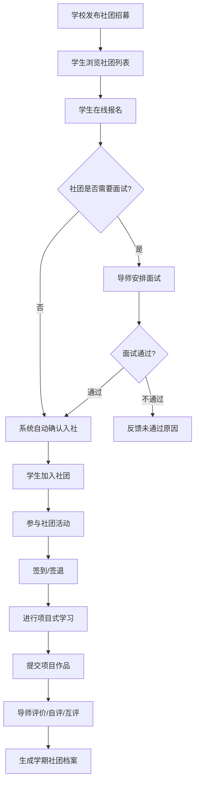
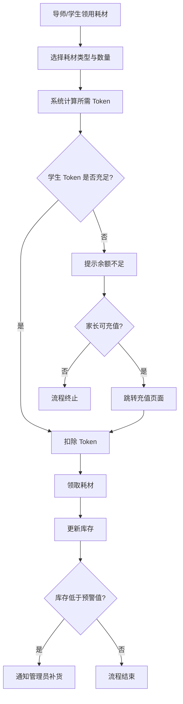
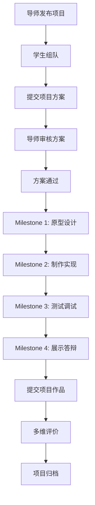
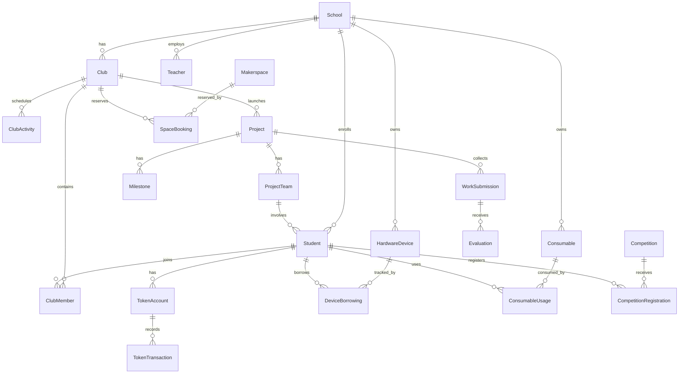
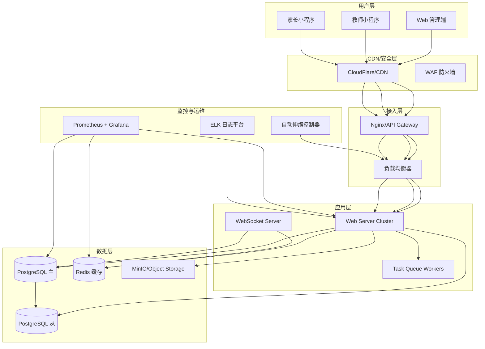

# 面向普通 K12 学校的 STEM（非学科类）教育管理 · 云托管版 —— 产品需求规格说明书（PRD）

**版本**: v1.0  
**日期**: 2026-06-23  
**状态**: 🟢 需求定义完成  
**文档定位**: 面向基础教育阶段学校（小学/初中/九年一贯制）的 **STEM 科创教育管理系统**，采用 SaaS 云托管部署模式。

> **核心差异声明（本 PRD 的灵魂）**：传统 K12 教务/校务管理系统的核心对象是「学科课程 / 班级 / 考试 / 学籍」，其业务模型为 **固定班级 + 固定课表 + 学科考试**。而 STEM 教育在普通 K12 学校中的定位是 **非学科类 / 兴趣类 / 社团类 / 项目式学习**，其业务模型是 **跨班级社团 + 硬件耗材 + 项目作品 + 竞赛报名 + 师生跨学科协作**。本 PRD 所有需求均建立在这一差异之上，**绝不**简单复用传统教务模块。

---

## 目录

1. [项目背景与目标](#1-项目背景与目标)
2. [产品定位与核心差异](#2-产品定位与核心差异)
3. [用户角色与权限](#3-用户角色与权限)
4. [功能需求](#4-功能需求)
5. [业务流程](#5-业务流程)
6. [数据模型](#6-数据模型)
7. [接口规范](#7-接口规范)
8. [非功能需求](#8-非功能需求)
9. [部署架构](#9-部署架构)
10. [安全标准](#10-安全标准)
11. [优先级矩阵](#11-优先级矩阵)
12. [术语表](#12-术语表)

---

## 1. 项目背景与目标

### 1.1 背景

教育部《义务教育课程方案和课程标准（2022 年版）》将信息科技、劳动（含工程技术）纳入独立课程，各地 K12 学校纷纷建立 STEM 科创中心/创客空间，开展机器人、编程、无人机、3D 打印、工程搭建等跨学科项目式学习活动。然而，当前市场上 **缺乏面向 K12 普通学校的 STEM 教育管理 SaaS 系统**：

- 传统教务系统（如排课、成绩、学籍管理）无法覆盖硬件设备管理、社团招募、项目作品管理等 STEM 特有场景；
- 现有 STEM 教育平台多为教学内容/LMS 型，缺乏对学校运营管理（设备、耗材、竞赛、场地）的支持；
- K12 学校 IT 能力薄弱，需要开箱即用、免运维的云托管方案。

### 1.2 目标

构建一套 **面向 K12 普通学校的 STEM 教育管理云托管系统**，实现：

- **社团全生命周期管理**：创建、招募、活动、解散
- **硬件设备与耗材管理**：入库、借用、归还、维护、盘点
- **项目式学习管理**：项目创建、里程碑、作品提交、评价
- **竞赛与等级考试管理**：报名、成绩、证书
- **创客空间/场地管理**：预约、排班、门禁联动
- **数据看板与分析**：学校/区域 STEM 教育数据可视化

### 1.3 适用范围

- **目标用户**：全国普通 K12 学校（小学、初中、九年一贯制）
- **部署方式**：SaaS 云托管（多租户）
- **终端覆盖**：Web 管理端 + 教师端小程序 + 家长端小程序
- **使用规模**：单校 500-3000 名学生，20-100 名教师

---

## 2. 产品定位与核心差异

### 2.1 与传统 K12 教务系统的核心差异

| 维度 | 传统教务系统 | STEM 教育管理系统 |
|------|-------------|------------------|
| 核心对象 | 学科课程、班级、考试、学籍 | 社团、硬件设备、项目、竞赛 |
| 教学形式 | 固定班级、固定课表、课堂授课 | 跨班级社团、项目式学习、活动制 |
| 评价方式 | 学科考试、分数排名 | 作品评价、过程评价、等级认证 |
| 资源管理 | 教材、教辅、教室 | 硬件设备、耗材、创客空间 |
| 师生关系 | 固定班主任/科任教师 | 社团导师、项目教练、跨学科协作 |
| 时间维度 | 学期制、固定课时 | 灵活排期、活动日历、竞赛周期 |
| 外部接口 | 教育局学籍系统、考试平台 | 硬件 IoT 平台、竞赛报名平台 |

### 2.2 核心竞争力

1. **STEM 专属**：不为传统教务而设计，专注科创教育管理场景
2. **云托管 SaaS**：开箱即用，零运维，自动升级
3. **硬件集成**：与主流教育硬件（机器人、3D 打印机、开源硬件）数据互通
4. **多校多租户**：支持区域教育局统一采购、学校独立使用
5. **家长参与**：家长端可查看学生作品、竞赛成果、耗材使用

---

## 3. 用户角色与权限

### 3.1 角色定义

| 角色编码 | 角色名称 | 说明 | 典型用户 |
|---------|---------|------|---------|
| R01 | 系统管理员 | 系统全局配置、租户管理、运维监控 | 云平台运营人员 |
| R02 | 校级管理员 | 学校信息配置、教师账号管理、全校数据查看 | 学校 STEM 中心主任/教务主任 |
| R03 | 社团导师 | 社团创建与管理、项目指导、设备审批 | STEM 社团负责教师 |
| R04 | 科任教师 | 协助指导、跨学科协作、评价打分 | 其他学科参与教师 |
| R05 | 学生 | 加入社团、参与项目、提交作品、借用设备 | 在校学生 |
| R06 | 家长 | 查看学生参与情况、作品成果、消费记录 | 学生家长 |
| R07 | 区域管理员 | 区域(区/县)内多校数据统计与分析 | 教育局装备中心/教研员 |

### 3.2 权限矩阵

| 功能模块 | 系统管理员 | 校级管理员 | 社团导师 | 科任教师 | 学生 | 家长 | 区域管理员 |
|---------|:---------:|:---------:|:---------:|:---------:|:---:|:---:|:---------:|
| 租户管理 | ✅ | — | — | — | — | — | — |
| 学校配置 | ✅ | ✅ | — | — | — | — | — |
| 教师账号管理 | ✅ | ✅ | — | — | — | — | — |
| 学生账号管理 | ✅ | ✅ | — | — | — | — | — |
| 社团开设 | — | ✅ | ✅ | — | — | — | — |
| 社团招募管理 | — | ✅ | ✅ | — | — | — | — |
| 社团活动排期 | — | ✅ | ✅ | ✅ | — | — | — |
| 设备入库管理 | — | ✅ | — | — | — | — | — |
| 设备借用 | — | — | ✅ | ✅ | ✅ | — | — |
| 设备审批 | — | — | ✅ | ✅ | — | — | — |
| 耗材申购 | — | ✅ | ✅ | ✅ | — | — | — |
| 耗材领用 | — | — | ✅ | ✅ | ✅ | — | — |
| 项目管理 | — | — | ✅ | ✅ | ✅ | — | — |
| 作品提交 | — | — | — | — | ✅ | — | — |
| 作品评价 | — | — | ✅ | ✅ | ✅ | — | — |
| 竞赛报名 | — | — | ✅ | ✅ | ✅ | — | — |
| 竞赛成绩查看 | — | ✅ | ✅ | ✅ | ✅ | ✅ | ✅ |
| 创客空间预约 | — | — | ✅ | ✅ | — | — | — |
| 创客空间审批 | — | ✅ | ✅ | — | — | — | — |
| Token 充值 | — | — | — | — | — | ✅ | — |
| 学生数据查看 | — | ✅ | ✅ | ✅ | ✅ | ✅ | ✅ |
| 校级看板 | — | ✅ | — | — | — | — | — |
| 区域看板 | — | — | — | — | — | — | ✅ |
| 系统日志 | ✅ | ✅ | — | — | — | — | — |

---

## 4. 功能需求

### 4.1 社团管理模块（FR-CLUB）

| 编号 | 功能名称 | 描述 | 优先级 |
|-----|---------|------|:-----:|
| FR-CLUB-01 | 社团创建 | 导师填写社团名称、Logo、简介、适用年级、人数上限、面试要求 | P0 |
| FR-CLUB-02 | 社团审核 | 校级管理员审核社团开设申请 | P0 |
| FR-CLUB-03 | 社团招募 | 发布招募公告，学生在线报名，导师筛选 | P0 |
| FR-CLUB-04 | 社团成员管理 | 成员添加/移除/退出，设置社团干部 | P0 |
| FR-CLUB-05 | 社团活动排期 | 按周/月排课，支持临时调课、停课 | P0 |
| FR-CLUB-06 | 社团考勤 | 活动签到/签退，支持二维码/蓝牙打卡 | P1 |
| FR-CLUB-07 | 社团评价 | 学期末综合评定，生成社团活动档案 | P1 |
| FR-CLUB-08 | 社团解散/归档 | 社团生命周期结束，数据归档保留 | P1 |
| FR-CLUB-09 | 跨社团选课 | 学生可同时加入多个社团，设置主社团 | P2 |

### 4.2 硬件设备管理模块（FR-HW）

| 编号 | 功能名称 | 描述 | 优先级 |
|-----|---------|------|:-----:|
| FR-HW-01 | 设备分类管理 | 支持多级分类（如机器人>主控器>电机>传感器） | P0 |
| FR-HW-02 | 设备入库 | 批量导入/手动录入设备信息（名称、型号、SN、购买日期、保修期） | P0 |
| FR-HW-03 | 设备标签 | 生成设备二维码/条形码标签，支持批量打印 | P0 |
| FR-HW-04 | 设备借用与归还 | 学生/教师扫码借用，自动记录借用人、时间、预计归还日 | P0 |
| FR-HW-05 | 设备审批流程 | 贵重设备需导师或管理员审批后方可借出 | P0 |
| FR-HW-06 | 设备维护记录 | 维修、校准、固件升级记录，支持附件上传 | P1 |
| FR-HW-07 | 设备盘点 | 支持手机扫码盘点，生成盘盈/盘亏报表 | P1 |
| FR-HW-08 | 设备报废处理 | 到达使用寿命或损坏无法修复时报废处理 | P1 |
| FR-HW-09 | 设备统计报表 | 使用率、故障率、借出排行等统计 | P1 |
| FR-HW-10 | IoT 设备状态监控 | 联网设备在线/离线/运行状态监控 | P2 |

### 4.3 耗材管理模块（FR-CONSUMABLE）

| 编号 | 功能名称 | 描述 | 优先级 |
|-----|---------|------|:-----:|
| FR-CON-01 | 耗材分类与规格 | 3D 打印耗材、电子元件、结构件等分类管理，规格参数 | P0 |
| FR-CON-02 | 耗材入库 | 采购入库，记录批次、数量、单价、供应商 | P0 |
| FR-CON-03 | 耗材领用 | 学生/教师领用耗材，扣除定额/Token | P0 |
| FR-CON-04 | 耗材库存预警 | 设置库存下限，低于阈值自动提醒 | P0 |
| FR-CON-05 | 耗材申购流程 | 导师发起申购，管理员审批，采购跟踪 | P1 |
| FR-CON-06 | 耗材使用统计 | 按社团、项目、个人统计耗材使用情况 | P1 |
| FR-CON-07 | 耗材成本核算 | 按学期/学年核算耗材费用 | P2 |

### 4.4 创客空间管理模块（FR-MAKERSPACE）

| 编号 | 功能名称 | 描述 | 优先级 |
|-----|---------|------|:-----:|
| FR-MKS-01 | 空间/工位管理 | 定义创客空间区域、工位数量及设备配置 | P0 |
| FR-MKS-02 | 空间预约 | 社团/教师预约空间，按时间段/工位/设备 | P0 |
| FR-MKS-03 | 预约审批 | 管理员审核预约冲突，支持自动/手动审批 | P0 |
| FR-MKS-04 | 空间使用统计 | 空间利用率、高峰时段、设备占用分析 | P1 |
| FR-MKS-05 | 门禁联动 | 与校园一卡通/人脸识别设备对接，预约后自动授权 | P2 |

### 4.5 项目式学习（PBL）管理模块（FR-PBL）

| 编号 | 功能名称 | 描述 | 优先级 |
|-----|---------|------|:-----:|
| FR-PBL-01 | 项目创建 | 导师发布项目主题、目标、要求、时间线 | P0 |
| FR-PBL-02 | 项目团队组建 | 学生自由组队或系统分配，设置队长 | P0 |
| FR-PBL-03 | 项目里程碑 | 设置关键节点（方案设计、原型制作、测试、展示） | P0 |
| FR-PBL-04 | 作品提交 | 支持文档、图片、视频、3D 模型等多类型作品上传 | P0 |
| FR-PBL-05 | 项目评价 | 自评、互评、导师评价多维评分，支持评分量表 | P1 |
| FR-PBL-06 | 项目成果展示 | 生成项目主页，支持校内/公开分享 | P1 |
| FR-PBL-07 | 项目档案 | 项目结束后归档，形成学校 STEM 成果库 | P1 |
| FR-PBL-08 | 跨学科关联 | 标注项目涉及的学科知识领域（数学、物理、艺术等） | P2 |

### 4.6 竞赛与等级考试管理模块（FR-COMP）

| 编号 | 功能名称 | 描述 | 优先级 |
|-----|---------|------|:-----:|
| FR-COMP-01 | 竞赛信息发布 | 录入竞赛/考级信息（主办方、级别、时间、费用） | P0 |
| FR-COMP-02 | 在线报名 | 学生在线报名，导师确认，缴费跟踪 | P0 |
| FR-COMP-03 | 赛前集训管理 | 集训课表、考勤、模拟训练记录 | P1 |
| FR-COMP-04 | 成绩与证书管理 | 录入竞赛成绩，上传证书扫描件 | P0 |
| FR-COMP-05 | 竞赛档案 | 每位学生的参赛记录、获奖等级历史 | P1 |
| FR-COMP-06 | 获奖统计 | 学校/区域竞赛获奖看板 | P1 |

### 4.7 Token 消费与充值模块（FR-TOKEN）

| 编号 | 功能名称 | 描述 | 优先级 |
|-----|---------|------|:-----:|
| FR-TOK-01 | Token 账户 | 每位学生拥有独立 Token 账户（虚拟积分） | P0 |
| FR-TOK-02 | Token 充值 | 家长端在线充值，支持学期/学年套餐 | P0 |
| FR-TOK-03 | Token 消费 | 耗材领用、设备使用、竞赛报名等场景消费 | P0 |
| FR-TOK-04 | Token 流水查询 | 学生/家长查看充值、消费、退款记录 | P1 |
| FR-TOK-05 | Token 定价策略 | 管理员配置不同耗材/服务的 Token 价格 | P1 |
| FR-TOK-06 | Token 退款 | 竞赛取消/耗材退货等场景触发退款 | P2 |

### 4.8 数据看板与分析模块（FR-DASHBOARD）

| 编号 | 功能名称 | 描述 | 优先级 |
|-----|---------|------|:-----:|
| FR-DSH-01 | 学校总览看板 | 社团数、项目数、设备数、活跃度概览 | P0 |
| FR-DSH-02 | 社团运营看板 | 各社团成员数、活动频次、出勤率 | P1 |
| FR-DSH-03 | 设备使用看板 | 设备使用率、借用排行、故障率 | P1 |
| FR-DSH-04 | 学生参与度看板 | 各年级/班级学生参与 STEM 项目情况 | P1 |
| FR-DSH-05 | 竞赛成果看板 | 获奖率、各赛项分布、历年趋势 | P1 |
| FR-DSH-06 | 区域数据看板 | 区域管理员查看辖区内学校 STEM 教育开展数据 | P1 |
| FR-DSH-07 | 数据导出 | 支持 Excel/PDF 报表导出 | P2 |

### 4.9 系统管理模块（FR-SYS）

| 编号 | 功能名称 | 描述 | 优先级 |
|-----|---------|------|:-----:|
| FR-SYS-01 | 租户管理 | 学校租户创建、配置、停用、删除 | P0 |
| FR-SYS-02 | 用户管理 | 教师/学生账号导入（支持批量）、角色分配 | P0 |
| FR-SYS-03 | 权限管理 | 基于 RBAC 的细粒度权限配置 | P0 |
| FR-SYS-04 | 系统配置 | 学校基本信息、学期设置、Token 定价 | P0 |
| FR-SYS-05 | 操作日志 | 关键操作审计日志，可追溯查询 | P1 |
| FR-SYS-06 | 消息通知 | 系统公告、审批提醒、活动提醒（站内信+小程序推送） | P1 |

---

## 5. 业务流程

### 5.1 学生参与 STEM 社团核心流程



### 5.2 设备借用与归还流程

```mermaid
flowchart TD
    A[学生/教师扫码借设备] --> B{是否需要审批?}
    B -->|不需要| C[系统自动确认]
    B -->|需要| D[导师/管理员审批]
    D --> E{审批通过?}
    E -->|通过| C
    E -->|不通过| F[拒绝并说明原因]
    C --> G[设备标记为"已借用"]
    G --> H[使用中]
    H --> I[归还扫码]
    I --> J[检查设备状况]
    J --> K{设备完好?}
    K -->|是| L[完成归还]
    K -->|否| M[记录损坏情况]
    M --> N[维修流程]
    N --> L
    L --> O[设备标记为"可用"]
```

### 5.3 耗材使用与 Token 消费流程



### 5.4 项目式学习（PBL）流程



---

## 6. 数据模型

### 6.1 核心实体关系图（ER 图）



### 6.2 主要实体属性

#### 学校（School）
| 属性 | 类型 | 说明 |
|------|------|------|
| id | UUID | 主键 |
| name | VARCHAR(200) | 学校名称 |
| code | VARCHAR(50) | 学校代码（教育局编码） |
| district | VARCHAR(100) | 所属区域 |
| level | ENUM | 小学/初中/九年一贯制 |
| contact_name | VARCHAR(50) | 联系人 |
| contact_phone | VARCHAR(20) | 联系电话 |
| student_count | INT | 学生人数 |
| status | ENUM | 启用/停用 |
| expire_date | DATE | 服务到期日 |
| created_at | TIMESTAMP | 创建时间 |

#### 社团（Club）
| 属性 | 类型 | 说明 |
|------|------|------|
| id | UUID | 主键 |
| school_id | UUID | 所属学校 |
| name | VARCHAR(100) | 社团名称 |
| logo | VARCHAR(500) | Logo URL |
| description | TEXT | 社团简介 |
| category | ENUM | 机器人/编程/无人机/3D打印/工程/科学实验/综合 |
| grade_range | VARCHAR(50) | 适用年级范围，如"3-6" |
| max_members | INT | 人数上限 |
| current_members | INT | 当前人数 |
| require_interview | BOOLEAN | 是否需要面试 |
| status | ENUM | 招募中/运营中/已归档/已解散 |
| leader_teacher_id | UUID | 社团导师（负责人） |
| created_at | TIMESTAMP | 创建时间 |

#### 硬件设备（HardwareDevice）
| 属性 | 类型 | 说明 |
|------|------|------|
| id | UUID | 主键 |
| school_id | UUID | 所属学校 |
| name | VARCHAR(200) | 设备名称 |
| model | VARCHAR(100) | 型号 |
| sn | VARCHAR(100) | 序列号（唯一） |
| category_id | UUID | 设备分类 |
| location | VARCHAR(200) | 存放位置 |
| purchase_date | DATE | 购买日期 |
| warranty_expire | DATE | 保修到期日 |
| price | DECIMAL(10,2) | 购买价格 |
| status | ENUM | 可用/已借用/维修中/已报废 |
| current_user_id | UUID | 当前使用人 |
| expected_return_date | DATE | 预计归还日 |
| qr_code | VARCHAR(500) | 二维码标签 |
| last_maintenance_date | DATE | 最近维护日期 |
| created_at | TIMESTAMP | 创建时间 |

#### 耗材（Consumable）
| 属性 | 类型 | 说明 |
|------|------|------|
| id | UUID | 主键 |
| school_id | UUID | 所属学校 |
| name | VARCHAR(200) | 耗材名称 |
| category | ENUM | 3D耗材/电子元件/结构件/工具/其他 |
| specification | VARCHAR(200) | 规格参数 |
| unit | VARCHAR(20) | 单位（个/卷/包/套） |
| unit_price | DECIMAL(10,2) | 单价 |
| token_price | INT | Token 价格 |
| current_stock | INT | 当前库存 |
| min_stock | INT | 库存预警下限 |
| supplier | VARCHAR(200) | 供应商 |
| batch_no | VARCHAR(100) | 批次号 |
| created_at | TIMESTAMP | 创建时间 |

#### 项目（Project）
| 属性 | 类型 | 说明 |
|------|------|------|
| id | UUID | 主键 |
| club_id | UUID | 所属社团 |
| title | VARCHAR(200) | 项目标题 |
| description | TEXT | 项目描述 |
| category | ENUM | 机器人挑战/编程创作/工程搭建/科学探究/创意制造 |
| difficulty | ENUM | 初级/中级/高级 |
| duration_weeks | INT | 预计持续周数 |
| status | ENUM | 进行中/已完成/已中止 |
| max_teams | INT | 最大团队数 |
| created_by | UUID | 创建人（导师） |
| created_at | TIMESTAMP | 创建时间 |

#### Token 账户（TokenAccount）
| 属性 | 类型 | 说明 |
|------|------|------|
| id | UUID | 主键 |
| student_id | UUID | 学生（唯一） |
| balance | INT | 余额 |
| total_recharged | INT | 累计充值 |
| total_consumed | INT | 累计消费 |
| frozen_amount | INT | 冻结金额 |
| created_at | TIMESTAMP | 创建时间 |

---

## 7. 接口规范

### 7.1 通用规范

- **协议**: HTTPS
- **基础路径**: `/api/v1`
- **请求格式**: `application/json`
- **响应格式**: JSON，统一结构如下：

```json
{
  "code": 0,
  "message": "success",
  "data": {},
  "request_id": "uuid",
  "timestamp": 1719123456789
}
```

- **鉴权方式**: JWT（Access Token + Refresh Token）
- **分页参数**: `?page=1&page_size=20`
- **排序参数**: `?sort_by=created_at&order=desc`

### 7.2 核心接口列表

#### 社团管理
| 方法 | 路径 | 说明 | 权限 |
|------|------|------|------|
| GET | /clubs | 获取社团列表 | R02-R07 |
| POST | /clubs | 创建社团 | R03 |
| GET | /clubs/{id} | 获取社团详情 | R02-R07 |
| PUT | /clubs/{id} | 更新社团信息 | R03 |
| DELETE | /clubs/{id} | 解散/删除社团 | R02 |
| GET | /clubs/{id}/members | 获取社团成员列表 | R03,R04 |
| POST | /clubs/{id}/members | 添加社团成员 | R03 |
| DELETE | /clubs/{id}/members/{userId} | 移除社团成员 | R03 |
| POST | /clubs/{id}/recruit | 发布招募公告 | R03 |
| GET | /clubs/{id}/activities | 获取社团活动排期 | R02-R07 |

#### 硬件设备
| 方法 | 路径 | 说明 | 权限 |
|------|------|------|------|
| GET | /devices | 获取设备列表 | R02-R07 |
| POST | /devices | 添加设备 | R02 |
| GET | /devices/{id} | 获取设备详情 | R02-R07 |
| PUT | /devices/{id} | 更新设备信息 | R02 |
| POST | /devices/{id}/borrow | 借用设备 | R03-R05 |
| POST | /devices/{id}/return | 归还设备 | R03-R05 |
| POST | /devices/{id}/maintain | 记录维修 | R02,R03 |
| GET | /devices/categories | 获取设备分类树 | R02-R07 |
| POST | /devices/batch-import | 批量导入设备 | R02 |
| GET | /devices/stats | 设备统计报表 | R02,R07 |

#### 耗材管理
| 方法 | 路径 | 说明 | 权限 |
|------|------|------|------|
| GET | /consumables | 获取耗材列表 | R02-R07 |
| POST | /consumables | 添加耗材 | R02 |
| PUT | /consumables/{id} | 更新耗材信息 | R02 |
| POST | /consumables/{id}/use | 领用耗材 | R03-R05 |
| GET | /consumables/low-stock | 低库存预警列表 | R02,R03 |
| POST | /consumables/purchase-request | 发起申购 | R03 |
| PUT | /consumables/purchase-request/{id} | 审批申购 | R02 |

#### 项目管理
| 方法 | 路径 | 说明 | 权限 |
|------|------|------|------|
| GET | /projects | 获取项目列表 | R02-R07 |
| POST | /projects | 创建项目 | R03 |
| GET | /projects/{id} | 获取项目详情 | R02-R07 |
| PUT | /projects/{id} | 更新项目 | R03 |
| POST | /projects/{id}/milestones | 添加里程碑 | R03 |
| PUT | /projects/{id}/milestones/{milestoneId} | 更新里程碑 | R03,R05 |
| POST | /projects/{id}/submissions | 提交作品 | R05 |
| GET | /projects/{id}/submissions | 获取作品列表 | R02-R07 |
| POST | /projects/{id}/evaluations | 提交评价 | R03,R04,R05 |

#### Token
| 方法 | 路径 | 说明 | 权限 |
|------|------|------|------|
| GET | /token/account/{studentId} | 获取 Token 账户信息 | R05,R06 |
| POST | /token/recharge | Token 充值 | R06 |
| GET | /token/transactions | 获取流水记录 | R05,R06 |
| POST | /token/consume | Token 消费 | R03-R05 |
| GET | /token/pricing | 获取 Token 定价策略 | R02-R07 |

#### 竞赛管理
| 方法 | 路径 | 说明 | 权限 |
|------|------|------|------|
| GET | /competitions | 获取竞赛列表 | R02-R07 |
| POST | /competitions | 录入竞赛信息 | R02 |
| POST | /competitions/{id}/register | 报名参赛 | R05 |
| GET | /competitions/{id}/registrations | 查看报名列表 | R02-R04 |
| PUT | /competitions/{id}/results | 录入竞赛成绩 | R02,R03 |
| GET | /competitions/stats | 竞赛统计看板 | R02,R07 |

#### 空间预约
| 方法 | 路径 | 说明 | 权限 |
|------|------|------|------|
| GET | /makerspaces | 获取创客空间列表 | R02-R07 |
| POST | /makerspaces/{id}/book | 预约空间 | R03,R04 |
| GET | /makerspaces/{id}/bookings | 查看预约列表 | R02-R07 |
| PUT | /makerspaces/bookings/{id} | 审批预约 | R02,R03 |
| DELETE | /makerspaces/bookings/{id} | 取消预约 | R03,R04 |

### 7.3 WebSocket 接口

| 事件 | 方向 | 说明 |
|------|------|------|
| device.status | Server→Client | 设备状态实时更新 |
| notification.new | Server→Client | 新消息通知 |
| club.activity.reminder | Server→Client | 社团活动提醒 |
| token.balance.change | Server→Client | Token 余额变动通知 |

---

## 8. 非功能需求

### 8.1 性能需求

| 编号 | 需求项 | 指标 | 优先级 |
|------|-------|------|:-----:|
| NFR-01 | 页面响应时间 | 核心页面（看板、列表）首屏加载 ≤ 2 秒 | P0 |
| NFR-02 | API 响应时间 | 95% 的 API 请求响应 ≤ 500ms | P0 |
| NFR-03 | 并发用户数 | 单校支持 200 并发用户，全平台 ≥ 5000 并发 | P0 |
| NFR-04 | 数据导出 | 10 万条数据导出 ≤ 30 秒 | P1 |
| NFR-05 | 设备扫码响应 | 扫码后信息显示 ≤ 1 秒 | P0 |
| NFR-06 | 搜索引擎 | 支持模糊搜索，搜索结果 ≤ 2 秒返回 | P1 |
| NFR-07 | 批量导入 | 1000 条记录导入 ≤ 10 秒 | P1 |

### 8.2 可用性需求

| 编号 | 需求项 | 指标 | 优先级 |
|------|-------|------|:-----:|
| NFR-08 | 系统可用性 | 99.9%（月度） | P0 |
| NFR-09 | 计划内维护 | 每月 ≤ 4 小时，提前 7 日公告 | P0 |
| NFR-10 | 故障恢复 | 常规故障 ≤ 30 分钟恢复；灾难故障 ≤ 4 小时 | P0 |
| NFR-11 | 数据备份 | 每日全量备份 + 每小时增量备份 | P0 |
| NFR-12 | 数据恢复 | 支持按时间点恢复至 24 小时内任意时刻 | P1 |

### 8.3 可扩展性需求

| 编号 | 需求项 | 描述 | 优先级 |
|------|-------|------|:-----:|
| NFR-13 | 水平扩展 | 应用层无状态，支持水平扩展 | P0 |
| NFR-14 | 数据库扩展 | 支持读写分离，分库分表策略 | P1 |
| NFR-15 | 租户扩展 | 支持 1000+ 租户（学校） | P0 |
| NFR-16 | 存储扩展 | 对象存储容量自动扩展（图片、视频、3D 模型文件） | P0 |
| NFR-17 | 接口限流 | API 网关层限流，单租户 1000 次/分钟 | P1 |

### 8.4 安全需求

| 编号 | 需求项 | 描述 | 优先级 |
|------|-------|------|:-----:|
| NFR-18 | 数据传输加密 | 全站 HTTPS，TLS 1.2+ | P0 |
| NFR-19 | 数据存储加密 | 敏感数据（手机号、身份证等）加密存储 | P0 |
| NFR-20 | 身份认证 | 支持密码登录 + 验证码 + OAuth 2.0（微信扫码） | P0 |
| NFR-21 | 权限控制 | RBAC 细粒度权限，按角色/功能/数据范围控制 | P0 |
| NFR-22 | 审计日志 | 关键操作完整记录，保留 ≥ 180 天 | P1 |
| NFR-23 | 防注入 | SQL 注入、XSS、CSRF 防护 | P0 |
| NFR-24 | 未成年人保护 | 学生数据脱敏，家长授权机制，《个人信息保护法》合规 | P0 |

### 8.5 兼容性需求

| 编号 | 需求项 | 描述 | 优先级 |
|------|-------|------|:-----:|
| NFR-25 | 浏览器兼容 | Chrome 90+、Firefox 90+、Edge 90+、Safari 14+ | P0 |
| NFR-26 | 移动端适配 | 教师/家长端小程序兼容 iOS 14+ / Android 10+ | P0 |
| NFR-27 | 打印兼容 | 设备标签、报表导出兼容主流打印设备 | P2 |

### 8.6 运维需求

| 编号 | 需求项 | 描述 | 优先级 |
|------|-------|------|:-----:|
| NFR-28 | 日志收集 | 集中式日志管理（ELK/Loki），支持按租户检索 | P1 |
| NFR-29 | 监控告警 | 服务器、数据库、应用层监控，关键指标阈值告警 | P0 |
| NFR-30 | 自动伸缩 | 基于 CPU/内存/请求量自动扩缩容 | P1 |
| NFR-31 | 灰度发布 | 支持蓝绿部署/金丝雀发布 | P2 |
| NFR-32 | 远程诊断 | 运维人员可远程查看运行状态（不侵入用户数据） | P2 |

---

## 9. 部署架构

### 9.1 总体架构



### 9.2 多租户隔离方案

| 隔离层面 | 方案 | 说明 |
|---------|------|------|
| 数据库 | PostgreSQL Schema 隔离 | 每校一个 Schema，表结构相同，数据物理隔离 |
| 缓存 | Redis Key 前缀 | `{tenant_id}:{key}` 格式 |
| 对象存储 | 路径前缀 | `/{tenant_id}/{bucket}/{path}` |
| 域名 | 独立子域名 | `{school}.stemcloud.cn` |
| 文件上传 | 租户隔离目录 | 上传文件自动归档至租户独立目录 |

### 9.3 数据备份策略

| 备份类型 | 频率 | 保留期限 | 存储位置 |
|---------|------|---------|---------|
| 全量备份 | 每日 02:00 | 30 天 | 异地对象存储 |
| 增量备份 | 每小时 | 7 天 | 同区域对象存储 |
| WAL 归档 | 连续 | 24 小时 | 本地存储 |
| 逻辑备份 | 每周 | 90 天 | 异地对象存储 |

---

## 10. 安全标准

### 10.1 合规要求

- **《个人信息保护法》**：学生/家长个人信息收集最小化，获得监护人授权
- **《未成年人保护法》**：不满 14 周岁未成年人信息特殊保护
- **《数据安全法》**：重要数据分类分级，出境安全评估
- **等保 2.0**：需达到第二级安全等级保护要求

### 10.2 数据安全措施

| 措施 | 说明 |
|------|------|
| 传输加密 | 全站 HTTPS（TLS 1.3），API 网关强制跳转 |
| 存储加密 | AES-256 加密敏感字段（手机号、身份证、家庭住址） |
| 数据脱敏 | 学生姓名、手机号在非授权界面自动脱敏（张**、138****1234） |
| 访问控制 | 基于 RBAC + 数据范围权限（教师只能查看自己社团的数据） |
| 操作审计 | 所有写操作记录审计日志，支持按时间/用户/操作类型检索 |
| 会话管理 | JWT 有效期 2 小时，Refresh Token 7 天，支持主动下线 |
| 防暴力破解 | 登录失败 5 次后锁定 15 分钟，支持 CAPTCHA |

### 10.3 隐私保护

- **家长授权机制**：学生注册需家长微信扫码授权
- **数据最小化**：仅收集业务必需字段，不支持非必要信息采集
- **数据删除**：学生毕业/转学后，个人数据可申请删除（法律要求保留的除外）
- **隐私协议**：首次使用需签署隐私协议，版本更新需重新确认

---

## 11. 优先级矩阵

### 11.1 优先级定义

| 等级 | 定义 |
|:----:|------|
| P0 | 核心功能，必须上线，缺失则系统不可用 |
| P1 | 重要功能，建议上线，可接受短期缺失 |
| P2 | 增强功能，可延后至第二期或更晚 |

### 11.2 功能模块优先级矩阵

| 模块 | P0 | P1 | P2 |
|-----|:--:|:--:|:--:|
| 社团管理 | 4 | 3 | 2 |
| 硬件设备管理 | 6 | 3 | 1 |
| 耗材管理 | 4 | 2 | 1 |
| 创客空间管理 | 3 | 1 | 1 |
| 项目式学习管理 | 5 | 2 | 1 |
| 竞赛管理 | 3 | 2 | 1 |
| Token 消费 | 3 | 2 | 1 |
| 数据看板 | 1 | 5 | 1 |
| 系统管理 | 4 | 2 | 0 |
| **合计（覆盖率）** | **33(51%)** | **22(34%)** | **10(15%)** |

### 11.3 实施阶段建议

| 阶段 | 时间 | 交付模块 | 里程碑 |
|------|------|---------|--------|
| Phase 1 | 第 1-2 月 | 社团管理 + 系统管理 + 基础看板 | MVP 可用 |
| Phase 2 | 第 3-4 月 | 硬件设备管理 + Token 消费 + 学生端 | 核心功能完整 |
| Phase 3 | 第 5-6 月 | 耗材管理 + 项目式学习 + 竞赛管理 | 全功能覆盖 |
| Phase 4 | 第 7-8 月 | 创客空间 + 数据看板增强 + 区域管理 | 增值功能 |

---

## 12. 术语表

| 术语 | 英文 | 说明 |
|------|------|------|
| STEM | Science, Technology, Engineering, Mathematics | 科学、技术、工程、数学跨学科教育 |
| PBL | Project-Based Learning | 项目式学习，以项目为核心的教学方法 |
| MakerSpace | — | 创客空间，配备硬件工具的开放式学习空间 |
| Token | — | 系统内虚拟积分，用于耗材领用、设备使用等 |
| SaaS | Software as a Service | 软件即服务，云托管模式 |
| RBAC | Role-Based Access Control | 基于角色的权限控制 |
| 多租户 | Multi-Tenancy | 一套系统服务多个学校租户 |
| WAF | Web Application Firewall | Web 应用防火墙 |
| 社团 | Club | 跨班级的学生兴趣/学习组织 |
| 创客 | Maker | 动手实践、创新创造的学习者 |
| 等保 | 信息安全等级保护 | 中国信息安全等级保护标准 |

---

> **文档信息**  
> 创建日期：2026-06-23  
> 文档版本：v1.0  
> 文档状态：✅ 已定稿  
> 维护团队：OpenMTEdu 产品部  
> 更新记录：初创版本，后续迭代根据实际开发反馈修订
