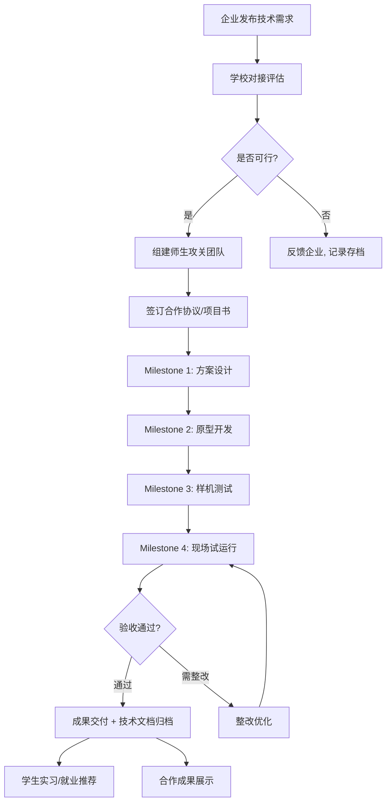
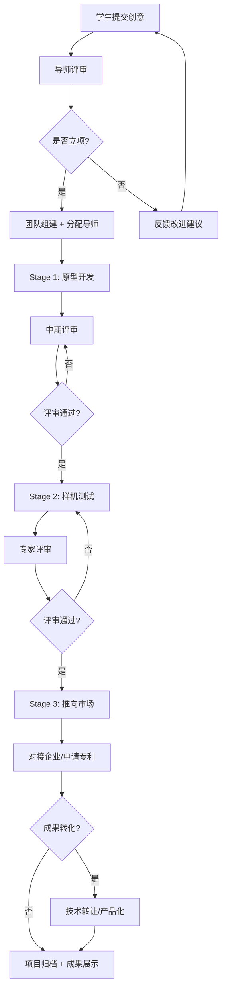
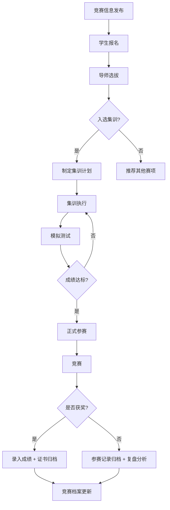
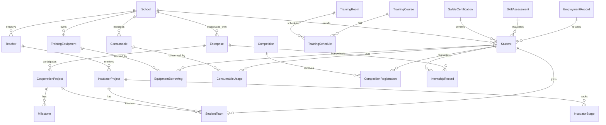
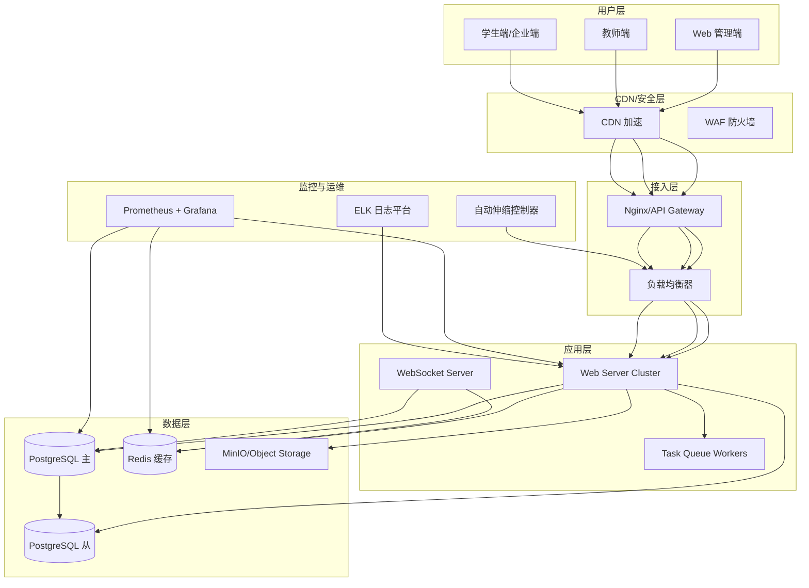

# 面向职业学校的 STEM 实训教学管理 · 云托管版 —— 产品需求规格说明书（PRD）

**版本**: v1.0  
**日期**: 2026-06-24  
**状态**: 🟢 需求定义完成  
**文档定位**: 面向中等职业学校/技工院校的 **STEM 实训教学管理系统**，采用 SaaS 云托管部署模式。

> **核心差异声明（本 PRD 的灵魂）**：传统职业院校教务/实训管理系统的核心对象是「专业课程 / 实训工位 / 技能证书 / 校企合作」，其业务模型为 **专业教学 + 实训排产 + 技能鉴定 + 顶岗实习**。而 STEM 教育在职业学校的落地场景强调的是 **跨专业融合 + 项目式实训 + 创新创业孵化 + 产教深度协同**，其业务模型是 **硬件设备全生命周期 + 耗材精益管理 + 双创项目孵化 + 校企联合攻关 + 技能竞赛体系**。本 PRD 所有需求均建立在这一差异之上，与通用教务管理系统和 K12 STEM 管理系统形成清晰区分。

---

## 目录

1. [项目背景与目标](#1-项目背景与目标)
2. [产品定位与核心差异](#2-产品定位与核心差异)
3. [用户角色与权限](#3-用户角色与权限)
4. [功能需求](#4-功能需求)
5. [业务流程](#5-业务流程)
6. [数据模型](#6-数据模型)
7. [接口规范](#7-接口规范)
8. [非功能需求](#8-非功能需求)
9. [部署架构](#9-部署架构)
10. [安全标准](#10-安全标准)
11. [优先级矩阵](#11-优先级矩阵)
12. [术语表](#12-术语表)

---

## 1. 项目背景与目标

### 1.1 背景

《国家职业教育改革实施方案》（职教 20 条）、《关于推动现代职业教育高质量发展的意见》等政策明确要求职业院校加强实训基地建设、推进产教融合、完善技能竞赛体系。然而，当前市场上 **缺乏面向职业学校的 STEM 实训教学管理 SaaS 系统**：

- 传统教务系统（排课、成绩、学籍）无法覆盖 **工业设备管理、实训耗材追踪、校企合作项目、双创孵化、技能竞赛** 等 STEM 实训特有场景；
- 现有 STEM 教育平台多面向 K12 科创教育或编程培训，缺少对 **工业级设备（PLC、CNC、工业机器人）** 和 **产教融合业务** 的支持；
- 职业院校 IT 能力普遍薄弱，需要开箱即用、免运维的云托管方案；
- 县域职业学校面临 **设备管理混乱、耗材浪费严重、校企合作缺乏信息化支撑、双创孵化效率低** 等痛点。

### 1.2 目标

构建一套 **面向职业学校的 STEM 实训教学管理云托管系统**，实现：

- **实训设备全生命周期管理**：工业级设备的入库、定位、借用、维护、盘点、报废
- **实训耗材精益管理**：采购、入库、领用、库存预警、成本核算
- **校企合作管理**：合作企业信息、联合项目、实习就业对接
- **双创孵化管理**：创意提交、原型开发、样机测试、推向市场全流程
- **技能竞赛管理**：赛事发布、报名、集训、成绩、证书
- **STEM 教务管理**：实训课程排课、实训室调度、教师工作量统计
- **实习就业跟踪**：实习记录、就业统计、企业评价反馈
- **数据分析仪表盘**：设备利用率、耗材消耗、竞赛成果、就业率等核心指标

### 1.3 适用范围

- **目标用户**：全国中等职业学校、技工院校、高职院校的 STEM 实训中心
- **部署方式**：SaaS 云托管（多租户）
- **终端覆盖**：Web 管理端 + 教师端 + 学生端
- **使用规模**：单校 500-3000 名学生，20-100 名实训教师
- **与通用教务的关系**：**只管理 STEM 实训课程**，不替代教务系统的文化课/学籍管理

---

## 2. 产品定位与核心差异

### 2.1 与通用职业院校教务系统的核心差异

| 维度 | 通用教务系统 | STEM 实训教学管理系统 |
|------|-------------|----------------------|
| 核心对象 | 专业、班级、课程、学籍 | 实训设备、耗材、校企合作项目、双创项目 |
| 教学形式 | 理论授课、固定课表 | 项目式实训、团队协作、工位轮转 |
| 评价方式 | 笔试、技能鉴定 | 作品评价、技能实操、项目交付、竞赛成绩 |
| 资源管理 | 教材、教室、普通设备 | 工业设备（PLC/CNC/机器人）、耗材、创客工坊 |
| 外部关系 | 教育主管部门 | 合作企业、产业园区、竞赛组委会 |
| 时间维度 | 学期制、固定课时 | 灵活排产、项目周期、竞赛备赛期 |
| 特色场景 | 无 | 校企联合攻关、双创孵化、产教融合项目 |

### 2.2 与 K12 STEM 教育管理系统的核心差异

| 维度 | K12 STEM 系统 | 职业学校 STEM 系统 |
|------|--------------|-------------------|
| 设备层级 | Arduino、传感器、3D 打印机 | PLC、CNC 机床、工业机器人、嵌入式开发平台 |
| 管理重点 | 借用频次、损坏率 | 利用率、维护周期、工位调度 |
| 耗材管理 | 基础电子元件 | 工业级耗材（焊锡丝、覆铜板、PLA 耗材、继电器模块等） |
| 项目类型 | 兴趣社团项目 | 企业真实需求 + 双创孵化项目 |
| 外部合作 | 家长、教育局 | 合作企业、产业园区、行业专家 |
| 就业导向 | 无 | 实习跟踪、就业对接、企业评价 |
| 安全要求 | 基础安全 | 工业安全规范、安全准入、紧急停机 |

### 2.3 核心竞争力

1. **工业级设备管理**：专为 PLC、CNC、工业机器人、嵌入式开发平台等实训设备设计
2. **产教融合支撑**：校企合作项目全流程管理，从需求对接 → 联合攻关 → 成果交付
3. **双创孵化引擎**：从创意到市场的全链条支撑，对接真实产业需求
4. **云托管 SaaS**：开箱即用，零运维，自动升级
5. **数据驱动决策**：设备利用率、耗材成本、就业率等核心 KPI 可视化

---

## 3. 用户角色与权限

### 3.1 角色定义

| 角色编码 | 角色名称 | 说明 | 典型用户 |
|---------|---------|------|---------|
| V-R01 | 系统管理员 | 系统全局配置、租户管理、运维监控 | 云平台运营人员 |
| V-R02 | 校级管理员 | 学校信息配置、教师账号管理、全校数据查看、预算审批 | 实训中心主任/教务处长 |
| V-R03 | 实训导师 | 实训教学、设备审批、项目指导、耗材申购 | 电子技术/PLC/数控讲师 |
| V-R04 | 企业导师 | 企业技术人员参与项目指导、设备维护 | 合作企业技术主管/工程师 |
| V-R05 | 学生 | 参与实训、借用设备、提交项目、竞赛报名 | 在校学生 |
| V-R06 | 企业管理员 | 查看合作项目进度、实习生表现、发布需求 | 企业人力资源/技术负责人 |
| V-R07 | 区域管理员 | 区域内多校实训数据统计与分析 | 教育局职成科/装备中心 |

### 3.2 权限矩阵

| 功能模块 | 系统管理员 | 校级管理员 | 实训导师 | 企业导师 | 学生 | 企业管理员 | 区域管理员 |
|---------|:---------:|:---------:|:---------:|:---------:|:---:|:---------:|:---------:|
| 租户管理 | ✅ | — | — | — | — | — | — |
| 学校配置 | ✅ | ✅ | — | — | — | — | — |
| 教师账号管理 | ✅ | ✅ | — | — | — | — | — |
| 学生账号管理 | ✅ | ✅ | — | — | — | — | — |
| 实训设备管理 | — | ✅ | ✅ | ✅ | 查看 | — | — |
| 设备借用/归还 | — | — | ✅ | ✅ | ✅ | — | — |
| 设备审批 | — | ✅ | ✅ | — | — | — | — |
| 实训耗材管理 | — | ✅ | ✅ | 查看 | 查看 | — | — |
| 耗材申购 | — | ✅ | ✅ | — | — | — | — |
| 耗材领用审批 | — | ✅ | ✅ | — | — | — | — |
| 校企合作管理 | — | ✅ | ✅ | ✅ | — | ✅ | — |
| 合作项目管理 | — | ✅ | ✅ | ✅ | ✅ | ✅ | 查看 |
| 双创孵化管理 | — | ✅ | ✅ | ✅ | ✅ | — | — |
| 双创项目评审 | — | ✅ | ✅ | ✅ | — | ✅ | — |
| 技能竞赛管理 | — | ✅ | ✅ | — | ✅ | — | — |
| 竞赛报名 | — | — | ✅ | — | ✅ | — | — |
| 竞赛成绩录入 | — | ✅ | ✅ | — | — | — | — |
| STEM 教务管理 | — | ✅ | ✅ | — | 查看 | — | — |
| 实训课表查看 | — | ✅ | ✅ | ✅ | ✅ | 查看 | — |
| 实习就业跟踪 | — | ✅ | ✅ | — | 自己 | ✅ | — |
| 安全准入管理 | — | ✅ | ✅ | — | 自己 | — | — |
| 技能评估 | — | ✅ | ✅ | ✅ | 自己 | — | — |
| 数据分析看板 | — | ✅ | ✅ | 查看 | — | 查看 | ✅ |
| 预算管理 | — | ✅ | 查看 | — | — | — | — |
| 系统日志 | ✅ | ✅ | — | — | — | — | — |

---

## 4. 功能需求

### 4.1 实训设备管理模块（FR-VEQ）

#### 功能概述
面向职业学校实训场景的工业级设备全生命周期管理，覆盖 PLC 控制套件、CNC 机床、工业机器人、嵌入式开发板、电工电子实训台、3D 打印机等设备类型。

| 编号 | 功能名称 | 描述 | 优先级 |
|-----|---------|------|:-----:|
| FR-VEQ-01 | 设备分类管理 | 支持多级分类：大类（电子/电气/机械/自动化）→ 子类（开发板/传感器/电机）→ 具体型号 | P0 |
| FR-VEQ-02 | 设备入库 | 批量导入/手动录入设备信息（名称、型号、SN、购买日期、保修期、存放位置、所属实训室） | P0 |
| FR-VEQ-03 | 设备标签生成 | 生成设备二维码/条形码标签，支持批量打印，包含设备名称、型号、位置信息 | P0 |
| FR-VEQ-04 | 设备存放定位 | 按"实训楼 → 楼层 → 实训室 → 工位/柜号"四级定位，扫码即可定位 | P0 |
| FR-VEQ-05 | 设备借用与归还 | 学生/教师扫码借用，记录借用人、借用时间、预计归还日、用途（课程/项目/竞赛） | P0 |
| FR-VEQ-06 | 设备审批流程 | 贵重设备/精密仪器（如 CNC 机床、工业机器人）需导师或管理员审批后方可借出 | P0 |
| FR-VEQ-07 | 设备维护记录 | 维修、校准、固件升级记录，支持附件上传（维修单、照片），自动提醒定期维护 | P1 |
| FR-VEQ-08 | 设备盘点 | 支持手机扫码盘点，生成盘盈/盘亏报表，支持按实训室分区盘点 | P1 |
| FR-VEQ-09 | 设备报废处理 | 到达使用寿命或损坏无法修复时报废处理，记录报废审批流程 | P1 |
| FR-VEQ-10 | 设备使用统计 | 使用率、空闲率、故障率、借用排行、各设备借用趋势图 | P1 |
| FR-VEQ-11 | 设备闲置预警 | 连续 N 天（可配置）未使用的设备自动标记为闲置，推送通知提醒利用 | P1 |
| FR-VEQ-12 | 工位管理 | 实训室内工位的编号、可用设备清单、同时容纳人数管理 | P1 |
| FR-VEQ-13 | 设备故障报修 | 扫码即可提交故障报修，拍照上传，维修进度跟踪 | P1 |
| FR-VEQ-14 | IoT 设备在线监控 | 联网设备（嵌入式开发板、智能传感器）在线/离线/运行状态监控 | P2 |

### 4.2 实训耗材管理模块（FR-VCON）

#### 功能概述
面向职业学校的实训耗材精益管理，覆盖电子元器件、五金工具、3D 打印耗材、焊接材料等，与 Token 计费系统联动。

| 编号 | 功能名称 | 描述 | 优先级 |
|-----|---------|------|:-----:|
| FR-VCON-01 | 耗材分类与规格 | 支持多级分类：电子元件（电阻/电容/二极管）、焊接材料（焊锡丝/助焊剂）、3D 耗材（PLA/ABS）、五金工具（螺丝/螺母/杜邦线）等，支持规格参数 | P0 |
| FR-VCON-02 | 耗材入库 | 采购入库，记录批次、数量、单价、供应商、采购日期、保质期（如有） | P0 |
| FR-VCON-03 | 耗材领用 | 学生/教师领用耗材，关联实训课程/项目/竞赛，自动扣除库存 | P0 |
| FR-VCON-04 | 耗材库存预警 | 设置库存下限（安全库存），低于阈值自动通知管理员补货 | P0 |
| FR-VCON-05 | 耗材申购流程 | 导师发起申购 → 管理员审批 → 采购跟踪 → 到货入库 | P1 |
| FR-VCON-06 | 耗材使用统计 | 按实训室、课程、项目、个人统计耗材使用情况，生成消耗趋势图 | P1 |
| FR-VCON-07 | 耗材成本核算 | 按学期/学年核算耗材费用，对比预算执行情况 | P1 |
| FR-VCON-08 | 耗材批次追踪 | 支持按批次追溯耗材来源，处理质量问题 | P2 |

### 4.3 校企合作管理模块（FR-VCOOP）

#### 功能概述
支撑职业学校的产教融合业务，管理合作企业信息、联合项目、人才输送通道，是职业学校区别于 K12 和培训机构的特色功能。

| 编号 | 功能名称 | 描述 | 优先级 |
|-----|---------|------|:-----:|
| FR-VCOOP-01 | 企业信息管理 | 录入合作企业基本信息（名称、类型、规模、联系人、合作历史） | P0 |
| FR-VCOOP-02 | 企业需求发布 | 企业发布技术需求/人才需求/设备需求，学校端对接 | P0 |
| FR-VCOOP-03 | 校企联合项目 | 创建联合攻关项目，设定目标、里程碑、双方负责人、学生团队 | P0 |
| FR-VCOOP-04 | 项目进度跟踪 | 里程碑管理、甘特图、阶段成果交付、现场试运行记录 | P0 |
| FR-VCOOP-05 | 企业导师管理 | 企业技术骨干兼职导师信息管理、授课/指导记录、课时统计 | P1 |
| FR-VCOOP-06 | 合作效益分析 | 企业投入（设备/资金/导师）vs 产出（人才输送/技术方案/专利），ROI 概览 | P1 |
| FR-VCOOP-07 | 合作到期提醒 | 合作协议到期前自动提醒续签 | P2 |
| FR-VCOOP-08 | 企业评价体系 | 学生对实习企业评价 + 企业对学校培养质量评价，双向反馈 | P2 |

### 4.4 双创孵化管理模块（FR-VINCUBATE）

#### 功能概述
面向职业学校的创新创业孵化全流程管理，从创意提交到推向市场，是体现职业学校 STEM 教育成果转化的核心功能。

| 编号 | 功能名称 | 描述 | 优先级 |
|-----|---------|------|:-----:|
| FR-VINC-01 | 创意提交 | 学生提交创意方案（主题、背景、技术路线、预期成果），导师审核 | P0 |
| FR-VINC-02 | 项目立项 | 审核通过的创意进入孵化流程，分配导师、场地、启动资金 | P0 |
| FR-VINC-03 | 孵化阶段管理 | 支持 4 阶段管理：创意提交 → 原型开发 → 样机测试 → 推向市场 | P0 |
| FR-VINC-04 | 团队管理 | 学生自由组队或系统分配，设置队长，记录团队成员贡献度 | P0 |
| FR-VINC-05 | 孵化资金管理 | 记录资金拨付、使用明细、剩余额度，支持资金使用审批 | P1 |
| FR-VINC-06 | 导师辅导记录 | 导师辅导时间、内容、建议记录，生成辅导报告 | P1 |
| FR-VINC-07 | 成果交付 | 项目结项报告、技术文档、作品照片/视频、专利/软著申请记录 | P1 |
| FR-VINC-08 | 成果转化追踪 | 对接企业意向、技术转让、产品试产、市场推广跟踪 | P1 |
| FR-VINC-09 | 孵化看板 | 各阶段项目数、资金使用、成功率、成果产出统计 | P1 |

### 4.5 技能竞赛管理模块（FR-VCOMP）

#### 功能概述
管理职业学校的技能竞赛全流程，覆盖省赛、市赛、县赛、行业赛等多级赛事体系。

| 编号 | 功能名称 | 描述 | 优先级 |
|-----|---------|------|:-----:|
| FR-VCOMP-01 | 竞赛信息发布 | 录入赛事信息（名称、级别、主办方、时间、地点、赛项设置、参赛费用） | P0 |
| FR-VCOMP-02 | 竞赛报名 | 学生在线报名，导师确认，缴费跟踪，自动生成报名表 | P0 |
| FR-VCOMP-03 | 赛前集训管理 | 集训课表、考勤、模拟训练记录、训练设备分配 | P1 |
| FR-VCOMP-04 | 竞赛成绩管理 | 录入竞赛成绩，上传获奖证书扫描件，支持获奖等级分类 | P0 |
| FR-VCOMP-05 | 竞赛档案 | 每位学生的参赛记录、获奖等级历史、指导老师记录 | P1 |
| FR-VCOMP-06 | 获奖统计分析 | 按赛项/年份/级别/指导老师统计获奖情况，生成趋势图 | P1 |
| FR-VCOMP-07 | 竞赛预算管理 | 参赛经费预算编制、报销记录、预算执行分析 | P2 |

### 4.6 STEM 教务管理模块（FR-VACADEMIC）

#### 功能概述
管理职业学校的 STEM 实训课程（非文化课/公共课），聚焦实训教学场景。

| 编号 | 功能名称 | 描述 | 优先级 |
|-----|---------|------|:-----:|
| FR-VACA-01 | 实训课程管理 | 创建实训课程（课程名称、适用专业、学时、实训类型：理论+实训/纯实训） | P0 |
| FR-VACA-02 | 实训室排课 | 实训室预约排课，支持按周/月排课，冲突检测 | P0 |
| FR-VACA-03 | 实训课表查看 | 按教师/班级/实训室/日期多维度查看课表 | P0 |
| FR-VACA-04 | 实训考勤 | 扫码/刷脸签到签退，自动统计出勤率 | P1 |
| FR-VACA-05 | 实训报告管理 | 学生提交实训报告，导师在线批阅评分 | P1 |
| FR-VACA-06 | 教师工作量统计 | 按课时/课程/班级统计教师工作量，可视化对比 | P1 |
| FR-VACA-07 | 实训室利用率分析 | 各实训室课时利用率、空闲时段、高峰时段分析 | P1 |
| FR-VACA-08 | 实训教案管理 | 电子教案上传、共享、版本管理 | P2 |

### 4.7 实习就业跟踪模块（FR-VEMPLOY）

#### 功能概述
跟踪学生的实习和就业情况，对接企业需求，为学校的就业指导提供数据支撑。

| 编号 | 功能名称 | 描述 | 优先级 |
|-----|---------|------|:-----:|
| FR-VEMP-01 | 实习岗位发布 | 企业发布实习岗位信息（岗位名称、人数、技能要求、薪资待遇） | P0 |
| FR-VEMP-02 | 实习申请匹配 | 学生在线申请实习岗位，系统根据技能标签自动匹配推荐 | P0 |
| FR-VEMP-03 | 实习过程跟踪 | 实习打卡、周报/月报提交、导师点评 | P0 |
| FR-VEMP-04 | 实习评价 | 企业评价学生实习表现 + 学生评价实习企业 | P1 |
| FR-VEMP-05 | 就业去向统计 | 按专业/班级统计就业率、就业去向分布、平均薪资 | P0 |
| FR-VEMP-06 | 企业录用记录 | 记录各企业录用学生名单、岗位、薪资，形成企业合作成果档案 | P1 |
| FR-VEMP-07 | 毕业生追踪 | 毕业生就业后 1/3/6 个月回访记录，留存率、岗位适配度追踪 | P2 |

### 4.8 安全监控与准入管理模块（FR-VSAFETY）

#### 功能概述
职业学校的实训安全是核心关切，提供安全准入、实时监控、事故记录等功能。

| 编号 | 功能名称 | 描述 | 优先级 |
|-----|---------|------|:-----:|
| FR-VSAF-01 | 安全准入认证 | 学生/教师使用设备前需通过安全培训考试，考试通过方可使用 | P0 |
| FR-VSAF-02 | 设备安全分级 | 按设备危险性分级（普通/警告/危险），不同级别对应不同准入要求 | P0 |
| FR-VSAF-03 | 安全培训记录 | 安全培训课程、考试、成绩管理，支持线上学习 + 线下实操考核 | P1 |
| FR-VSAF-04 | 安全检查清单 | 每日/每周设备安全检查清单，扫码完成检查，记录异常 | P1 |
| FR-VSAF-05 | 事故报告 | 实训事故记录（类型、原因、损失、处理结果），支持整改跟踪 | P1 |
| FR-VSAF-06 | 安全天数统计 | 持续无事故天数、安全事故趋势图、安全状态看板 | P1 |
| FR-VSAF-07 | 紧急联络机制 | 一键紧急联络实训中心负责人/医务室/校领导 | P2 |

### 4.9 技能评估体系模块（FR-VASSESS）

#### 功能概述
基于实际操作的职业能力量化评估体系，支持多维度的技能认证考核。

| 编号 | 功能名称 | 描述 | 优先级 |
|-----|---------|------|:-----:|
| FR-VASS-01 | 技能标准库 | 按专业/工种建立技能标准库（技能项、等级要求、考核标准） | P0 |
| FR-VASS-02 | 实操考核 | 技能项实操考核记录，支持打分 + 评语 + 现场照片/视频 | P0 |
| FR-VASS-03 | 能力雷达图 | 多维度能力评估可视化（理论、实操、创新、协作、安全规范） | P1 |
| FR-VASS-04 | 技能达标率统计 | 按专业/班级/年级统计技能达标率、优秀率 | P1 |
| FR-VASS-05 | 技能成长轨迹 | 学生在校期间技能水平变化趋势图 | P1 |
| FR-VASS-06 | 证书关联 | 对接国家职业技能等级证书，记录证书获取情况 | P1 |

### 4.10 数据看板与分析模块（FR-VDASHBOARD）

#### 功能概述
为实训中心主任/校级管理员提供全面的数据分析看板，驱动数据化决策。

| 编号 | 功能名称 | 描述 | 优先级 |
|-----|---------|------|:-----:|
| FR-VDSH-01 | 核心指标总览 | 在训人数、设备利用率、技能认证通过率、就业对接率四大核心指标 | P0 |
| FR-VDSH-02 | 设备使用分析 | 设备使用趋势图、各类型设备利用率对比、闲置设备预警 | P0 |
| FR-VDSH-03 | 耗材消耗分析 | 耗材使用趋势、库存预警列表、耗材成本月度对比 | P1 |
| FR-VDSH-04 | 校企合作看板 | 合作企业数量、联合项目数、实习在岗人数、合作效益概览 | P1 |
| FR-VDSH-05 | 双创孵化看板 | 各阶段项目数、孵化成功率、资金使用情况、成果产出 | P1 |
| FR-VDSH-06 | 竞赛成果看板 | 获奖数量、各赛项分布、历年趋势、指导老师排行 | P1 |
| FR-VDSH-07 | 就业统计看板 | 就业率趋势、就业去向分布、平均薪资、合作企业录用排行 | P1 |
| FR-VDSH-08 | 预算执行看板 | 年度预算执行率、各分类支出占比、剩余预算 | P1 |
| FR-VDSH-09 | 数据导出 | 支持 Excel/PDF 报表导出，支持定时自动报表推送 | P2 |
| FR-VDSH-10 | 区域数据看板 | 区域管理员查看辖区内职业学校实训教育开展数据 | P1 |

### 4.11 系统管理模块（FR-VSYS）

| 编号 | 功能名称 | 描述 | 优先级 |
|-----|---------|------|:-----:|
| FR-VSYS-01 | 租户管理 | 学校租户创建、配置、停用、删除 | P0 |
| FR-VSYS-02 | 用户管理 | 教师/学生/企业用户账号导入（支持批量）、角色分配 | P0 |
| FR-VSYS-03 | 权限管理 | 基于 RBAC 的细粒度权限配置，支持自定义角色 | P0 |
| FR-VSYS-04 | 系统配置 | 学校基本信息、学期设置、实训室配置、耗材种类管理 | P0 |
| FR-VSYS-05 | 操作日志 | 关键操作审计日志，可追溯查询，保留 ≥ 180 天 | P1 |
| FR-VSYS-06 | 消息通知 | 系统公告、审批提醒、库存预警、竞赛通知（站内信+邮件/小程序推送） | P1 |
| FR-VSYS-07 | 数据导入导出 | 支持 Excel/CSV 批量导入设备、学生、教师数据 | P1 |

---

## 5. 业务流程

### 5.1 设备借用与归还流程

```mermaid
flowchart TD
    A[学生/教师扫码借用设备] --> B{是否需要审批?}
    B -->|不需要| C[系统自动确认]
    B -->|需要| D[实训导师审批]
    D --> E{审批通过?}
    E -->|通过| C
    E -->|不通过| F[拒绝并说明原因]
    C --> G[设备标记为"已借用"]
    G --> H[使用中]
    H --> I[归还扫码]
    I --> J[检查设备状况]
    J --> K{设备完好?}
    K -->|是| L[完成归还]
    K -->|否| M[记录损坏情况]
    M --> N[维修流程]
    N --> O{是否可修复?}
    O -->|是| P[送修登记]
    O -->|否| Q[报废申请]
    P --> L
    Q --> R[管理员审批报废]
    L --> S[设备标记为"可用"]
```

### 5.2 校企合作项目全流程



### 5.3 双创孵化流程



### 5.4 技能竞赛备赛流程



---

## 6. 数据模型

### 6.1 核心实体关系图（ER 图）



### 6.2 主要实体属性

#### 学校/租户（School/Tenant）
| 属性 | 类型 | 说明 |
|------|------|------|
| id | UUID | 主键 |
| name | VARCHAR(200) | 学校名称 |
| code | VARCHAR(50) | 学校代码（教育局编码） |
| type | ENUM | 中职/技工/高职 |
| district | VARCHAR(100) | 所属区域 |
| level | VARCHAR(50) | 国家级/省级/市级示范 |
| contact_name | VARCHAR(50) | 联系人 |
| contact_phone | VARCHAR(20) | 联系电话 |
| student_count | INT | 在校生人数 |
| department_count | INT | 专业科/系部数量 |
| annual_budget | DECIMAL(12,2) | 年度实训经费预算 |
| status | ENUM | 启用/停用 |
| expire_date | DATE | 服务到期日 |

#### 实训设备（TrainingEquipment）
| 属性 | 类型 | 说明 |
|------|------|------|
| id | UUID | 主键 |
| school_id | UUID | 所属学校 |
| name | VARCHAR(200) | 设备名称 |
| model | VARCHAR(100) | 型号 |
| sn | VARCHAR(100) | 序列号（唯一） |
| category_id | UUID | 设备分类 |
| category_path | TEXT | 分类路径（如"自动化 > PLC > FX3U"） |
| location_building | VARCHAR(100) | 所在楼栋 |
| location_floor | VARCHAR(50) | 所在楼层 |
| location_room | VARCHAR(100) | 实训室名称 |
| location_station | VARCHAR(100) | 工位编号 |
| qr_code | VARCHAR(500) | 二维码标签 URL |
| purchase_date | DATE | 购买日期 |
| warranty_expire | DATE | 保修到期日 |
| price | DECIMAL(10,2) | 购买价格 |
| safety_level | ENUM | 普通/警告/危险 |
| status | ENUM | 可用/已借用/维修中/已报废/闲置 |
| current_user_id | UUID | 当前使用人 |
| expected_return_date | DATE | 预计归还日 |
| last_maintenance_date | DATE | 最近维护日期 |
| last_check_date | DATE | 最近检查日期 |
| total_borrow_count | INT | 累计借用次数 |
| total_usage_hours | DECIMAL(8,1) | 累计使用小时数 |

#### 实训耗材（Consumable）
| 属性 | 类型 | 说明 |
|------|------|------|
| id | UUID | 主键 |
| school_id | UUID | 所属学校 |
| name | VARCHAR(200) | 耗材名称 |
| category | ENUM | 电子元件/焊接材料/3D耗材/五金工具/传感器/线缆/其他 |
| specification | VARCHAR(200) | 规格参数 |
| unit | VARCHAR(20) | 单位（个/卷/包/套/颗/米） |
| unit_price | DECIMAL(10,2) | 单价 |
| token_price | INT | Token 价格（可选） |
| current_stock | INT | 当前库存 |
| min_stock | INT | 库存预警下限（安全库存） |
| max_stock | INT | 库存上限 |
| supplier | VARCHAR(200) | 供应商 |
| batch_no | VARCHAR(100) | 批次号 |
| shelf_life_days | INT | 保质期（天），可为空 |
| location | VARCHAR(200) | 存放位置 |

#### 校企合作项目（CooperationProject）
| 属性 | 类型 | 说明 |
|------|------|------|
| id | UUID | 主键 |
| school_id | UUID | 所属学校 |
| enterprise_id | UUID | 合作企业 |
| name | VARCHAR(200) | 项目名称 |
| description | TEXT | 项目描述（含企业痛点/需求背景） |
| tech_field | VARCHAR(100) | 技术领域（嵌入式/自动化/机械/软件） |
| pain_point | TEXT | 企业痛点 |
| value_proposition | TEXT | 学生参与价值 |
| progress | INT | 总体进度百分比 |
| stage | ENUM | 需求对接/方案设计/原型开发/样机测试/现场试运行/已交付 |
| status | ENUM | 进行中/已完成/已中止 |
| start_date | DATE | 开始日期 |
| expected_end_date | DATE | 预计完成日期 |
| enterprise_contact | VARCHAR(50) | 企业联系人 |
| enterprise_contact_phone | VARCHAR(20) | 联系人电话 |
| school_supervisor_id | UUID | 学校负责人（导师） |
| enterprise_supervisor_id | UUID | 企业方负责人 |
| total_funding | DECIMAL(10,2) | 项目经费 |
| created_at | TIMESTAMP | 创建时间 |

#### 双创孵化项目（IncubatorProject）
| 属性 | 类型 | 说明 |
|------|------|------|
| id | UUID | 主键 |
| school_id | UUID | 所属学校 |
| name | VARCHAR(200) | 项目名称 |
| team_name | VARCHAR(100) | 团队名称 |
| leader_id | UUID | 队长（学生） |
| description | TEXT | 项目描述 |
| pain_point | TEXT | 解决的问题/痛点 |
| tech_solution | TEXT | 技术方案 |
| stage | ENUM | 创意提交/原型开发/样机测试/推向市场 |
| progress | INT | 进度百分比 |
| mentor_id | UUID | 指导导师 |
| total_funding | DECIMAL(10,2) | 获得经费总额 |
| funding_source | VARCHAR(200) | 经费来源（学校/企业/自筹） |
| patent_applied | BOOLEAN | 是否申请专利 |
| patent_number | VARCHAR(100) | 专利号 |
| market_status | VARCHAR(200) | 市场推广情况 |
| status | ENUM | 进行中/已结项/已中止 |
| created_at | TIMESTAMP | 创建时间 |

#### 竞赛信息（Competition）
| 属性 | 类型 | 说明 |
|------|------|------|
| id | UUID | 主键 |
| school_id | UUID | 所属学校 |
| name | VARCHAR(200) | 竞赛名称 |
| sub_title | VARCHAR(200) | 赛项名称 |
| level | ENUM | 国家级/省级/市级/县级/行业赛 |
| organizer | VARCHAR(200) | 主办方 |
| competition_date | DATE | 竞赛日期 |
| registration_deadline | DATE | 报名截止日期 |
| location | VARCHAR(200) | 竞赛地点 |
| entry_fee | DECIMAL(10,2) | 参赛费用 |
| status | ENUM | 报名中/备赛中/集训中/已结束 |
| award_history | TEXT | 往届获奖情况 |

#### 实习记录（InternshipRecord）
| 属性 | 类型 | 说明 |
|------|------|------|
| id | UUID | 主键 |
| student_id | UUID | 学生 |
| enterprise_id | UUID | 企业 |
| position | VARCHAR(100) | 实习岗位 |
| start_date | DATE | 开始日期 |
| end_date | DATE | 结束日期 |
| status | ENUM | 在岗/已结束/提前终止 |
| supervisor_teacher_id | UUID | 校内指导老师 |
| enterprise_mentor | VARCHAR(50) | 企业导师 |
| weekly_report_count | INT | 周报提交数 |
| final_evaluation | TEXT | 企业评价 |
| score | INT | 实习成绩（百分制） |

---

## 7. 接口规范

### 7.1 通用规范

- **协议**: HTTPS
- **基础路径**: `/api/v1/vocational`
- **请求格式**: `application/json`
- **响应格式**: JSON，统一结构：

```json
{
  "code": 0,
  "message": "success",
  "data": {},
  "request_id": "uuid",
  "timestamp": 1719123456789
}
```

- **鉴权方式**: JWT（Access Token + Refresh Token）
- **分页参数**: `?page=1&page_size=20`
- **排序参数**: `?sort_by=created_at&order=desc`

### 7.2 核心接口列表

#### 实训设备管理
| 方法 | 路径 | 说明 | 权限 |
|------|------|------|------|
| GET | /equipment | 获取设备列表 | V-R02~V-R07 |
| POST | /equipment | 添加设备 | V-R02,V-R03 |
| GET | /equipment/{id} | 获取设备详情 | V-R02~V-R07 |
| PUT | /equipment/{id} | 更新设备信息 | V-R02,V-R03 |
| DELETE | /equipment/{id} | 删除/报废设备 | V-R02 |
| POST | /equipment/{id}/borrow | 借用设备 | V-R03~V-R05 |
| POST | /equipment/{id}/return | 归还设备 | V-R03~V-R05 |
| POST | /equipment/{id}/maintain | 记录维修 | V-R02,V-R03 |
| PUT | /equipment/{id}/location | 更新存放位置 | V-R02,V-R03 |
| POST | /equipment/batch-import | 批量导入设备 | V-R02 |
| GET | /equipment/stats | 设备统计报表 | V-R02,V-R07 |
| GET | /equipment/idle-alert | 闲置设备预警列表 | V-R02,V-R03 |
| POST | /equipment/{id}/report-fault | 设备故障报修 | V-R03~V-R05 |

#### 实训耗材管理
| 方法 | 路径 | 说明 | 权限 |
|------|------|------|------|
| GET | /consumables | 获取耗材列表 | V-R02~V-R07 |
| POST | /consumables | 添加耗材 | V-R02 |
| PUT | /consumables/{id} | 更新耗材信息 | V-R02 |
| POST | /consumables/{id}/use | 领用耗材 | V-R03~V-R05 |
| GET | /consumables/low-stock | 低库存预警列表 | V-R02,V-R03 |
| POST | /consumables/purchase-request | 发起申购 | V-R03 |
| PUT | /consumables/purchase-request/{id} | 审批申购 | V-R02 |
| GET | /consumables/stats | 耗材使用统计 | V-R02,V-R07 |
| GET | /consumables/cost-report | 耗材成本核算 | V-R02 |

#### 校企合作
| 方法 | 路径 | 说明 | 权限 |
|------|------|------|------|
| GET | /enterprises | 获取合作企业列表 | V-R02~V-R07 |
| POST | /enterprises | 添加合作企业 | V-R02,V-R03 |
| PUT | /enterprises/{id} | 更新企业信息 | V-R02,V-R03 |
| GET | /enterprises/{id}/projects | 获取企业合作项目列表 | V-R02~V-R07 |
| GET | /cooperation-projects | 获取联合项目列表 | V-R02~V-R07 |
| POST | /cooperation-projects | 创建联合项目 | V-R02,V-R03 |
| PUT | /cooperation-projects/{id} | 更新项目信息 | V-R02,V-R03 |
| PUT | /cooperation-projects/{id}/progress | 更新项目进度 | V-R03,V-R04 |
| POST | /cooperation-projects/{id}/milestones | 添加里程碑 | V-R03,V-R04 |
| GET | /cooperation-projects/stats | 合作效益分析 | V-R02,V-R07 |
| POST | /enterprises/{id}/demands | 发布企业需求 | V-R06 |

#### 双创孵化
| 方法 | 路径 | 说明 | 权限 |
|------|------|------|------|
| GET | /incubator/projects | 获取孵化项目列表 | V-R02~V-R07 |
| POST | /incubator/projects | 提交创意/创建项目 | V-R05 |
| PUT | /incubator/projects/{id} | 更新项目信息 | V-R03,V-R05 |
| PUT | /incubator/projects/{id}/stage | 更新孵化阶段 | V-R03 |
| PUT | /incubator/projects/{id}/progress | 更新进度 | V-R03,V-R05 |
| POST | /incubator/projects/{id}/team | 管理团队成员 | V-R05 |
| GET | /incubator/projects/{id}/funding | 获取资金明细 | V-R02,V-R03 |
| POST | /incubator/projects/{id}/funding | 记录资金使用 | V-R02,V-R03 |
| GET | /incubator/stats | 孵化看板统计 | V-R02,V-R07 |

#### 技能竞赛
| 方法 | 路径 | 说明 | 权限 |
|------|------|------|------|
| GET | /competitions | 获取竞赛列表 | V-R02~V-R07 |
| POST | /competitions | 录入竞赛信息 | V-R02,V-R03 |
| PUT | /competitions/{id} | 更新竞赛信息 | V-R02,V-R03 |
| POST | /competitions/{id}/register | 报名参赛 | V-R05 |
| GET | /competitions/{id}/registrations | 查看报名列表 | V-R02~V-R04 |
| PUT | /competitions/{id}/results | 录入竞赛成绩 | V-R02,V-R03 |
| GET | /competitions/stats | 竞赛统计看板 | V-R02,V-R07 |
| POST | /competitions/{id}/training-plan | 创建集训计划 | V-R03 |

#### STEM 教务
| 方法 | 路径 | 说明 | 权限 |
|------|------|------|------|
| GET | /courses | 获取实训课程列表 | V-R02~V-R07 |
| POST | /courses | 创建实训课程 | V-R02,V-R03 |
| PUT | /courses/{id} | 更新课程信息 | V-R02,V-R03 |
| GET | /schedule | 获取实训课表 | V-R02~V-R07 |
| POST | /schedule | 排课（预约实训室） | V-R03 |
| GET | /rooms | 获取实训室列表 | V-R02~V-R07 |
| POST | /rooms | 添加实训室 | V-R02 |
| GET | /rooms/{id}/utilization | 实训室利用率分析 | V-R02,V-R07 |
| GET | /teacher-workload | 教师工作量统计 | V-R02,V-R07 |

#### 实习就业
| 方法 | 路径 | 说明 | 权限 |
|------|------|------|------|
| GET | /internships | 获取实习记录列表 | V-R02~V-R07 |
| POST | /internships | 创建实习记录 | V-R03,V-R05 |
| PUT | /internships/{id} | 更新实习记录 | V-R03,V-R05 |
| POST | /internships/{id}/report | 提交实习周报 | V-R05 |
| GET | /employment/stats | 就业统计看板 | V-R02,V-R07 |
| GET | /employment/destinations | 就业去向分布 | V-R02,V-R07 |
| POST | /employment/records | 记录就业信息 | V-R02,V-R03 |

#### 安全与技能评估
| 方法 | 路径 | 说明 | 权限 |
|------|------|------|------|
| GET | /safety/certifications | 获取安全认证记录 | V-R02~V-R07 |
| POST | /safety/certifications | 通过安全认证 | V-R03 |
| GET | /safety/checklists | 安全检查清单 | V-R02,V-R03 |
| POST | /safety/checklists | 提交检查结果 | V-R03 |
| POST | /safety/incidents | 记录事故 | V-R02,V-R03 |
| GET | /safety/stats | 安全统计看板 | V-R02,V-R07 |
| GET | /assessments/standards | 技能标准库 | V-R02~V-R07 |
| POST | /assessments/evaluate | 提交技能评估 | V-R03,V-R04 |
| GET | /assessments/student/{id}/profile | 学生技能档案 | V-R02~V-R05 |

### 7.3 WebSocket 接口

| 事件 | 方向 | 说明 |
|------|------|------|
| equipment.status | Server→Client | 设备状态实时更新（借用/归还/故障） |
| consumable.low-stock | Server→Client | 耗材库存预警推送 |
| project.progress | Server→Client | 合作项目/孵化项目进度更新 |
| competition.reminder | Server→Client | 竞赛报名/集训提醒 |
| internship.report-due | Server→Client | 实习周报提交提醒 |
| safety.alert | Server→Client | 安全检查异常/事故告警 |

---

## 8. 非功能需求

### 8.1 性能需求

| 编号 | 需求项 | 指标 | 优先级 |
|------|-------|------|:-----:|
| V-NFR-01 | 页面响应时间 | 核心页面（看板、设备列表）首屏加载 ≤ 2 秒 | P0 |
| V-NFR-02 | API 响应时间 | 95% 的 API 请求响应 ≤ 500ms | P0 |
| V-NFR-03 | 并发用户数 | 单校支持 200 并发用户，全平台 ≥ 5000 并发 | P0 |
| V-NFR-04 | 数据导出 | 10 万条数据导出 ≤ 30 秒 | P1 |
| V-NFR-05 | 设备扫码响应 | 扫码后信息显示 ≤ 1 秒 | P0 |
| V-NFR-06 | 批量导入 | 1000 条设备记录导入 ≤ 10 秒 | P1 |
| V-NFR-07 | 实时推送延迟 | WebSocket 消息延迟 ≤ 200ms | P1 |

### 8.2 可用性需求

| 编号 | 需求项 | 指标 | 优先级 |
|------|-------|------|:-----:|
| V-NFR-08 | 系统可用性 | 99.9%（月度） | P0 |
| V-NFR-09 | 计划内维护 | 每月 ≤ 4 小时，提前 7 日公告 | P0 |
| V-NFR-10 | 故障恢复 | 常规故障 ≤ 30 分钟恢复；灾难故障 ≤ 4 小时 | P0 |
| V-NFR-11 | 数据备份 | 每日全量备份 + 每小时增量备份 | P0 |
| V-NFR-12 | 数据恢复 | 支持按时间点恢复至 24 小时内任意时刻 | P1 |

### 8.3 可扩展性需求

| 编号 | 需求项 | 描述 | 优先级 |
|------|-------|------|:-----:|
| V-NFR-13 | 水平扩展 | 应用层无状态，支持水平扩展 | P0 |
| V-NFR-14 | 数据库扩展 | 支持读写分离，分库分表策略 | P1 |
| V-NFR-15 | 租户扩展 | 支持 1000+ 租户（学校） | P0 |
| V-NFR-16 | 存储扩展 | 对象存储容量自动扩展（设备照片、项目文档、竞赛证书等文件） | P0 |
| V-NFR-17 | 接口限流 | API 网关层限流，单租户 1000 次/分钟 | P1 |

### 8.4 安全需求

| 编号 | 需求项 | 描述 | 优先级 |
|------|-------|------|:-----:|
| V-NFR-18 | 数据传输加密 | 全站 HTTPS，TLS 1.2+ | P0 |
| V-NFR-19 | 数据存储加密 | 敏感数据（手机号、身份证等）加密存储 | P0 |
| V-NFR-20 | 身份认证 | 支持密码登录 + 验证码 + OAuth 2.0（微信扫码） | P0 |
| V-NFR-21 | 权限控制 | RBAC 细粒度权限，按角色/功能/数据范围控制 | P0 |
| V-NFR-22 | 审计日志 | 关键操作完整记录，保留 ≥ 180 天 | P1 |
| V-NFR-23 | 防注入 | SQL 注入、XSS、CSRF 防护 | P0 |
| V-NFR-24 | 未成年人保护 | 未满 18 周岁学生数据脱敏，家长授权机制 | P0 |

### 8.5 兼容性需求

| 编号 | 需求项 | 描述 | 优先级 |
|------|-------|------|:-----:|
| V-NFR-25 | 浏览器兼容 | Chrome 90+、Firefox 90+、Edge 90+、Safari 14+ | P0 |
| V-NFR-26 | 移动端适配 | 教师/学生端兼容 iOS 14+ / Android 10+ | P0 |
| V-NFR-27 | 打印兼容 | 设备标签、报表导出兼容主流打印设备 | P2 |
| V-NFR-28 | 扫码设备兼容 | 兼容主流二维码扫描枪/手持终端 | P0 |

### 8.6 运维需求

| 编号 | 需求项 | 描述 | 优先级 |
|------|-------|------|:-----:|
| V-NFR-29 | 日志收集 | 集中式日志管理，支持按租户检索 | P1 |
| V-NFR-30 | 监控告警 | 服务器、数据库、应用层监控，关键指标阈值告警 | P0 |
| V-NFR-31 | 自动伸缩 | 基于 CPU/内存/请求量自动扩缩容 | P1 |
| V-NFR-32 | 灰度发布 | 支持蓝绿部署/金丝雀发布 | P2 |

---

## 9. 部署架构

### 9.1 总体架构



### 9.2 多租户隔离方案

| 隔离层面 | 方案 | 说明 |
|---------|------|------|
| 数据库 | PostgreSQL Schema 隔离 | 每校一个 Schema，表结构相同，数据物理隔离 |
| 缓存 | Redis Key 前缀 | `{tenant_id}:{key}` 格式 |
| 对象存储 | 路径前缀 | `/{tenant_id}/{bucket}/{path}` |
| 域名 | 独立子域名 | `{school}.openmt.cn` |

### 9.3 数据备份策略

| 备份类型 | 频率 | 保留期限 | 存储位置 |
|---------|------|---------|---------|
| 全量备份 | 每日 02:00 | 30 天 | 异地对象存储 |
| 增量备份 | 每小时 | 7 天 | 同区域对象存储 |
| WAL 归档 | 连续 | 24 小时 | 本地存储 |
| 逻辑备份 | 每周 | 90 天 | 异地对象存储 |

---

## 10. 安全标准

### 10.1 合规要求

- **《个人信息保护法》**：学生/教师个人信息收集最小化
- **《数据安全法》**：实训数据分类分级，重要数据保护
- **《网络安全法》**：落实网络安全等级保护制度
- **等保 2.0**：需达到第二级安全等级保护要求
- **《职业学校学生实习管理规定》**：实习数据安全与隐私保护

### 10.2 数据安全措施

| 措施 | 说明 |
|------|------|
| 传输加密 | 全站 HTTPS（TLS 1.3），API 网关强制跳转 |
| 存储加密 | AES-256 加密敏感字段（手机号、身份证、家庭住址） |
| 数据脱敏 | 学生/教师姓名、手机号在非授权界面自动脱敏 |
| 访问控制 | 基于 RBAC + 数据范围权限（教师只能查看所负责实训室的数据） |
| 操作审计 | 所有写操作记录审计日志，支持按时间/用户/操作类型检索 |
| 会话管理 | JWT 有效期 2 小时，Refresh Token 7 天，支持主动下线 |
| 防暴力破解 | 登录失败 5 次后锁定 15 分钟，支持 CAPTCHA |

### 10.3 实训安全规范

| 措施 | 说明 |
|------|------|
| 安全准入 | 使用危险设备前必须通过安全培训考试 |
| 设备分级 | 按危险性将设备分为普通/警告/危险三级，不同级别对应不同权限 |
| 事故上报 | 实训事故必须在 24 小时内上报，支持整改跟踪 |
| 定期检查 | 每日/每周设备安全检查，扫码完成，异常自动上报 |

---

## 11. 优先级矩阵

### 11.1 优先级定义

| 等级 | 定义 |
|:----:|------|
| P0 | 核心功能，必须上线，缺失则系统不可用 |
| P1 | 重要功能，建议上线，可接受短期缺失 |
| P2 | 增强功能，可延后至第二期或更晚 |

### 11.2 功能模块优先级矩阵

| 模块 | P0 | P1 | P2 |
|-----|:--:|:--:|:--:|
| 实训设备管理 | 6 | 6 | 2 |
| 实训耗材管理 | 4 | 3 | 1 |
| 校企合作管理 | 3 | 3 | 2 |
| 双创孵化管理 | 4 | 4 | 1 |
| 技能竞赛管理 | 3 | 3 | 1 |
| STEM 教务管理 | 3 | 4 | 1 |
| 实习就业跟踪 | 3 | 2 | 2 |
| 安全监控与准入 | 2 | 4 | 1 |
| 技能评估体系 | 2 | 3 | 1 |
| 数据看板与分析 | 2 | 7 | 1 |
| 系统管理 | 4 | 3 | 0 |
| **合计（覆盖率）** | **36(39%)** | **42(45%)** | **15(16%)** |

### 11.3 实施阶段建议

| 阶段 | 时间 | 交付模块 | 里程碑 |
|------|------|---------|--------|
| Phase 1 | 第 1-2 月 | 实训设备管理 + 系统管理 + 核心看板 | MVP 可用：学校可管理设备和查看基本数据 |
| Phase 2 | 第 3-4 月 | 实训耗材管理 + STEM 教务 + 安全准入 | 核心功能完整：可支撑日常实训教学 |
| Phase 3 | 第 5-6 月 | 校企合作管理 + 技能竞赛 + 实习就业跟踪 | 全功能覆盖：产教融合链条贯通 |
| Phase 4 | 第 7-8 月 | 双创孵化管理 + 技能评估体系 + 数据看板增强 | 增值功能：创新创业 + 数据驱动决策 |

---

## 12. 术语表

| 术语 | 英文 | 说明 |
|------|------|------|
| STEM | Science, Technology, Engineering, Mathematics | 科学、技术、工程、数学跨学科教育 |
| 实训 | Practical Training | 职业学校以实操为主的教学活动 |
| PLC | Programmable Logic Controller | 可编程逻辑控制器，工业自动化核心设备 |
| CNC | Computer Numerical Control | 计算机数控机床 |
| 产教融合 | Industry-Education Integration | 产业与教育深度融合，校企协同育人 |
| 双创 | Innovation & Entrepreneurship | 创新创业 |
| 孵化器 | Incubator | 为创新创业项目提供支持和资源的平台 |
| 校企合作 | School-Enterprise Cooperation | 学校与企业之间的合作关系 |
| Token | — | 系统内虚拟积分，用于耗材领用、设备使用等 |
| PBL | Project-Based Learning | 项目式学习，以项目为核心的教学方法 |
| SaaS | Software as a Service | 软件即服务，云托管模式 |
| RBAC | Role-Based Access Control | 基于角色的权限控制 |
| 多租户 | Multi-Tenancy | 一套系统服务多个学校租户 |
| 等保 | Information Security等级 Protection | 中国信息安全等级保护标准 |
| 工位 | Workstation | 实训室内学生操作的工作位置 |
| 安全准入 | Safety Access | 使用设备前必须通过的安全认证 |
| 实训室利用率 | Lab Utilization Rate | 实训室实际使用时段 / 可用时段 × 100% |

---

> **文档信息**  
> 创建日期：2026-06-24  
> 文档版本：v1.0  
> 文档状态：✅ 已定稿  
> 维护团队：OpenMTEdu 产品部  
> 更新记录：初创版本，基于原型站（梅山县职业技术学校）演示数据整理

---

**相关文档**：
- [云托管版 PRD](./CLOUD_HOSTING_PRD.md)
- [K12 STEM 云托管版 PRD](./K12_STEM_CLOUD_HOSTING_PRD.md)
- [培训平台核心功能 PRD](./TRAINING_PLATFORM_PRD.md)
- [产品需求目录](./02-product-requirements/README.md)
- [系统架构](../03-architecture/system-architecture.md)
- [API 接口规范](./API_SPECIFICATION.md)
- [数据库设计](./DATABASE_SCHEMA.md)